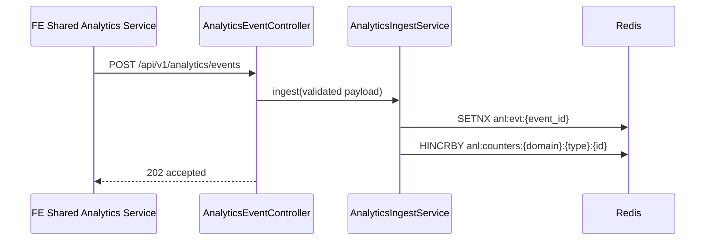
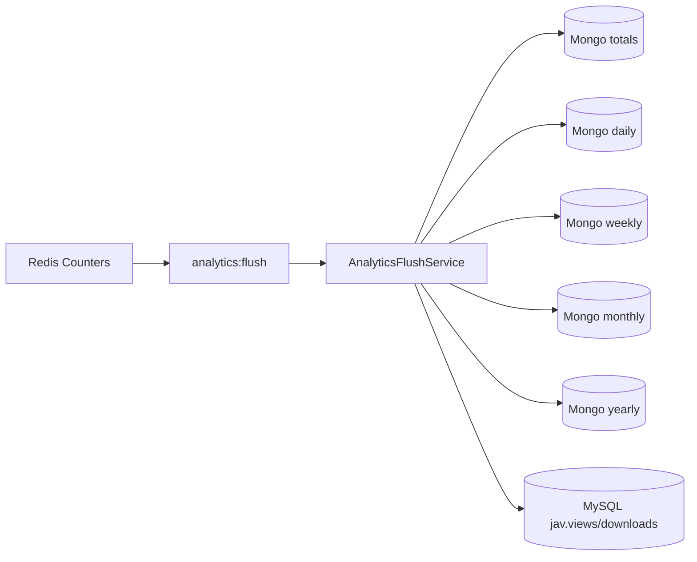
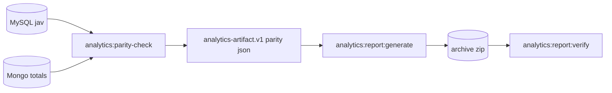

# Analytics Architecture V2 (Core Event Pipeline)

## 1) Scope

This document describes the current analytics architecture implemented in Core + JAV modules:
- event ingest API
- Redis hot counters + dedupe
- flush into Mongo rollups (daily/weekly/monthly/yearly + totals)
- MySQL replica synchronization for `jav.views/downloads`
- parity/report generation and verification

## 2) Code Structure

```text
Modules/Core/app
├── Enums
│   ├── AnalyticsAction.php
│   ├── AnalyticsDomain.php
│   └── AnalyticsEntityType.php
├── Http
│   ├── Controllers/Api/AnalyticsEventController.php
│   └── Requests/IngestAnalyticsEventRequest.php
├── Services
│   ├── AnalyticsIngestService.php
│   ├── AnalyticsFlushService.php
│   ├── AnalyticsParityService.php
│   └── AnalyticsArtifactSchemaService.php
├── Models/Mongo/Analytics
│   ├── AnalyticsEntityTotals.php
│   ├── AnalyticsEntityDaily.php
│   ├── AnalyticsEntityWeekly.php
│   ├── AnalyticsEntityMonthly.php
│   └── AnalyticsEntityYearly.php
└── Console
    ├── FlushAnalyticsCommand.php
    ├── AnalyticsParityCheckCommand.php
    ├── AnalyticsReportGenerateCommand.php
    └── AnalyticsReportVerifyCommand.php

Modules/JAV/app
├── Services/JavAnalyticsTrackerService.php
└── Services/AnalyticsReadService.php

Modules/Core/resources/js
└── Services/analyticsService.js
```

## 3) API Contract

### 3.1 Ingest API

- Method: `POST`
- Path: `/api/v1/analytics/events`
- Route name: `api.analytics.events.store`
- Purpose: accept analytics events from FE/BE producers

Payload:

```json
{
  "event_id": "string",
  "domain": "jav",
  "entity_type": "movie|actor|tag",
  "entity_id": "string",
  "action": "view|download",
  "value": 1,
  "occurred_at": "ISO8601 datetime",
  "user_id": 123
}
```

Response:
- `202` with `{"status":"accepted"}`
- `422` for validation errors

## 4) Commands

| Command | Purpose |
|---|---|
| `analytics:flush` | Flush Redis counters to Mongo rollups + sync MySQL replicas |
| `analytics:parity-check` | Compare MySQL replicas against Mongo totals |
| `analytics:report:generate` | Generate N-day parity artifacts, rollback artifacts, optional archive |
| `analytics:report:verify` | Verify artifact schema/integrity for directory/archive |

## 5) Data Flow

### 5.1 FE/BE Request Lifecycle



### 5.2 Flush + Rollup Lifecycle



### 5.3 Parity + Artifact Lifecycle



## 6) Domain Constants Strategy

- Canonical analytics dimensions are centralized in enums:
  - `AnalyticsDomain`
  - `AnalyticsEntityType`
  - `AnalyticsAction`
- Services, requests, tracker, and analytics tests use enum values.
- This removes scattered literals (`'jav'`, `'movie'`, `'view'`, `'download'`) from core analytics business logic.

## 7) FE Integration

- Shared FE service: `Modules/Core/resources/js/Services/analyticsService.js`
- Used by `Modules/JAV/resources/js/Pages/Movies/Show.vue` on mount.
- Contract tests enforce:
  - no legacy `analyticsClient.js`
  - no hardcoded `/api/v1/analytics/events` calls across JAV FE sources
  - movie page must use shared Core analytics service

## 8) Test Coverage Summary

| Layer | Key Coverage |
|---|---|
| BE Unit | enums, ingest mapping/dedupe, flush behavior |
| BE Feature | ingest endpoint, flush job, parity, operational simulation, production-like flow |
| FE Service | happy/unhappy/edge/exploit-guard paths, singleton runtime behavior |
| FE Contract | no legacy client, no endpoint hardcode, component usage guard |

## 9) Legacy Removal Notes

- Removed legacy analytics snapshot execution paths:
  - `jav:sync:analytics` command
  - hourly scheduler entry for `jav:sync:analytics`
  - snapshot refresh queue dispatch from `JavSubscriber`
  - `RefreshAnalyticsSnapshotsJob`
- Removed snapshot storage model/factory used by legacy cache:
  - `Modules/JAV/app/Models/Mongo/AnalyticsSnapshot.php`
  - `database/factories/AnalyticsSnapshotFactory.php`
- Admin/CLI analytics now read from `AnalyticsReadService` (live aggregation), preserving payload contract for existing UI/report consumers.

## 10) Known Environment Limitation

- `vitest + @vue/test-utils` setup requires npm registry access.
- Current execution environment cannot install packages due `ENOTFOUND registry.npmjs.org`.
- FE tests currently run using Node test runner with runtime/contract coverage.
