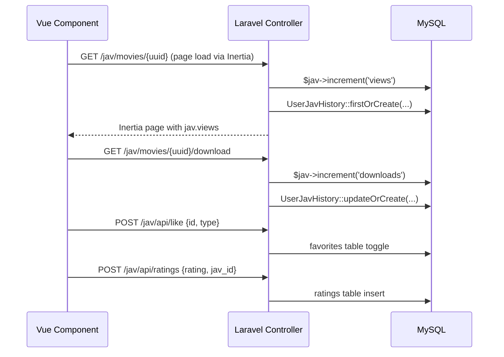
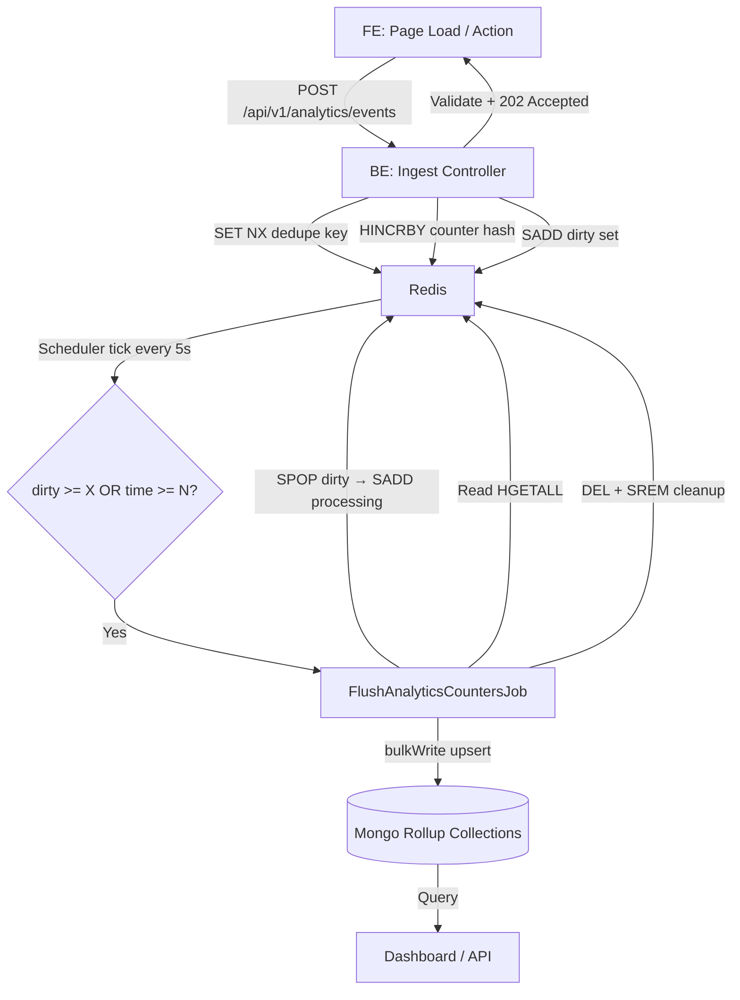

# Analytics Refactoring: Event-Based System (Redis Hot-Path + Mongo Rollups)

## Current State Analysis

### What Exists Today

The current analytics system is **scattered across multiple controllers** with no central event architecture, no deduplication, and no time-bucketed rollups.

| Feature | How it works today | Where in code | Problems |
|---|---|---|---|
| **Views** | `$jav->increment('views')` synchronously on every page load | [MovieController.php](file:///Users/vietvu/Sites/JOOservices/XCrawlerII/Modules/JAV/app/Http/Controllers/Users/MovieController.php#L31) (SSR) + [ApiMovieController.php](file:///Users/vietvu/Sites/JOOservices/XCrawlerII/Modules/JAV/app/Http/Controllers/Users/Api/MovieController.php#L13) (AJAX) | No dedupe — refresh = +1. MySQL write on every page load. No time-series. |
| **Downloads** | `$jav->increment('downloads')` on each download | [MovieController.php](file:///Users/vietvu/Sites/JOOservices/XCrawlerII/Modules/JAV/app/Http/Controllers/Users/MovieController.php#L63) | Same issues as views |
| **Favorites** | Toggle polymorphic [favorites](file:///Users/vietvu/Sites/JOOservices/XCrawlerII/Modules/JAV/app/Models/Jav.php#209-213) table row | [LibraryController.php](file:///Users/vietvu/Sites/JOOservices/XCrawlerII/Modules/JAV/app/Http/Controllers/Users/Api/LibraryController.php#L19-L49) | Stores state (liked/unliked), not event counts. No analytics dimension. |
| **Ratings** | Dedicated [ratings](file:///Users/vietvu/Sites/JOOservices/XCrawlerII/Modules/JAV/app/Models/Jav.php#214-218) table with `user_id`, `jav_id`, [rating](file:///Users/vietvu/Sites/JOOservices/XCrawlerII/Modules/JAV/app/Models/Jav.php#214-218) | [Rating.php](file:///Users/vietvu/Sites/JOOservices/XCrawlerII/Modules/JAV/app/Models/Rating.php) | Stores actual reviews — this is a *state* table, not an analytics counter |
| **History** | `user_jav_history` table (view/download records per user) | [UserJavHistory.php](file:///Users/vietvu/Sites/JOOservices/XCrawlerII/Modules/JAV/app/Models/UserJavHistory.php) | User-level tracking, not aggregate analytics |
| **Dashboard** | [AnalyticsSnapshotService](file:///Users/vietvu/Sites/JOOservices/XCrawlerII/Modules/JAV/app/Services/AnalyticsSnapshotService.php#13-295) runs heavy MySQL `COUNT(*)` aggregations, caches result into Mongo `analytics_snapshots` | [AnalyticsSnapshotService.php](file:///Users/vietvu/Sites/JOOservices/XCrawlerII/Modules/JAV/app/Services/AnalyticsSnapshotService.php) | Slow, full re-aggregation every 30min. No real-time counters. |

### Current FE → BE Flow



> [!WARNING]
> **No deduplication**: Every browser refresh = +1 view. Bots/crawlers inflate counts. No rate limiting. No event ID tracking.

---

## Design Decisions (Confirmed)

- **State tables stay untouched** — [favorites](file:///Users/vietvu/Sites/JOOservices/XCrawlerII/Modules/JAV/app/Models/Jav.php#209-213), [ratings](file:///Users/vietvu/Sites/JOOservices/XCrawlerII/Modules/JAV/app/Models/Jav.php#214-218), [watchlists](file:///Users/vietvu/Sites/JOOservices/XCrawlerII/Modules/JAV/app/Models/Jav.php#219-223), `user_jav_history` remain as-is for user features. We do NOT modify how they save to DB.
- **Analytics = aggregate counters** — dashboard reads from Mongo rollups, not MySQL `COUNT(*)`
- **One `AnalyticsService`** in Core — write (ingest) + read (query). SOLID/DRY.
- **One shared FE `analyticsService.js`** in Core — singleton class, all modules import it
- **5 action types**: [view](file:///Users/vietvu/Sites/JOOservices/XCrawlerII/Modules/JAV/app/Http/Controllers/Users/Api/MovieController.php#11-19), [download](file:///Users/vietvu/Sites/JOOservices/XCrawlerII/Modules/JAV/app/Http/Controllers/Users/MovieController.php#61-104), [favorite](file:///Users/vietvu/Sites/JOOservices/XCrawlerII/Modules/JAV/app/Models/Jav.php#209-213), [rating](file:///Users/vietvu/Sites/JOOservices/XCrawlerII/Modules/JAV/app/Models/Jav.php#214-218), [watchlist](file:///Users/vietvu/Sites/JOOservices/XCrawlerII/Modules/JAV/app/Models/Jav.php#219-223)

---

## Proposed Architecture



---

## Proposed Changes

### Core Module — Analytics Engine (NEW)

Domain-agnostic analytics engine. One service, one controller, one request class. All new files.

---

#### [NEW] [AnalyticsEventController.php](file:///Users/vietvu/Sites/JOOservices/XCrawlerII/Modules/Core/app/Http/Controllers/Api/AnalyticsEventController.php)

Thin controller — delegates everything to `AnalyticsService`.

- `ingest()` — validates via `IngestAnalyticsEventRequest`, calls `AnalyticsService::ingest()`, returns `202`
- Returns `400 Bad Request` for anti-cheat validation failures

---

#### [NEW] [IngestAnalyticsEventRequest.php](file:///Users/vietvu/Sites/JOOservices/XCrawlerII/Modules/Core/app/Http/Requests/IngestAnalyticsEventRequest.php)

Validation uses `AnalyticsAction` enum (see below) for type-safe action validation:

```php
'event_id'    => 'required|string|uuid',
'domain'      => 'required|string|in:jav',          // extensible for future domains
'entity_type' => 'required|string|in:movie,actor,tag,provider',
'entity_id'   => 'required|string|uuid',
'action'      => ['required', 'string', Rule::enum(AnalyticsAction::class)],
'occurred_at' => 'required|date',
'user_id'     => 'nullable|integer',
'value'       => 'required|integer|min:1|max:5',
```

Custom rule: non-rating actions → `value` must be exactly `1`.

---

#### [NEW] [AnalyticsAction.php](file:///Users/vietvu/Sites/JOOservices/XCrawlerII/Modules/Core/app/Enums/AnalyticsAction.php)

**Why**: Avoid raw string literals like `'download'` scattered across the codebase. Single source of truth for allowed action types. Type-safe, IDE-friendly, easy to extend.

```php
<?php
namespace Modules\Core\Enums;

enum AnalyticsAction: string
{
    case VIEW      = 'view';
    case DOWNLOAD  = 'download';
    case FAVORITE  = 'favorite';
    case RATING    = 'rating';
    case WATCHLIST = 'watchlist';

    /** Counter fields to increment for this action */
    public function counterFields(): array
    {
        return match ($this) {
            self::VIEW      => ['views' => 1],
            self::DOWNLOAD  => ['downloads' => 1],
            self::FAVORITE  => ['favorites' => 1],
            self::WATCHLIST => ['watchlists' => 1],
            self::RATING    => ['ratings_count' => 1], // ratings_sum handled separately
        };
    }

    /** Whether value must be exactly 1 */
    public function isFixedValue(): bool
    {
        return $this !== self::RATING;
    }
}
```

**How to extend**: Add a new case (e.g. `case SHARE = 'share'`), add its `counterFields()`, done. No other code changes needed.

---

#### [NEW] [AnalyticsService.php](file:///Users/vietvu/Sites/JOOservices/XCrawlerII/Modules/Core/app/Services/AnalyticsService.php)

**Single unified service** — all analytics logic lives here. Both **write** (ingest) and **read** (query).

Uses `AnalyticsAction` enum instead of raw strings everywhere.

##### Write methods (hot-path)

`ingest(array $event): bool` — core ingest logic:
1. **Dedupe**: `SET anl:evt:v1:{event_id} 1 NX EX 172800`
2. **Compute daily bucket**: `occurred_at` → `YYYY-MM-DD`
3. **Resolve action**: `AnalyticsAction::from($event['action'])` — type-safe
4. **Increment counters**: `HINCRBY` using `$action->counterFields()`
5. **Mark dirty**: `SADD anl:dirty:v1 {counter_key}`

##### Read methods (query from Mongo rollups)

- `getTotals(string $domain, string $entityType, string $entityId): ?object`
- `getTopByCounter(string $domain, string $entityType, string $counter, int $limit = 10): Collection`
- `getDailyCounters(string $domain, string $entityType, string $entityId, int $days): array`
- `getBucketedCounters(string $bucket, string $domain, string $entityType, string $entityId, ...): array`

> [!NOTE]
> This replaces the need for [AnalyticsSnapshotService](file:///Users/vietvu/Sites/JOOservices/XCrawlerII/Modules/JAV/app/Services/AnalyticsSnapshotService.php#13-295) to do heavy MySQL `COUNT(*)` aggregations. JAV's [AnalyticsSnapshotService](file:///Users/vietvu/Sites/JOOservices/XCrawlerII/Modules/JAV/app/Services/AnalyticsSnapshotService.php#13-295) calls `AnalyticsService::getTopByCounter()` etc. instead.

---

#### [NEW] [FlushAnalyticsCountersJob.php](file:///Users/vietvu/Sites/JOOservices/XCrawlerII/Modules/Core/app/Jobs/FlushAnalyticsCountersJob.php)

Queue job dispatched by scheduler:

1. **Claim**: `SPOP anl:dirty:v1 {batchSize}` → `SADD anl:processing:v1 {keys}`
2. **Read**: `HGETALL` each counter hash
3. **Derive buckets**: daily (`YYYY-MM-DD`), weekly (ISO `YYYY-Www`), monthly (`YYYY-MM`), yearly (`YYYY`)
4. **Mongo bulkWrite** (ordered=false) into 5 collections
5. **Cleanup**: `DEL {counter_key}`, `SREM anl:processing:v1 {key}`, `SET anl:last_flush_ts {now}`

---

#### [NEW] [AnalyticsWatchdogJob.php](file:///Users/vietvu/Sites/JOOservices/XCrawlerII/Modules/Core/app/Jobs/AnalyticsWatchdogJob.php)

Runs every 1–5min. Scans `anl:processing:v1` for keys stuck >5min → moves them back to `anl:dirty:v1`.

---

#### [NEW] Mongo models — 5 files in `Modules/Core/app/Models/Mongo/Analytics/`

| # | File | Path | Collection | Unique Index | Extra Fields |
|---|---|---|---|---|---|
| 1 | [AnalyticsEntityTotals.php](file:///Users/vietvu/Sites/JOOservices/XCrawlerII/Modules/Core/app/Models/Mongo/Analytics/AnalyticsEntityTotals.php) | `app/Models/Mongo/Analytics/` | `analytics_entity_totals` | `{domain, entity_type, entity_id}` | — |
| 2 | [AnalyticsEntityDaily.php](file:///Users/vietvu/Sites/JOOservices/XCrawlerII/Modules/Core/app/Models/Mongo/Analytics/AnalyticsEntityDaily.php) | same | `analytics_entity_daily` | `{domain, entity_type, entity_id, date}` | `date` (string `YYYY-MM-DD`) |
| 3 | [AnalyticsEntityWeekly.php](file:///Users/vietvu/Sites/JOOservices/XCrawlerII/Modules/Core/app/Models/Mongo/Analytics/AnalyticsEntityWeekly.php) | same | `analytics_entity_weekly` | `{domain, entity_type, entity_id, week}` | `week` (string `YYYY-Www`) |
| 4 | [AnalyticsEntityMonthly.php](file:///Users/vietvu/Sites/JOOservices/XCrawlerII/Modules/Core/app/Models/Mongo/Analytics/AnalyticsEntityMonthly.php) | same | `analytics_entity_monthly` | `{domain, entity_type, entity_id, month}` | `month` (string `YYYY-MM`) |
| 5 | [AnalyticsEntityYearly.php](file:///Users/vietvu/Sites/JOOservices/XCrawlerII/Modules/Core/app/Models/Mongo/Analytics/AnalyticsEntityYearly.php) | same | `analytics_entity_yearly` | `{domain, entity_type, entity_id, year}` | `year` (string `YYYY`) |

**Common fields** (all 5 models): `domain`, `entity_type`, `entity_id`, `views`, `downloads`, [favorites](file:///Users/vietvu/Sites/JOOservices/XCrawlerII/Modules/JAV/app/Models/Jav.php#209-213), [watchlists](file:///Users/vietvu/Sites/JOOservices/XCrawlerII/Modules/JAV/app/Models/Jav.php#219-223), `ratings_count`, `ratings_sum`, `updated_at`.

---

#### [NEW] [AnalyticsCommand.php](file:///Users/vietvu/Sites/JOOservices/XCrawlerII/Modules/Core/app/Console/AnalyticsCommand.php)

**Why one command?** Currently JAV has `jav:sync:analytics` for snapshots. The new system adds flush-check, backfill, and watchdog. Instead of 4 separate commands, one consolidated command with subcommands avoids duplication and makes discovery easier.

```bash
php artisan analytics flush:check    # check dirty count, dispatch flush job if threshold met
php artisan analytics watchdog        # recover stuck keys from processing set
php artisan analytics backfill        # Phase 3: seed Mongo from MySQL historical data
php artisan analytics sync            # refresh AnalyticsSnapshotService cache (replaces jav:sync:analytics)
```

Signature: `analytics {action : flush:check|watchdog|backfill|sync} {--days=*} {--chunk=500} {--dry-run}`

> [!NOTE]
> The existing `jav:sync:analytics` command calls `AnalyticsSnapshotService::getSnapshot()`. After Phase 2, that service delegates to Core. So we can alias `analytics sync` to the same logic, then deprecate `jav:sync:analytics` in Phase 5.

---

#### [MODIFY] [CoreServiceProvider.php](file:///Users/vietvu/Sites/JOOservices/XCrawlerII/Modules/Core/app/Providers/CoreServiceProvider.php)

Register route file, schedule flush check command + watchdog, bind `AnalyticsService` as singleton.

---

#### [NEW] [api.php (Core routes)](file:///Users/vietvu/Sites/JOOservices/XCrawlerII/Modules/Core/routes/api.php)

```php
Route::middleware(['web', 'throttle:analytics'])
    ->prefix('api/v1/analytics')
    ->group(function () {
        Route::post('/events', [AnalyticsEventController::class, 'ingest']);
    });
```

---

### JAV Module — Integration Changes

Each change below shows the **current code** (what exists today) and the **new code** (what it changes to), with explanation of what/why/how.

---

#### [MODIFY] [MovieController.php](file:///Users/vietvu/Sites/JOOservices/XCrawlerII/Modules/JAV/app/Http/Controllers/Users/MovieController.php)

##### [show()](file:///Users/vietvu/Sites/JOOservices/XCrawlerII/Modules/JAV/app/Http/Controllers/Users/MovieController.php#29-60) method — current code (line 29–41):

```php
// CURRENT: increments MySQL views column on every page load
public function show(Jav $jav): InertiaResponse
{
    $jav->increment('views');  // ← THIS LINE GETS REMOVED

    if (auth()->check()) {
        UserJavHistory::firstOrCreate([
            'user_id' => auth()->id(),
            'jav_id' => $jav->id,
            'action' => 'view',
        ], ['updated_at' => now()]);
    }
    // ... rest stays the same
}
```

**What changes**: Remove line `$jav->increment('views')`.
**Why**: View tracking moves to FE → `analytics.track(AnalyticsAction.VIEW)` → Core API → Redis. Server-side increment has no deduplication.
**How**: Simply delete the line. [UserJavHistory](file:///Users/vietvu/Sites/JOOservices/XCrawlerII/Modules/JAV/app/Models/UserJavHistory.php#10-37) stays — it's user state, not analytics.

```diff
  public function show(Jav $jav): InertiaResponse
  {
-     $jav->increment('views');
+     // View tracking handled by FE analytics event (Phase 4)

      if (auth()->check()) {
```

##### [download()](file:///Users/vietvu/Sites/JOOservices/XCrawlerII/Modules/JAV/app/Http/Controllers/Users/MovieController.php#61-104) method — current code (line 61–71):

```php
// CURRENT: increments MySQL downloads column
public function download(Jav $jav): Response|RedirectResponse
{
    $jav->increment('downloads');  // ← THIS LINE GETS REPLACED

    if (auth()->check()) {
        UserJavHistory::updateOrCreate([
            'user_id' => auth()->id(),
            'jav_id' => $jav->id,
            'action' => 'download',
        ]);
    }
    // ... torrent download logic stays the same
}
```

**What changes**: Replace `$jav->increment('downloads')` with `AnalyticsService::ingest()`.
**Why**: Downloads are server-initiated (user clicks → BE fetches torrent), so BE fires the analytics event directly. FE doesn't need to track this.
**How**: Use `AnalyticsAction::DOWNLOAD` enum (not raw string). Feature flag for safe rollout.

```diff
  public function download(Jav $jav): Response|RedirectResponse
  {
-     $jav->increment('downloads');
+     if (config('analytics.use_event_system', false)) {
+         app(AnalyticsService::class)->ingest([
+             'event_id'    => (string) Str::uuid(),
+             'domain'      => 'jav',
+             'entity_type' => 'movie',
+             'entity_id'   => $jav->uuid,
+             'action'      => AnalyticsAction::DOWNLOAD->value,
+             'occurred_at' => now()->toIso8601ZuluString(),
+             'user_id'     => auth()->id(),
+             'value'       => 1,
+         ]);
+     } else {
+         $jav->increment('downloads'); // legacy fallback
+     }
```

---

#### [MODIFY] [ApiMovieController.php](file:///Users/vietvu/Sites/JOOservices/XCrawlerII/Modules/JAV/app/Http/Controllers/Users/Api/MovieController.php)

##### Current code (entire file — 20 lines):

```php
// CURRENT: increments MySQL views and returns new count
class MovieController extends ApiController
{
    public function view(Jav $jav): JsonResponse
    {
        $jav->increment('views');  // ← direct MySQL write

        return response()->json([
            'views' => $jav->views,  // ← reads from MySQL column
        ]);
    }
}
```

**What changes**: Stop incrementing MySQL. Read view count from `AnalyticsService::getTotals()` instead.
**Why**: The API endpoint still needs to return a view count (FE displays it). But the count now comes from Mongo rollups, not MySQL.
**How**: Inject `AnalyticsService`, query Mongo totals. Feature flag for fallback.

```diff
  public function view(Jav $jav): JsonResponse
  {
-     $jav->increment('views');
-     return response()->json(['views' => $jav->views]);
+     if (config('analytics.use_event_system', false)) {
+         $totals = app(AnalyticsService::class)
+             ->getTotals('jav', 'movie', $jav->uuid);
+         return response()->json(['views' => $totals->views ?? 0]);
+     }
+     // Legacy fallback
+     return response()->json(['views' => $jav->views]);
  }
```

---

#### [MODIFY] [AnalyticsSnapshotService.php](file:///Users/vietvu/Sites/JOOservices/XCrawlerII/Modules/JAV/app/Services/AnalyticsSnapshotService.php)

Keeps JAV-specific logic (entity totals, provider stats, quality, sync health). **Counter queries** delegate to Core.

##### `topViewed` — current code (line 119–133):

```php
// CURRENT: queries MySQL jav table, orders by views column
$topViewed = Jav::query()
    ->orderByDesc('views')
    ->orderByDesc('downloads')
    ->take(10)
    ->get(['uuid', 'code', 'title', 'views', 'downloads'])
    ->map(static function (Jav $item): array {
        return [
            'uuid' => $item->uuid, 'code' => $item->code,
            'title' => $item->title,
            'views' => (int) ($item->views ?? 0),
            'downloads' => (int) ($item->downloads ?? 0),
        ];
    })->all();
```

**What changes**: Replace MySQL query with `AnalyticsService::getTopByCounter()`.
**Why**: Views/downloads live in Mongo rollups now. MySQL columns become stale.
**How**: Feature flag same pattern. Core service returns collection in same shape.

```diff
- $topViewed = Jav::query()->orderByDesc('views')...;
+ $topViewed = config('analytics.use_event_system', false)
+     ? $this->analyticsService->getTopByCounter('jav', 'movie', 'views', 10)
+     : Jav::query()->orderByDesc('views')...; // legacy fallback
```

##### `topDownloaded` (line 135–149) — same pattern as above.

##### `dailyEngagement` (line 94–99) — same pattern, delegates to `AnalyticsService::getDailyCounters()`.

---

### FE — Shared Analytics Service (NEW)

---

#### [NEW] [analyticsService.js](file:///Users/vietvu/Sites/JOOservices/XCrawlerII/Modules/Core/resources/js/Services/analyticsService.js)

**One shared class** — lives in Core module. Extensible via `analytics.track(type)` pattern — pass any `AnalyticsAction` string. No need to add a new method per action type.

**Why `track(type)` instead of individual `trackView()`, `trackDownload()` etc.?**
- **Extensible**: Adding [watchlist](file:///Users/vietvu/Sites/JOOservices/XCrawlerII/Modules/JAV/app/Models/Jav.php#219-223) or future actions = just pass the string. No new method needed.
- **DRY**: One method, one code path.
- **Consistent with BE**: Uses same `AnalyticsAction` values as the PHP enum.

---

#### [MODIFY] [Show.vue](file:///Users/vietvu/Sites/JOOservices/XCrawlerII/Modules/JAV/resources/js/Pages/Movies/Show.vue) (FE refactor phase)

```diff
+ import analytics from '@core/Services/analyticsService';
+ onMounted(() => analytics.track('view', 'movie', props.jav.uuid, page.props.auth?.user?.id));
```

Favorite tracking:
```diff
+ if (response.data.liked) analytics.track('favorite', 'movie', props.jav.uuid, userId);
```

> [!NOTE]
> FE refactor is a later phase. Pattern: always `analytics.track(actionType, entityType, entityId, userId)`.

---

### Mongo Schema & Indexes

| Collection | Unique Index | Counter Fields |
|---|---|---|
| `analytics_entity_totals` | `{domain, entity_type, entity_id}` | `views, downloads, favorites, watchlists, ratings_count, ratings_sum` |
| `analytics_entity_daily` | `{domain, entity_type, entity_id, date}` | same |
| `analytics_entity_weekly` | `{domain, entity_type, entity_id, week}` | same |
| `analytics_entity_monthly` | `{domain, entity_type, entity_id, month}` | same |
| `analytics_entity_yearly` | `{domain, entity_type, entity_id, year}` | same |

---

## Anti-Cheat Validation Summary

| Layer | Rule | Action |
|---|---|---|
| **FE value rules** | `VALUE_RULES` map enforces `value: 1` for non-rating. [rating](file:///Users/vietvu/Sites/JOOservices/XCrawlerII/Modules/JAV/app/Models/Jav.php#214-218) clamped 1–5 via `Math.max/min`. | Prevent casual tampering |
| **FE dedupe** | `Map` key = `entityType:entityId:action`. Same combo → skip. | No double-fire on re-render |
| **BE request** | `IngestAnalyticsEventRequest` uses `AnalyticsAction` enum + `isFixedValue()` check | 400 on bad value |
| **BE dedupe** | Redis `SET NX` on `event_id` with 48h TTL | No duplicate counting |
| **Rate limit** | `throttle:analytics` middleware (60 req/min per IP) | Prevent flooding |
| **BE mapping** | `AnalyticsAction::counterFields()` decides which fields to `$inc`. FE cannot specify. | No arbitrary manipulation |

---

## Risks & Mitigations

| Risk | Impact | Mitigation |
|---|---|---|
| Redis unavailable | Events lost | Redis AOF persistence. Fallback: log event to file, re-ingest later |
| Flush job fails mid-batch | Partial write | `processing` set ensures retry. Watchdog moves stuck keys back to `dirty` |
| Mongo unavailable during flush | Counters stuck in Redis | Job retries (3 attempts). Redis TTL on dirty keys prevents indefinite growth |
| FE event_id collision | Missed counts | UUID v4 collision probability is negligible (1 in 2^122) |
| Clock skew between FE/BE | Wrong daily bucket | Use server `occurred_at` if drift >5min, or sanitize in BE |
| Bot/crawler inflation | Inflated view counts | Rate limiting + [auth](file:///Users/vietvu/Sites/JOOservices/XCrawlerII/Modules/JAV/app/Http/Requests/AnalyticsApiRequest.php#11-15) middleware option + optional CAPTCHA for anonymous |
| Breaking existing tests | CI failure | All existing tests continue to pass since state tables remain unchanged |

---

## Phase Breakdown (Detailed)

### Phase Overview

| Phase | Scope | Depends On | Can Deploy Alone? |
|---|---|---|---|
| **Phase 1** | Core Analytics Engine (BE) | Nothing | ✅ Yes — no existing code touched |
| **Phase 2** | JAV Module Integration (BE) | Phase 1 | ✅ Yes — feature flag gates new path |
| **Phase 3** | Backfill Historical Data | Phase 1 + 2 | ✅ Yes — one-time command |
| **Phase 4** | FE Shared Service | Phase 1 | ✅ Yes — fire-and-forget |
| **Phase 5** | Legacy Cleanup | All above stable | ⚠️ Only after confirmed |

---

### Phase 1: Core Analytics Engine (BE)

#### Definition of Done
- [ ] `POST /api/v1/analytics/events` returns 202 for valid payload
- [ ] Invalid payload returns 400 (missing fields, bad value for action)
- [ ] Duplicate `event_id` → 202 but counter NOT incremented
- [ ] Rate limiting returns 429 when exceeded
- [ ] `FlushAnalyticsCountersJob` moves Redis counters → 5 Mongo collections
- [ ] `AnalyticsWatchdogJob` recovers stuck keys
- [ ] Read methods return correct data from Mongo rollups
- [ ] All Core tests pass
- [ ] **Zero changes** to any existing file except `CoreServiceProvider.php`

#### Files

```
Modules/Core/
├── app/
│   ├── Enums/
│   │   └── AnalyticsAction.php                                [NEW]
│   ├── Http/
│   │   ├── Controllers/Api/
│   │   │   └── AnalyticsEventController.php                   [NEW]
│   │   └── Requests/
│   │       └── IngestAnalyticsEventRequest.php                [NEW]
│   ├── Services/
│   │   └── AnalyticsService.php                               [NEW]
│   ├── Jobs/
│   │   ├── FlushAnalyticsCountersJob.php                      [NEW]
│   │   └── AnalyticsWatchdogJob.php                           [NEW]
│   ├── Console/
│   │   └── AnalyticsCommand.php                               [NEW]
│   ├── Models/Mongo/Analytics/
│   │   ├── AnalyticsEntityTotals.php                          [NEW]
│   │   ├── AnalyticsEntityDaily.php                           [NEW]
│   │   ├── AnalyticsEntityWeekly.php                          [NEW]
│   │   ├── AnalyticsEntityMonthly.php                         [NEW]
│   │   └── AnalyticsEntityYearly.php                          [NEW]
│   └── Providers/
│       └── CoreServiceProvider.php                            [MODIFY — register only]
├── routes/
│   └── api.php                                                [MODIFY — add route]
├── resources/js/Services/
│   └── analyticsService.js                                    [NEW]
└── tests/
    ├── Unit/
    │   ├── Enums/AnalyticsActionTest.php                      [NEW]
    │   ├── Services/AnalyticsServiceTest.php                  [NEW]
    │   ├── Jobs/FlushAnalyticsCountersJobTest.php             [NEW]
    │   ├── Jobs/AnalyticsWatchdogJobTest.php                  [NEW]
    │   └── Requests/IngestAnalyticsEventRequestTest.php       [NEW]
    └── Feature/
        └── Controllers/AnalyticsEventControllerTest.php       [NEW]
```

#### Skeleton — [AnalyticsService.php](file:///Users/vietvu/Sites/JOOservices/XCrawlerII/Modules/JAV/app/Services/ActorAnalyticsService.php)

```php
<?php
namespace Modules\Core\Services;

use Illuminate\Support\Facades\Redis;
use Modules\Core\Enums\AnalyticsAction;
use Modules\Core\Models\Mongo\Analytics\AnalyticsEntityTotals;
// ... other Mongo models

class AnalyticsService
{
    private const DEDUPE_PREFIX  = 'anl:evt:v1:';
    private const COUNTER_PREFIX = 'anl:cnt:v1:';
    private const DIRTY_SET      = 'anl:dirty:v1';
    private const PROCESSING_SET = 'anl:processing:v1';
    private const LAST_FLUSH_KEY = 'anl:last_flush_ts';
    private const DEDUPE_TTL     = 172800; // 48h

    // ── WRITE ────────────────────────────────────────────
    public function ingest(array $event): bool
    {
        // 1. Dedupe via Redis SET NX
        $isNew = Redis::set(self::DEDUPE_PREFIX . $event['event_id'], 1, 'NX', 'EX', self::DEDUPE_TTL);
        if (!$isNew) return false; // duplicate event, skip

        // 2. Resolve action from enum (type-safe)
        $action = AnalyticsAction::from($event['action']);

        // 3. Compute daily bucket key
        $date = substr($event['occurred_at'], 0, 10);
        $counterKey = self::COUNTER_PREFIX
            . "{$event['domain']}:{$event['entity_type']}:{$event['entity_id']}:{$date}";

        // 4. Increment counters using enum-defined fields
        foreach ($action->counterFields() as $field => $delta) {
            Redis::hincrby($counterKey, $field, $delta);
        }
        if ($action === AnalyticsAction::RATING) {
            Redis::hincrbyfloat($counterKey, 'ratings_sum', $event['value']);
        }

        // 5. Mark dirty for flush job
        Redis::sadd(self::DIRTY_SET, $counterKey);
        return true;
    }

    // ── READ ─────────────────────────────────────────────
    public function getTotals(string $domain, string $entityType, string $entityId): ?object
    {
        return AnalyticsEntityTotals::query()
            ->where(compact('domain', 'entity_type' => $entityType, 'entity_id' => $entityId))
            ->first();
    }

    public function getTopByCounter(string $domain, string $entityType, string $counter, int $limit = 10): Collection
    {
        return AnalyticsEntityTotals::query()
            ->where(['domain' => $domain, 'entity_type' => $entityType])
            ->orderByDesc($counter)
            ->take($limit)
            ->get();
    }

    public function getDailyCounters(string $domain, string $entityType, string $entityId, int $days): array { /* ... */ }

    // ── FLUSH HELPERS (used by FlushAnalyticsCountersJob) ─
    public function claimDirtyKeys(int $batchSize): array { /* SPOP + SADD processing */ }
    public function shouldFlush(int $threshold = 1000, int $maxInterval = 30): bool { /* ... */ }
    public function getCounterData(string $key): array { /* HGETALL */ }
    public function deriveTimeBuckets(string $date): array { /* daily, weekly, monthly, yearly */ }
    public function commitFlush(array $results): void { /* DEL + SREM */ }
}
```

#### Skeleton — `IngestAnalyticsEventRequest.php`

```php
<?php
namespace Modules\Core\Http\Requests;

use Illuminate\Foundation\Http\FormRequest;
use Illuminate\Validation\Rule;
use Modules\Core\Enums\AnalyticsAction;

class IngestAnalyticsEventRequest extends FormRequest
{
    public function rules(): array
    {
        return [
            'event_id'    => 'required|string|uuid',
            'domain'      => ['required', 'string', Rule::in(['jav'])],
            'entity_type' => ['required', 'string', Rule::in(['movie', 'actor', 'tag', 'provider'])],
            'entity_id'   => 'required|string|uuid',
            'action'      => ['required', 'string', Rule::enum(AnalyticsAction::class)],
            'occurred_at' => 'required|date',
            'user_id'     => 'nullable|integer',
            'value'       => 'required|integer|min:1|max:5',
        ];
    }

    public function withValidator($validator): void
    {
        $validator->after(function ($v) {
            $action = AnalyticsAction::tryFrom($this->input('action'));
            if ($action && $action->isFixedValue() && (int) $this->input('value') !== 1) {
                $v->errors()->add('value', "value must be 1 for action={$action->value}");
            }
        });
    }
}
```

#### How to Avoid Issues

| Risk | Prevention |
|---|---|
| Breaking existing code | Zero modifications to JAV module. Only `CoreServiceProvider` gets route registration. |
| Redis not available in tests | Mock Redis facade in unit tests. Feature tests use `Redis::fake()`. |
| Mongo not available in tests | Mock Mongo models. Feature tests use test MongoDB or mock. |
| Counter key format mismatch | Constants for prefixes. One `parseCounterKey()` method, tested independently. |
| Validation passes bad data | `withValidator` after-hook. Dedicated test for every edge case. |

#### Verification & Evidence

```bash
php artisan test --filter=AnalyticsServiceTest
php artisan test --filter=FlushAnalyticsCountersJobTest
php artisan test --filter=AnalyticsWatchdogJobTest
php artisan test --filter=IngestAnalyticsEventRequestTest
php artisan test --filter=AnalyticsEventControllerTest
php artisan test --testsuite=Unit   # existing tests unbroken
php artisan test --testsuite=Feature
```

**Evidence**: test output screenshot (all green), curl demo (202/400/429), `redis-cli KEYS "anl:*"`, `db.analytics_entity_totals.find()` after flush.

---

### Phase 2: JAV Module Integration (BE)

#### Definition of Done
- [ ] `MovieController::show()` no longer calls `$jav->increment('views')`
- [ ] `MovieController::download()` calls `AnalyticsService::ingest()` with `AnalyticsAction::DOWNLOAD` (not raw string)
- [ ] `ApiMovieController::view()` reads from `AnalyticsService::getTotals()`
- [ ] `AnalyticsSnapshotService::topViewed`/`topDownloaded`/`dailyEngagement` delegate to Core
- [ ] Feature flag `config('analytics.use_event_system')` gates new vs old path
- [ ] All JAV tests pass with flag OFF (legacy) AND flag ON (new path)
- [ ] State tables remain **completely untouched**
- [ ] Existing `jav:sync:analytics` command still works (internally calls updated service)

#### Current Code → New Code

See [JAV Module — Integration Changes](#jav-module--integration-changes) above for full before/after diffs with line numbers.

#### How to Avoid Issues

| Risk | Prevention |
|---|---|
| Switching too early breaks dashboard | Feature flag defaults to `false`. Prod stays on old path until explicitly enabled. |
| Mongo has no data yet | Dashboard falls back to MySQL via feature flag. |
| Breaking JAV tests | Run `php artisan test --filter=Modules\\\\JAV` after each file change. |
| Raw string `'download'` used instead of enum | Code review checklist: all `->ingest()` calls must use `AnalyticsAction::X->value`. |
| `jav:sync:analytics` stops working | It calls `AnalyticsSnapshotService::getSnapshot()` which internally branches on flag. No signature change. |

#### Verification & Evidence

```bash
# Flag OFF → identical behavior (old MySQL path)
php artisan test --testsuite=Feature

# Flag ON → new path (reads from Mongo)
ANALYTICS_USE_EVENT_SYSTEM=true php artisan test --testsuite=Feature

# Sync command still works
php artisan jav:sync:analytics --days=7
```

**Evidence**: tests pass with flag both ON and OFF. Side-by-side dashboard output identical. Sync command output shows same totals.

---

### Phase 3: Backfill Historical Data

#### Definition of Done
- [ ] `analytics:backfill` reads MySQL `jav.views` + `jav.downloads`
- [ ] Seeds `analytics_entity_totals` per movie UUID
- [ ] **Idempotent** — running twice produces same result
- [ ] Reports: processed, upserted, skipped
- [ ] Backfilled docs marked `source: 'migration'`

#### Skeleton

```php
// BackfillAnalyticsCommand.php
Jav::query()
    ->where(fn($q) => $q->where('views', '>', 0)->orWhere('downloads', '>', 0))
    ->chunkById(500, function ($javs) {
        foreach ($javs as $jav) {
            AnalyticsEntityTotals::updateOrCreate(
                ['domain' => 'jav', 'entity_type' => 'movie', 'entity_id' => $jav->uuid],
                ['views' => $jav->views, 'downloads' => $jav->downloads, 'source' => 'migration']
            );
        }
    });
```

#### How to Avoid Issues

| Risk | Prevention |
|---|---|
| Doubling counts | `updateOrCreate` uses `$set` not `$inc` for migration. Idempotent. |
| Missing UUIDs | Skip rows where `uuid IS NULL`, log them. |
| Timeout | `chunkById` with configurable `--chunk` size. |

#### Verification & Evidence

```bash
php artisan analytics:backfill --dry-run   # preview first
php artisan analytics:backfill             # execute
```

**Evidence**: command output table, MySQL top 5 vs Mongo top 5 comparison — identical numbers. Run twice — counts unchanged.

---

### Phase 4: FE Shared Analytics Service

#### Definition of Done
- [ ] `analyticsService.js` in `Modules/Core/resources/js/Services/`
- [ ] Vite alias `@core` resolves to `Modules/Core/resources/js`
- [ ] Single `track(action, entityType, entityId, userId)` method — extensible for any action
- [ ] FE dedupe via `Map` prevents double-fire within same page session
- [ ] [Show.vue](file:///Users/vietvu/Sites/JOOservices/XCrawlerII/Modules/JAV/resources/js/Pages/Javs/Show.vue) fires `track('view', ...)` on mount, `track('favorite', ...)` on like
- [ ] `npm run build` passes

#### Skeleton — extensible `track(type)` pattern

**Why `track(type)` instead of individual methods?**
- Adding a new action (e.g. `share`) = just call `analytics.track('share', ...)`.
- No new method needed. No code change in `analyticsService.js`.
- Action types match `AnalyticsAction` PHP enum values exactly.

```javascript
import axios from 'axios';
import { v4 as uuidv4 } from 'uuid';

// Mirrors PHP AnalyticsAction enum. Value rules enforced here.
const VALUE_RULES = {
    view: 1, download: 1, favorite: 1, watchlist: 1,
    rating: null, // caller provides value, clamped to 1-5
};

class AnalyticsService {
    #firedEvents = new Map();

    /**
     * Track any analytics action. Extensible — pass any valid action type string.
     * @param {string} action    - Must match AnalyticsAction enum: view|download|favorite|rating|watchlist
     * @param {string} entityType - movie|actor|tag|provider
     * @param {string} entityId   - UUID of the entity
     * @param {number|null} userId - Authenticated user ID or null
     * @param {object} opts       - { domain, value } overrides
     */
    track(action, entityType, entityId, userId = null, opts = {}) {
        const key = `${entityType}:${entityId}:${action}`;
        if (this.#firedEvents.has(key)) return Promise.resolve();
        this.#firedEvents.set(key, true);

        const domain = opts.domain || 'jav';
        const rawValue = opts.value ?? VALUE_RULES[action] ?? 1;
        const value = action === 'rating'
            ? Math.max(1, Math.min(5, Math.round(rawValue)))
            : 1; // non-rating always 1

        return axios.post('/api/v1/analytics/events', {
            event_id: uuidv4(), domain, entity_type: entityType,
            entity_id: entityId, action, value,
            occurred_at: new Date().toISOString().replace(/\.\d{3}Z$/, 'Z'),
            ...(userId != null && { user_id: userId }),
        }).catch(() => {}); // fire-and-forget — never break UX
    }
}

export default new AnalyticsService(); // singleton
```

**Usage everywhere** (no boilerplate):
```javascript
import analytics from '@core/Services/analyticsService';

analytics.track('view', 'movie', uuid, userId);           // view
analytics.track('favorite', 'movie', uuid, userId);       // like
analytics.track('rating', 'movie', uuid, userId, { value: 4 }); // rating
analytics.track('watchlist', 'movie', uuid, userId);      // watchlist
// Future: analytics.track('share', 'movie', uuid, userId);  // no code change needed
```

#### Verification & Evidence

```bash
npm run build  # must succeed with no errors
```

**Evidence**: `npm run build` succeeds, network tab screenshot showing POST → 202, refresh → no second request (dedupe), click Like → POST with `action: 'favorite'`.

---

### Phase 5: Legacy Cleanup

#### Definition of Done
- [ ] `views`/`downloads` columns dropped from [jav](file:///Users/vietvu/Sites/JOOservices/XCrawlerII/Modules/JAV/app/Models/Rating.php#41-48) table (migration)
- [ ] [Jav](file:///Users/vietvu/Sites/JOOservices/XCrawlerII/Modules/JAV/app/Models/Jav.php#12-252) model: removed from `$fillable`, `$casts`, [toSearchableArray()](file:///Users/vietvu/Sites/JOOservices/XCrawlerII/Modules/JAV/app/Models/Jav.php#93-170)
- [ ] `POST /jav/movies/{jav}/view` route removed
- [ ] `ApiMovieController::view()` deleted
- [ ] Feature flag removed (always on)
- [ ] All orphaned imports removed
- [ ] `grep -rn "increment.*views\|increment.*downloads" Modules/JAV/` → **zero matches**
- [ ] All tests pass

#### How to Avoid Issues

| Risk | Prevention |
|---|---|
| Dropping columns loses data | Phase 3 already backfilled. Verify counts match BEFORE migration. |
| Elasticsearch index stale | Update [toSearchableArray()](file:///Users/vietvu/Sites/JOOservices/XCrawlerII/Modules/JAV/app/Models/Jav.php#93-170). Re-index after. |
| Tests reference deleted code | grep + fix/delete before running suite. |

#### Verification & Evidence

```bash
grep -rn "increment.*views\|increment.*downloads" Modules/JAV/  # zero matches
grep -rn "use_event_system" Modules/                             # zero matches
php artisan test --testsuite=Unit
php artisan test --testsuite=Feature
```

**Evidence**: grep zero matches, all tests green, dashboard screenshot showing correct data from Mongo.

---

## Verification Plan — Tests

### Core Module Tests (`Modules/Core/tests/`)

| Test File | Type | What It Covers |
|---|---|---|
| `Unit/Services/AnalyticsServiceTest.php` | Unit | **Write**: dedupe, counter mapping for all 5 actions, dirty set. **Read**: `getTotals()`, `getTopByCounter()`, `getDailyCounters()`. |
| `Unit/Jobs/FlushAnalyticsCountersJobTest.php` | Unit | Claim dirty→processing, HGETALL, bucket derivation, Mongo bulkWrite, cleanup, retry |
| `Unit/Jobs/AnalyticsWatchdogJobTest.php` | Unit | Stuck key detection, move processing→dirty |
| `Unit/Requests/IngestAnalyticsEventRequestTest.php` | Unit | Validation rules, anti-cheat value enforcement |
| `Feature/Controllers/AnalyticsEventControllerTest.php` | Feature | 202/400/429, dedupe |

### JAV Module Tests (`Modules/JAV/tests/`)

| Test File | Type | Changes |
|---|---|---|
| `Feature/Controllers/MovieControllerTest.php` | Feature | Verify no `increment('views')`. Verify `download()` calls `AnalyticsService::ingest()`. |
| `Unit/Services/AnalyticsSnapshotServiceTest.php` | Unit | Reads from Mongo rollups instead of MySQL |
| `Unit/Services/AnalyticsSnapshotServiceSyncHealthTest.php` | Unit | No changes expected |
| `Unit/Jobs/RefreshAnalyticsSnapshotsJobTest.php` | Unit | Should still pass |
| ~~`Feature/Controllers/ApiMovieControllerTest.php`~~ | Feature | **Delete** in Phase 5 |

### Manual Verification

```bash
curl -X POST http://localhost:8000/api/v1/analytics/events \
  -H 'Content-Type: application/json' \
  -d '{"event_id":"test-001","domain":"jav","entity_type":"movie","entity_id":"<uuid>","action":"view","occurred_at":"2026-02-19T01:17:00Z","value":1}'
# → 202 Accepted
# Dedupe: same event_id → 202 but counter unchanged
# Anti-cheat: value=999 → 400
# Redis: redis-cli KEYS "anl:*"
# Flush: php artisan analytics:flush:check
# Mongo: mongosh --eval 'db.analytics_entity_totals.find()'
```

---

## Addendum V2 (Appended, original content above kept unchanged)

This section is appended only. Original plan text above is preserved as-is.

### A) Evidence Corrections vs Current Code (No Assumption)

1. Primary movie detail view increment path is currently `JAVController::showVue`, not `MovieController::show`.
- Evidence:
  - `Modules/JAV/routes/web.php:51`
  - `Modules/JAV/app/Http/Controllers/Users/JAVController.php:71`
  - increment line: `Modules/JAV/app/Http/Controllers/Users/JAVController.php:74`

2. Current API view endpoint does increment directly:
- Evidence:
  - `Modules/JAV/routes/web.php:98`
  - `Modules/JAV/app/Http/Controllers/Users/Api/MovieController.php:13`

3. Core route provider already prefixes `/api`, so Core `routes/api.php` should not prefix `api` again.
- Evidence:
  - `Modules/Core/app/Providers/RouteServiceProvider.php:48`

4. There is no existing analytics-specific throttle alias/limiter in bootstrap middleware aliases.
- Evidence:
  - `bootstrap/app.php:20`

5. FE alias `@core` does not exist in current Vite config.
- Evidence:
  - `vite.config.js:70`

6. Legacy `views/downloads` are used beyond snapshot service and must be accounted before Phase 5 column drop.
- Evidence:
  - `Modules/JAV/app/Services/RecommendationService.php:84`
  - `Modules/JAV/app/Http/Controllers/Users/Api/SearchSuggestController.php:31`
  - `Modules/JAV/app/Services/SearchService.php:714`
  - `Modules/JAV/app/Repositories/DashboardReadRepository.php:58`

### B) Keep/Adjust List by Role

### B.1 Senior Software Architect (SA)

Keep from original plan:
- event-based ingestion
- Redis hot path
- Mongo rollups
- phased rollout + feature flag

Adjust/clarify:
- Add explicit dual-write then shadow-read gate before full cutover.
- Add parity gate (7/14/30/90 windows) as release blocker.
- Add atomic flush requirement (avoid `HGETALL -> DEL` loss race when concurrent ingest happens).
- Add rollback drill requirement before legacy cleanup.

Definition of Done additions (SA):
- 14-day parity report accepted.
- rollback validated in staging.
- dependency checklist on `views/downloads` consumers signed off.

Visible evidence (SA):
- parity report artifact.
- route list artifact showing final endpoint.
- rollback drill log.

### B.2 Senior Backend Developer (BE)

Keep from original plan:
- `AnalyticsAction` enum
- request validation + anti-cheat rules
- ingest endpoint + dedupe
- flush/watchdog jobs

Adjust/clarify:
- Producer integration must include real primary path `JAVController::showVue`.
- Validation response status must be explicitly defined if requiring `400` instead of default `422`.
- Command naming should be consistent (`analytics ...` vs `analytics:...`) in docs and implementation.
- Backfill scope: totals-only backfill may cause historical chart discontinuity; explicitly accept or extend to bucket backfill.

Definition of Done additions (BE):
- existing Movie show/download tests updated and passing for both flag OFF/ON paths.
- no counter loss under concurrent ingest + flush simulation.
- command output includes processed/upserted/skipped with deterministic rerun behavior.

Visible evidence (BE):
- curl 202/validation/rate-limit examples.
- Redis before/after snapshots for dedupe.
- Mongo samples after flush/backfill.

### B.3 Senior Frontend Developer (FE)

Keep from original plan:
- shared analytics client/service
- `track(action, ...)` generic API
- fire-and-forget non-blocking behavior

Adjust/clarify:
- Integrate where real actions occur today:
  - `Modules/JAV/resources/js/Pages/Movies/Show.vue`
  - `Modules/JAV/resources/js/Components/MovieCard.vue`
- Add alias config before `@core` imports.
- FE dedupe scope should be documented as page-lifecycle only; BE dedupe remains source of truth.

Definition of Done additions (FE):
- no UX regression when analytics call fails.
- event requests visible for view/favorite/watchlist/rating success paths.
- build success after alias update.

Visible evidence (FE):
- `npm run build` output.
- network capture for key actions.

### C) Naming Review (Reusable vs Too Specific)

Good/reusable:
- `AnalyticsAction`
- `AnalyticsService` family
- `analytics_entity_totals|daily|weekly|monthly|yearly`

Too specific to avoid in Core:
- hardcoded `jav` assumptions in Core logic.

Recommendation:
- keep Core domain-agnostic with allowlisted domains from config.

### D) SOLID / DRY / KISS Review

SOLID:
- Risk: one large `AnalyticsService` can become multi-responsibility.
- Recommendation: separate ingest/query/flush responsibilities by class while keeping one facade if needed.

DRY:
- Keep one canonical action mapping reused by request validation + counter mapping + FE constants.

KISS:
- Start with minimal dimensions and action set.
- Defer optional anti-bot/CAPTCHA complexity until baseline stability.

### E) Migration Caution Checklist (Must Pass Before Legacy Drop)

1. All `views/downloads` consumers reviewed and migrated or intentionally retained.
2. Parity gate passed for agreed windows.
3. Rollback gate passed.
4. Route/middleware/alias wiring verified in runtime.
5. Command and docs naming consistent.

---

## Addendum V3: Code-Verified Review & Counter-Sync Strategy

This section is appended only. Original plan text and Addendum V2 above are preserved as-is.

### F) Code-Verified Review Findings

All findings verified against the actual codebase on 2026-02-19.

#### CRIT-1: Missing Primary View Increment Path — `JAVController::showVue()`

The plan references `MovieController::show()` as the primary view increment.
**The actual primary user-facing path is `JAVController::showVue()`.**

There are **3 separate files** that increment `views`:

| # | File | Line | Route |
|---|---|---|---|
| 1 | `Modules/JAV/app/Http/Controllers/Users/JAVController.php` | 74 | `GET /jav/movies/{jav}` — **primary user-facing movie page** |
| 2 | `Modules/JAV/app/Http/Controllers/Users/MovieController.php` | 31 | Legacy/secondary path |
| 3 | `Modules/JAV/app/Http/Controllers/Users/Api/MovieController.php` | 13 | `POST /jav/movies/{jav}/view` — API |

And **1 file** increments `downloads`:

| # | File | Line |
|---|---|---|
| 1 | `Modules/JAV/app/Http/Controllers/Users/MovieController.php` | 63 |

**Action**: Phase 2 must add `JAVController::showVue()` to the modification list. Remove `$jav->increment('views')` from line 74.

#### CRIT-2: Route Double-Prefix Produces 404

`Modules/Core/app/Providers/RouteServiceProvider.php:48` already applies `->prefix('api')`:
```php
Route::middleware('api')->prefix('api')->name('api.')->group(module_path($this->name, '/routes/api.php'));
```

The plan's route snippet uses `prefix('api/v1/analytics')` inside `routes/api.php`.
Result: final URL = `/api/api/v1/analytics/events` → **404**.

**Fix**: Use `prefix('v1/analytics')` in the route file (omit `api/`).

**Also**: The plan uses `'web'` middleware on a route registered via `api.php`. The `RouteServiceProvider` already applies `'api'` middleware. Using `'web'` would add CSRF, causing 419 errors unless the FE sends `X-XSRF-TOKEN`.

**Decision**: Either use `api` middleware (stateless, no CSRF) or add CSRF token handling to `analyticsService.js`.

#### CRIT-3: `throttle:analytics` Rate Limiter Not Registered

`bootstrap/app.php` has no `throttle` or `analytics` references. Laravel will throw `InvalidArgumentException: Rate limiter [analytics] is not defined`.

**Fix**: Register in `CoreServiceProvider::boot()`:
```php
RateLimiter::for('analytics', function (Request $request) {
    return Limit::perMinute(60)->by($request->ip());
});
```

#### CRIT-4: `compact()` Syntax Error in `getTotals()` Skeleton

```php
// Broken:
->where(compact('domain', 'entity_type' => $entityType, 'entity_id' => $entityId))

// Fix:
->where(['domain' => $domain, 'entity_type' => $entityType, 'entity_id' => $entityId])
```

`compact()` does **not** accept `key => value` pairs.

#### HIGH-1: `occurred_at` Validation Too Loose

`'required|date'` accepts any date format. The `ingest()` method uses `substr($event['occurred_at'], 0, 10)` assuming `YYYY-MM-DD` prefix. Non-ISO formats corrupt daily bucket keys.

**Fix**: `'required|date_format:Y-m-d\TH:i:s\Z'`

#### HIGH-2: `@core` Vite Alias Does Not Exist

`vite.config.js` only has `@` and `@jav` aliases. `import analytics from '@core/...'` will fail.

**Fix**: Add to Phase 4 file list — update `vite.config.js`:
```javascript
resolve: {
    alias: {
        '@': '/resources/js',
        '@jav': '/Modules/JAV/resources/js',
        '@core': '/Modules/Core/resources/js',  // NEW
    },
},
```

#### HIGH-3: Atomic Flush Race Condition

`HGETALL → DEL` loses increments arriving between the two commands.

**Fix**: Use `RENAME` to atomically move hash to temp key, then `HGETALL` + `DEL` the temp key. Or use Lua script.

#### MED-1: No Dual-Write Parity Gate

Phase 5 drops columns without a parity validation step. Add a 14-day parity report between Phases 4 and 5.

#### MED-2: FE Dedupe Map Persists Across SPA Navigation

Singleton `Map` means navigating away and back to the same movie never fires a second `view` event. Decide if this is desired or reset on Inertia `navigate`.

---

### G) Complete `views`/`downloads` Column Consumer Inventory

Before dropping columns in Phase 5, **all** consumers must be accounted for.

| # | File | Line | Usage | Impact if Column Dropped |
|---|---|---|---|---|
| 1 | `JAVController.php` | 74 | `$jav->increment('views')` | N/A (removed in Phase 2) |
| 2 | `MovieController.php` | 31 | `$jav->increment('views')` | N/A (removed in Phase 2) |
| 3 | `MovieController.php` | 63 | `$jav->increment('downloads')` | N/A (removed in Phase 2) |
| 4 | `Api/MovieController.php` | 13 | `$jav->increment('views')` | N/A (removed in Phase 2) |
| 5 | `RecommendationService.php` | 84 | `->orderBy('views', 'desc')->orderBy('downloads', 'desc')` | **Sort breaks — returns unsorted** |
| 6 | `SearchSuggestController.php` | 31 | `->orderByDesc('views')` | **Sort breaks** |
| 7 | `SearchService.php` | 714 | Validates `views`/`downloads` as allowed sort fields | **Sort option rejected** |
| 8 | `SearchService.php` | 74, 865 | `->withSum('javs as jav_views', 'views')` (actor hydration) | **Actor jav_views = 0** |
| 9 | `DashboardReadRepository.php` | 58 | Validates `views`/`downloads` as allowed sort fields | **Sort option rejected** |
| 10 | `Jav::toSearchableArray()` | 150-151 | Indexes `views`/`downloads` into Elasticsearch | **ES sort by views/downloads breaks** |
| 11 | `Movies/Show.vue` | 83-84 | Displays `{{ jav.views }}` and `{{ jav.downloads }}` | **Shows 0/undefined** |
| 12 | `MovieCard.vue` | 274 | Displays `{{ item.views ?? 0 }}` | **Shows 0** |

**Total**: 4 write consumers (removed in Phase 2) + 8 read consumers (must be handled before column drop).

---

### H) Counter-Sync Strategy: Solving Sort/Display/ES After Migration

#### The Problem

After moving view/download counting to Redis → Mongo, we lose the ability to:
1. **Sort MySQL queries** by `views`/`downloads` (e.g. `->orderBy('views', 'desc')`)
2. **Display counts in FE** from server-side Inertia props (`$jav->views`)
3. **Sort in Elasticsearch** by `views`/`downloads` field
4. **Aggregate actor view totals** via `->withSum('javs as jav_views', 'views')`

Cross-database JOINs (MySQL ↔ Mongo) are not possible. Fetching counts from Mongo per-row in a paginated query is N+1 and unacceptable.

#### Chosen Strategy: MySQL Columns as Eventually-Consistent Read Replicas

**Keep the `views` and `downloads` columns in MySQL**, but make them **read-only replicas** updated by the flush job. This is the safest, lowest-risk approach because:

- Zero changes to sort/display/ES/recommendation code
- Eventual consistency (flush runs every 1-5 minutes) is acceptable for counters
- No cross-database queries
- FE display, ES indexing, and MySQL sorting all work unchanged

#### Implementation

##### Phase 1 Addition: Extend `FlushAnalyticsCountersJob`

After writing to Mongo, also sync totals back to MySQL:

```php
// In FlushAnalyticsCountersJob::handle(), after Mongo bulkWrite:

// Sync totals back to MySQL for sort/display/ES compatibility
foreach ($flushedEntities as $entity) {
    if ($entity['domain'] !== 'jav' || $entity['entity_type'] !== 'movie') {
        continue;
    }

    $totals = AnalyticsEntityTotals::where([
        'domain' => 'jav',
        'entity_type' => 'movie',
        'entity_id' => $entity['entity_id'],
    ])->first();

    if (!$totals) {
        continue;
    }

    Jav::query()
        ->where('uuid', $entity['entity_id'])
        ->update([
            'views' => $totals->views ?? 0,
            'downloads' => $totals->downloads ?? 0,
        ]);
}
```

> **Note**: This is a batch `UPDATE ... SET views = X WHERE uuid = Y` — not an `increment()`. It sets the absolute value from Mongo, ensuring MySQL is a true replica.

##### Phase 2 Adjustment: Remove Inline Increments Only

In Phase 2, only remove the `$jav->increment('views')` calls. **Do not** remove the `views`/`downloads` columns or their usage in sort/display.

The columns remain in `$fillable`, `$casts`, `toSearchableArray()`, and all sort queries.

##### Phase 3 Addition: Backfill Updates MySQL Too

After populating Mongo totals from MySQL, verify the values match:

```bash
# Verify parity
php artisan tinker --execute="
    \$mismatch = 0;
    \Modules\JAV\Models\Jav::query()->chunk(500, function (\$javs) use (&\$mismatch) {
        foreach (\$javs as \$jav) {
            \$mongo = \App\Models\AnalyticsEntityTotals::where([
                'entity_id' => \$jav->uuid, 'entity_type' => 'movie'
            ])->first();
            if ((\$mongo->views ?? 0) !== (int)\$jav->views) \$mismatch++;
        }
    });
    echo \"Mismatches: \$mismatch\";
"
```

##### Phase 5 Revision: Don't Drop Columns

**Change Phase 5 scope**: Instead of dropping `views`/`downloads` columns, Phase 5 becomes:

1. ✅ Remove inline `increment()` calls (already done in Phase 2)
2. ✅ Remove feature flag (always use event system)
3. ✅ Remove legacy API route `POST /jav/movies/{jav}/view`
4. ❌ ~~Drop `views`/`downloads` columns~~ → **Keep them as sync targets**
5. ✅ Verify `grep -rn "increment.*views\|increment.*downloads"` returns zero matches

The columns stay in the schema but are now **write-only from the flush job** and **read by all consumers**.

##### Future Optional: True Column Drop

If a future decision is made to drop the columns entirely, a separate initiative would:

1. Refactor all 8 read consumers to fetch from Mongo or a denormalized cache
2. Update `toSearchableArray()` to query Mongo for counts
3. Modify FE components to fetch counts from an API endpoint
4. Only then create the drop-column migration

This is out of scope for this migration.

#### Why Not Other Approaches?

| Approach | Why Rejected |
|---|---|
| **Two-phase query** (Mongo IDs → MySQL fetch) | Can't combine with arbitrary `WHERE` clauses + pagination. Only works for "top N" queries. |
| **Elasticsearch-only sort** | ES is optional (fallback to MySQL exists). Would need to handle fallback differently. |
| **Drop columns + rewrite all consumers** | High risk, large blast radius across 8 files. Delays the entire migration. |
| **Virtual/computed column** | MySQL can't query Mongo in a virtual column expression. |
| **Periodic full-table sync command** | Wasteful — the flush job already knows which entities changed. Surgical update is better. |

#### Consumer Disposition Table (Final)

| # | Consumer | Action | Phase |
|---|---|---|---|
| 1 | `JAVController::showVue()` | Remove `increment('views')` | Phase 2 |
| 2 | `MovieController::show()` | Remove `increment('views')` | Phase 2 |
| 3 | `MovieController::download()` | Remove `increment('downloads')` | Phase 2 |
| 4 | `Api\MovieController::view()` | Remove `increment('views')`, deprecate endpoint | Phase 2 |
| 5 | `RecommendationService` `->orderBy('views')` | **No change** — reads from MySQL replica | — |
| 6 | `SearchSuggestController` `->orderByDesc('views')` | **No change** — reads from MySQL replica | — |
| 7 | `SearchService::normalizeSort()` | **No change** — `views`/`downloads` remain valid sort fields | — |
| 8 | `SearchService` actor `withSum('jav_views')` | **No change** — reads from MySQL replica | — |
| 9 | `DashboardReadRepository` sort validation | **No change** — `views`/`downloads` remain valid sort fields | — |
| 10 | `Jav::toSearchableArray()` | **No change** — indexes from MySQL replica. ES re-indexes naturally via model observer on flush update | — |
| 11 | `Movies/Show.vue` display | **No change** — reads `$jav->views` from Inertia props | — |
| 12 | `MovieCard.vue` display | **No change** — reads `item.views` | — |

#### Verification of Counter-Sync

```bash
# 1. Fire test event
curl -X POST http://localhost:8000/api/v1/analytics/events \
  -H 'Content-Type: application/json' \
  -d '{"event_id":"sync-test-001","domain":"jav","entity_type":"movie","entity_id":"<uuid>","action":"view","occurred_at":"2026-02-19T09:00:00Z","value":1}'

# 2. Check Redis has the counter
redis-cli HGETALL "anl:counters:jav:movie:<uuid>"

# 3. Run flush
php artisan analytics flush-check

# 4. Verify Mongo updated
mongosh --eval 'db.analytics_entity_totals.findOne({entity_id:"<uuid>"})'

# 5. Verify MySQL updated (key verification for sort strategy)
php artisan tinker --execute="echo \Modules\JAV\Models\Jav::where('uuid','<uuid>')->value('views');"

# 6. Verify ES updated (after model observer fires)
curl -s "localhost:9200/jav/_doc/<id>?_source=views,downloads" | jq .

# Evidence: All 3 stores (Mongo, MySQL, ES) show matching view count.
```


---

## Addendum V3 (Deep Review After Additional Source Audit)

This section is appended only. Original plan and Addendum V2 above remain unchanged.

## 1) Response to feedback: why details were missed before

- Root cause:
  - Previous addendum focused on critical flow corrections but did not exhaustively trace all downstream dependencies (admin payload contracts, command/report contracts, subscriber/job coupling, FE build path conventions).
- Current round scope:
  - Re-audited controllers, routes, requests, services, jobs, listeners, commands, admin FE, and existing tests directly tied to analytics behavior.
- Conclusion:
  - The current plan is directionally correct but still has non-trivial gaps and contract risks listed below.

## 2) Additional Findings (Severity Ordered, with evidence)

### 2.1 Critical

1. Primary view increment path mismatch remains a migration blocker.
- Evidence:
  - route to movie detail page: `Modules/JAV/routes/web.php:51`
  - implementation path: `Modules/JAV/app/Http/Controllers/Users/JAVController.php:71`
  - current increment line: `Modules/JAV/app/Http/Controllers/Users/JAVController.php:74`
- Impact:
  - If only `MovieController::show` is migrated, production movie-page views remain on legacy path.

2. Route prefix in original plan is still incorrect for Core API context.
- Evidence:
  - Core provider already does `prefix('api')`: `Modules/Core/app/Providers/RouteServiceProvider.php:48`
  - original plan proposes route-group `prefix('api/v1/analytics')` inside Core api file.
- Impact:
  - results in wrong endpoint path (`/api/api/v1/...`) if implemented literally.

3. `entity_id` UUID constraint in original plan is incompatible with current domain model for all entities.
- Evidence:
  - `Tag` model has no UUID field: `Modules/JAV/app/Models/Tag.php:28`
  - current APIs use integer ids for like/watchlist/rating payloads:
    - `Modules/JAV/app/Http/Requests/ToggleLikeRequest.php:25`
    - `Modules/JAV/app/Http/Requests/AddToWatchlistRequest.php:25`
    - `Modules/JAV/app/Http/Requests/StoreRatingRequest.php:26`
- Impact:
  - validation/contract mismatch; ingestion can fail for valid existing flows.

4. Flush design in original plan has a data-loss race under concurrency.
- Evidence:
  - original logic pattern: `HGETALL` then `DEL` on the same hash key.
- Impact:
  - events arriving between read and delete can be dropped.

### 2.2 High

5. Top lists contract needs metadata join not defined in plan.
- Evidence:
  - admin FE expects `code` and links by `uuid` for top lists: `Modules/JAV/resources/js/Pages/Admin/Analytics.vue:696`, `Modules/JAV/resources/js/Pages/Admin/Analytics.vue:704`, `Modules/JAV/resources/js/Pages/Admin/Analytics.vue:719`, `Modules/JAV/resources/js/Pages/Admin/Analytics.vue:727`
  - CLI report also renders `code/title/views/downloads`: `Modules/JAV/app/Console/JavAnalyticsReportCommand.php:295`, `Modules/JAV/app/Console/JavAnalyticsReportCommand.php:304`
- Impact:
  - rollup-only docs (`entity_id + counters`) are insufficient for UI/report payload shape.

6. Daily engagement contract includes `history` series that new action set does not define.
- Evidence:
  - current payload includes `history`: `Modules/JAV/app/Services/AnalyticsSnapshotService.php:98`
  - admin FE chart consumes `dailyEngagement.history`: `Modules/JAV/resources/js/Pages/Admin/Analytics.vue:88`
- Impact:
  - chart regressions or missing series unless explicit mapping strategy is defined.

7. Legacy `views/downloads` dependency footprint is wider than analytics pages.
- Evidence:
  - recommendation ranking: `Modules/JAV/app/Services/RecommendationService.php:84`
  - suggest ordering: `Modules/JAV/app/Http/Controllers/Users/Api/SearchSuggestController.php:31`
  - search sort allowlist: `Modules/JAV/app/Services/SearchService.php:714`
  - dashboard repository sort/preset: `Modules/JAV/app/Repositories/DashboardReadRepository.php:58`, `Modules/JAV/app/Repositories/DashboardReadRepository.php:68`
  - request validation allows views/downloads sort: `Modules/JAV/app/Http/Requests/GetJavRequest.php:39`
- Impact:
  - dropping columns in Phase 5 as originally written causes functional regression.

8. Existing snapshot refresh automation can conflict with cutover strategy.
- Evidence:
  - scheduled hourly sync command: `Modules/JAV/app/Providers/JAVServiceProvider.php:118`
  - subscriber-triggered debounced refresh job: `Modules/JAV/app/Listeners/JavSubscriber.php:44`
  - refresh job forces snapshots for 7/14/30/90: `Modules/JAV/app/Jobs/RefreshAnalyticsSnapshotsJob.php:26`
- Impact:
  - duplicate compute load, stale/competing data semantics during migration.

9. FE shared service path in original plan does not match current module asset layout.
- Evidence:
  - Core JS assets are under `Modules/Core/resources/assets/js`, not `Modules/Core/resources/js`
  - root Vite aliases only `@` and `@jav`: `vite.config.js:70`
- Impact:
  - import/build failures if plan path is used as-is.

10. FE skeleton in original plan requires `uuid` package not currently present.
- Evidence:
  - no `uuid` dependency in `package.json`.
- Impact:
  - compile failure unless dependency added or UUID generated server-side.

### 2.3 Medium

11. Validation status code expectation is ambiguous (`400` vs framework-default `422`).
- Evidence:
  - original plan states `400`, Laravel request validation defaults to `422` unless customized.
- Impact:
  - API contract/test mismatch.

12. Command ecosystem coupling not fully accounted.
- Evidence:
  - AIO command calls `jav:sync:analytics`: `Modules/JAV/app/Console/JavCommand.php:99`
  - dedicated tests expect current command signature behavior: `Modules/JAV/tests/Feature/Commands/JavSyncAnalyticsCommandTest.php:11`
- Impact:
  - deprecating command without alias/backward support breaks CLI workflows/tests.

13. Original skeleton has at least one invalid PHP construct.
- Evidence:
  - `compact('domain', 'entity_type' => $entityType, ...)` form in skeleton is invalid.
- Impact:
  - implementation confusion and immediate syntax failure if copied literally.

## 3) Detailed Code Structure / Directory / Class Blueprint (append-only proposal)

This is an additive blueprint to make implementation concrete without rewriting the original plan sections.

### 3.1 Core module BE structure (new/modified)

- `Modules/Core/app/Enums/AnalyticsAction.php` (NEW)
- `Modules/Core/app/Http/Controllers/Api/AnalyticsEventController.php` (NEW)
- `Modules/Core/app/Http/Requests/IngestAnalyticsEventRequest.php` (NEW)
- `Modules/Core/app/Services/AnalyticsIngestService.php` (NEW)
- `Modules/Core/app/Services/AnalyticsQueryService.php` (NEW)
- `Modules/Core/app/Services/AnalyticsFlushService.php` (NEW)
- `Modules/Core/app/Jobs/FlushAnalyticsCountersJob.php` (NEW)
- `Modules/Core/app/Jobs/AnalyticsWatchdogJob.php` (NEW)
- `Modules/Core/app/Console/AnalyticsCommand.php` (NEW)
- `Modules/Core/app/Models/Mongo/Analytics/AnalyticsEntityTotals.php` (NEW)
- `Modules/Core/app/Models/Mongo/Analytics/AnalyticsEntityDaily.php` (NEW)
- `Modules/Core/app/Models/Mongo/Analytics/AnalyticsEntityWeekly.php` (NEW)
- `Modules/Core/app/Models/Mongo/Analytics/AnalyticsEntityMonthly.php` (NEW)
- `Modules/Core/app/Models/Mongo/Analytics/AnalyticsEntityYearly.php` (NEW)
- `Modules/Core/routes/api.php` (MODIFY)
- `Modules/Core/app/Providers/CoreServiceProvider.php` (MODIFY)
- `bootstrap/app.php` (MODIFY: register limiter alias if needed)
- `config/analytics.php` (NEW)

### 3.2 JAV module BE structure (new/modified)

- `Modules/JAV/app/Http/Controllers/Users/JAVController.php` (MODIFY primary view producer)
- `Modules/JAV/app/Http/Controllers/Users/MovieController.php` (MODIFY download producer)
- `Modules/JAV/app/Http/Controllers/Users/Api/MovieController.php` (MODIFY/DEPRECATE per phase)
- `Modules/JAV/app/Http/Controllers/Users/Api/LibraryController.php` (MODIFY event emission on toggle outcome)
- `Modules/JAV/app/Http/Controllers/Users/Api/WatchlistController.php` (MODIFY event emission on create/update/remove)
- `Modules/JAV/app/Http/Controllers/Users/Api/RatingController.php` (MODIFY event emission on create/update/remove with explicit semantics)
- `Modules/JAV/app/Services/AnalyticsSnapshotService.php` (MODIFY read integration + payload compatibility)
- `Modules/JAV/app/Console/JavSyncAnalyticsCommand.php` (MODIFY/alias compatibility)
- `Modules/JAV/app/Console/JavCommand.php` (MODIFY if command migration changes)
- `Modules/JAV/app/Jobs/RefreshAnalyticsSnapshotsJob.php` (MODIFY or deprecate per rollout phase)
- `Modules/JAV/app/Listeners/JavSubscriber.php` (MODIFY debounce trigger policy)

### 3.3 FE structure (new/modified)

- Recommended shared client path aligned with current build:
  - `Modules/Core/resources/assets/js/Services/analyticsClient.js` (NEW) OR
  - `Modules/JAV/resources/js/Services/analyticsClient.js` (NEW, simpler for first rollout)
- `vite.config.js` (MODIFY alias if importing from Core module)
- `Modules/JAV/resources/js/Pages/Movies/Show.vue` (MODIFY)
- `Modules/JAV/resources/js/Components/MovieCard.vue` (MODIFY)
- `Modules/JAV/resources/js/Pages/Actors/Index.vue` (MODIFY if actor favorite events are tracked)

## 4) Role-based Review Round (updated)

### 4.1 Round 1 - Senior Software Architecture (SA)

Risk/Impact summary:
- Architecture is viable but migration governance is currently under-specified for cross-contract compatibility.
- Biggest architecture risk is semantic drift between event metrics and current state-based metrics.

What is wrong or incomplete:
- entity identity contract not normalized across `movie/actor/tag`.
- missing metadata join strategy for top list payload.
- missing explicit strategy for `history` series continuity.
- insufficient cutover governance for command/listener/scheduler coupling.

SA must-have migration safeguards:
- Dual-write gate before any read cutover.
- Shadow-read parity report for 7/14/30/90 windows.
- Explicit metric dictionary:
  - `favorites_events`, `favorites_active`, `ratings_events`, `ratings_current_avg`, `history_events`.
- Rollback drill as release gate, not optional.

SA DoD (visible evidence beyond tests):
- Route contract evidence: `php artisan route:list | rg analytics` artifact.
- Parity artifact: daily diff reports for defined windows.
- Operational artifact: ingest accepted/duplicate/rejected counters and flush lag trend.
- Rollback artifact: switch read path and confirm dashboard recovery.

### 4.2 Round 2 - Senior Backend Developer (BE)

Risk/Impact summary:
- Primary risk is contract breakage and hidden coupling with existing commands/jobs/tests.

Anything wrong compared with current code:
- primary producer missed (`JAVController::showVue`).
- command ecosystem (`jav:sync`, `jav:sync:analytics`, tests) not fully mapped.
- snapshot payload consumers require extra fields not guaranteed by rollups.
- tag UUID assumption is invalid.

Implementation cautions:
- For top lists, query flow should be:
  - rollup for ranking IDs/counters -> join Jav table for `uuid/code/title`.
- For rating update/delete, define whether analytics records:
  - events count,
  - current state delta,
  - both.
- For atomic flush, avoid non-atomic read-delete pattern.
- Keep backward-compatible command aliases during transition.

BE DoD (visible evidence beyond tests):
- Before/after Redis + Mongo sample documents for same entity/date.
- Controlled concurrent ingest/flush demo showing no lost increments.
- `jav:sync` and `jav:sync:analytics` still functional during migration.
- Admin payload diff (legacy vs new) shows identical keys and expected values.

### 4.3 Round 3 - Senior Frontend Developer (FE)

Risk/Impact summary:
- Build path and payload compatibility are the biggest FE risks.

Anything wrong compared with current code:
- planned Core JS path mismatches current assets layout.
- `@core` alias not configured.
- `uuid` package missing while FE skeleton imports it.
- `topViewed/topDownloaded` UI assumes `code/title/uuid` fields.

Implementation cautions:
- Keep FE non-blocking behavior for analytics calls.
- Add lightweight debug logs for failed calls in non-prod to support verification.
- Ensure events are sent only after successful user action mutations for state toggles.

FE DoD (visible evidence beyond tests):
- build log (`npm run build`) with no unresolved imports.
- network capture showing:
  - page view event on movie detail,
  - favorite/watchlist/rating events on success actions.
- admin analytics page render unchanged for top tables and charts.

## 5) “No Risk / No Impact” clarification

Absolute “no risk/no impact” is not realistic for this migration class.
What is achievable is controlled risk with explicit gates and observable evidence.

Required acceptance gates:
- Gate 1: data parity stable across agreed windows.
- Gate 2: operational stability (flush lag, retries, watchdog recoveries within threshold).
- Gate 3: rollback readiness demonstrated.
- Gate 4: no unresolved dependency on legacy columns before schema drop.

## 6) Minimal update checklist to apply on top of original plan

1. Correct producer integration target to include `JAVController::showVue`.
2. Correct Core route path composition under existing `/api` prefix.
3. Replace UUID-only `entity_id` rule with contract compatible with current entity models.
4. Add metadata join step for top-list payload compatibility.
5. Define `history` metric continuity explicitly.
6. Add command/listener/scheduler transition plan and backward compatibility.
7. Align FE shared client path and alias strategy with current Vite setup.
8. Add non-test evidence requirements as release criteria.

---

## Addendum V4: Final Deep Audit (Consolidating Both Reviews)

This section is appended only. All prior text preserved as-is.

### I) Self-Assessment: Why Were These Gaps Missed?

Both AI reviewers missed findings because of incomplete code graph traversal:

1. **Scope creep**: Initial plan focused on `views`/`downloads` increment paths. Did not trace downstream: who reads `dailyEngagement.history`, what shape `topViewed` payload needs, or how `jav:sync:analytics` couples to the snapshot system.
2. **Entity identity assumption**: Plan assumed all entities have UUID. `Tag` model only has integer `id` and `name` — no UUID field. `ToggleLikeRequest` validates `id` as integer.
3. **Asset path assumption**: Plan assumed `Modules/Core/resources/js/` exists. Actual path is `Modules/Core/resources/assets/js/`.
4. **Missing action-to-table mapping**: `dailyEngagement.history` counts rows from `user_jav_history` table. The new analytics event action set has no equivalent.
5. **Snapshot system not fully mapped**: `AnalyticsSnapshotService` builds payload entirely from MySQL, caches in Mongo. `JavSyncAnalyticsCommand` forces refresh. `JavSubscriber` debounces refresh on `ItemParsed`. None of this was addressed.

---

### J) Consolidated Findings Matrix

All findings from both reviews merged, de-duplicated, verified against source code.

| ID | Severity | Summary | Source | Evidence |
|---|---|---|---|---|
| F-01 | CRIT | Primary view increment at `JAVController::showVue()` missing from plan | Both | `JAVController.php:74` |
| F-02 | CRIT | Route double-prefix → `/api/api/v1/...` → 404 | Both | `RouteServiceProvider.php:48` |
| F-03 | CRIT | `throttle:analytics` rate limiter unregistered | V3 | No `analytics` in `bootstrap/app.php` |
| F-04 | CRIT | `compact()` syntax error in skeleton | Both | Invalid PHP |
| F-05 | CRIT | Entity ID contract: Tag has no UUID | V3(AI2) | `Tag.php` — only `id`, `name` in `$fillable` |
| F-06 | CRIT | Flush race: `HGETALL → DEL` loses increments | Both | Plan's flush pattern |
| F-07 | HIGH | `occurred_at` validation too loose | V3 | `substr()` assumes `YYYY-MM-DD` |
| F-08 | HIGH | `@core` Vite alias missing | Both | `vite.config.js:70` |
| F-09 | HIGH | Core JS path wrong: `resources/js` vs `resources/assets/js` | V3(AI2) | Verified via `find_by_name` |
| F-10 | HIGH | Top list contract needs `uuid`, `code`, `title` — rollup insufficient | V3(AI2) | `Analytics.vue:696-760`, `JavAnalyticsReportCommand.php:295-320` |
| F-11 | HIGH | `dailyEngagement.history` from `user_jav_history` not in new action set | V3(AI2) | `AnalyticsSnapshotService.php:98`, `Analytics.vue:88` |
| F-12 | HIGH | No `uuid` npm package; FE skeleton imports it | V3(AI2) | `package.json` — no uuid |
| F-13 | HIGH | `GetJavRequest` validates `views`/`downloads` as sort fields | V3(AI2) | `GetJavRequest.php:39` |
| F-14 | HIGH | Snapshot refresh automation: hourly cron + event debounce | V3(AI2) | `JAVServiceProvider.php:118`, `JavSubscriber.php:44` |
| F-15 | MED | No dual-write parity gate | V3 | Plan Phase 5 |
| F-16 | MED | FE dedupe map persists across SPA navigation | V3 | Singleton `Map` |
| F-17 | MED | Validation returns 422, plan expects 400 | V3(AI2) | Laravel default |
| F-18 | MED | `jav:sync:analytics` command/test/scheduler coupling | V3(AI2) | `JavCommand.php:99`, tests ×3, schedule ×1 |
| F-19 | MED | `WatchlistController`/`RatingController` use integer `jav_id` | V4(new) | `WatchlistController.php:18`, `RatingController.php:17` |
| F-20 | MED | `LibraryController::toggleLike()` uses integer `id` + `type` | V4(new) | `LibraryController.php:29` |
| F-21 | LOW | Existing snapshot system (MySQL→Mongo) may conflict | V4(new) | `AnalyticsSnapshotService.php:30-38` |
| F-22 | LOW | CLI report renders History+ column from engagement series | V4(new) | `JavAnalyticsReportCommand.php:290,341` |
| F-23 | LOW | `topRated` uses MySQL aggregation for ratings | V4(new) | `AnalyticsSnapshotService.php:151-168` |

---

### K) Entity Identity Contract Design

#### Current Entity ID Landscape

| Entity | Has UUID? | Has int `id`? | Route binding | Used by |
|---|---|---|---|---|
| `Jav` | ✅ | ✅ | UUID | All user-facing |
| `Actor` | ✅ | ✅ | UUID | All user-facing |
| `Tag` | ❌ | ✅ | Integer | `ToggleLikeRequest` |
| `Favorite` | ❌ | ✅ (morph) | N/A | State table |
| `Watchlist` | ❌ | ✅ | `jav_id` (int) | State table |
| `Rating` | ❌ | ✅ | `jav_id` (int) | State table |

#### Recommended: Polymorphic `entity_id`

```php
// entity_id is always string. Resolution depends on entity_type:
$model = match ($entityType) {
    'movie' => Jav::where('uuid', $entityId)->first(),
    'actor' => Actor::where('uuid', $entityId)->first(),
    'tag'   => Tag::find((int) $entityId),   // No UUID
};
```

---

### L) Existing Snapshot System Architecture

Understanding how the current system works is critical before modifying anything.

```
 ┌─────────────────────────────────────┐
 │ AnalyticsSnapshotService            │
 │  buildFromMySql($days)              │
 │  ├── COUNT(*) from jav/actors/tags  │
 │  ├── topViewed: orderByDesc('views')│  ← reads MySQL views column
 │  │   selects: uuid, code, title,    │
 │  │           views, downloads       │
 │  ├── topDownloaded: similar         │
 │  ├── topRated: withAvg/withCount    │  ← reads MySQL ratings table
 │  ├── dailyEngagement:               │
 │  │   ├── favorites (COUNT per day)  │  ← reads MySQL favorites table
 │  │   ├── watchlists (COUNT per day) │  ← reads MySQL watchlists table
 │  │   ├── ratings (COUNT per day)    │  ← reads MySQL ratings table
 │  │   └── history (COUNT per day)    │  ← reads MySQL user_jav_history
 │  └── stores payload → Mongo         │
 │      AnalyticsSnapshot collection   │
 └─────────────────────────────────────┘
           ▲              ▲              ▲
           │              │              │
    Hourly cron      ItemParsed      CLI manual
    jav:sync:        debounced       jav:sync:
    analytics        Refresh         analytics
                     SnapshotsJob    --days=7
```

#### Key Insight: What Is NOT Being Migrated

The following are state-based MySQL reads, NOT event counters:

| Data | Source Table | Used By | Migration Action |
|---|---|---|---|
| Daily favorites count | `favorites` | Engagement chart | **KEEP AS-IS** |
| Daily watchlists count | `watchlists` | Engagement chart | **KEEP AS-IS** |
| Daily ratings count | `ratings` | Engagement chart | **KEEP AS-IS** |
| Daily history count | `user_jav_history` | Engagement chart | **KEEP AS-IS** |
| Top rated (avg, count) | `ratings` table join | Top tables + CLI | **KEEP AS-IS** |

Only `views` and `downloads` counters are being migrated to the event system.

#### Transition Strategy

- **Phase 1-3**: Snapshot system unchanged. New event system runs in parallel.
- **Phase 4**: `topViewed`/`topDownloaded` queries still work because MySQL columns are kept as replicas.
- **Phase 5**: No changes to snapshot system. It continues reading from MySQL.
- **Future**: If engagement tracking moves to events, that's a separate initiative.

---

### M) Role-Based Final Review

#### M.1) Senior Software Architect (SA)

**Architecture Verdict**: Sound with counter-sync. Governance is the remaining gap.

**SA Mandatory Gates**:

| Gate | Condition | Evidence Required |
|---|---|---|
| Route Contract | Routes registered correctly | `php artisan route:list --path=analytics --json` |
| Data Parity | MySQL views = Mongo views for 100% movies | Parity script output (0 mismatches) |
| Operational Health | Flush lag < 5 min for 7 days | Redis `HLEN anl:counters:*` monitoring logs |
| Rollback Drill | Feature flag off → system works | Admin dashboard screenshot + CLI output |

**SA DoD Script**:
```bash
# Route contract
php artisan route:list --path=analytics --json > storage/artifacts/route-contract.json

# Parity check
php artisan tinker --execute="
    \$total = \Modules\JAV\Models\Jav::count();
    \$matched = 0;
    \Modules\JAV\Models\Jav::query()->chunk(500, function (\$javs) use (&\$matched) {
        foreach (\$javs as \$jav) {
            \$mongo = DB::connection('mongodb')->collection('analytics_entity_totals')
                ->where('entity_id', \$jav->uuid)->where('entity_type', 'movie')->first();
            if ((\$mongo['view'] ?? 0) === (int)\$jav->views) \$matched++;
        }
    });
    echo \"Parity: \$matched / \$total\";
"

# Rollback drill
# Set ANALYTICS_EVENTS_ENABLED=false in .env
php artisan jav:analytics:report --days=7  # Must succeed
# Visit /jav/admin/analytics — must render
```

---

#### M.2) Senior Backend Developer (BE)

**Critical Insight: Only `view` and `download` are event counters.**

`like`, `watchlist`, `rate` are state changes → MySQL rows → already counted by `buildDailyCounts()`. Do NOT emit analytics events for them.

**Complete Producer Inventory**:

| Action | Controller | Method | Current | Migration |
|---|---|---|---|---|
| `view` | `JAVController` | `showVue()` | `increment('views')` | FE event |
| `view` | `MovieController` | `show()` | `increment('views')` | Remove (legacy) |
| `view` | `Api\MovieController` | `view()` | `increment('views')` | Deprecate |
| `download` | `MovieController` | `download()` | `increment('downloads')` | Server event |
| `like` | `LibraryController` | `toggleLike()` | Creates `Favorite` row | **NO CHANGE** |
| `watchlist` | `WatchlistController` | `store()` | Creates `Watchlist` row | **NO CHANGE** |
| `rate` | `RatingController` | `store()` | Creates `Rating` row | **NO CHANGE** |

**Atomic Flush (RENAME pattern)**:
```php
// Instead of HGETALL → DEL (race condition):
$tempKey = "anl:flushing:" . Str::random(8);
Redis::rename($originalKey, $tempKey);  // Atomic
$counters = Redis::hgetall($tempKey);
Redis::del($tempKey);
```

**Command Ecosystem — No Deprecation**:
```
KEEP UNCHANGED:
├── jav:sync:analytics      (hourly snapshot sync)
├── jav:analytics:report    (CLI report)
├── RefreshAnalyticsSnapshotsJob
├── JavSubscriber
└── JAVServiceProvider schedule

ADD NEW:
└── analytics:flush         (1-minute counter flush)
```

**BE DoD**:
```bash
# 1. All increments removed
grep -rn "increment.*views\|increment.*downloads" Modules/JAV/app/Http/Controllers/
# Expected: 0 results

# 2. Redis counter after page view
curl -s http://localhost:8000/jav/movies/{uuid} > /dev/null
redis-cli HGETALL "anl:counters:jav:movie:{uuid}"

# 3. Flush → Mongo + MySQL
php artisan analytics:flush
mongosh --eval 'db.analytics_entity_totals.findOne({entity_id:"{uuid}"})'
php artisan tinker --execute="echo Jav::where('uuid','{uuid}')->value('views');"

# 4. Existing commands work
php artisan jav:sync:analytics --days=7
php artisan jav:analytics:report --days=7 --limit=5
```

---

#### M.3) Senior Frontend Developer (FE)

**FE Path Decision**: Place `analyticsClient.js` in `Modules/JAV/resources/js/Services/`.
No `@core` alias needed. No `uuid` package needed.

**analyticsClient.js Skeleton**:
```javascript
import axios from 'axios';

const dedupeMap = new Map();
const DEDUPE_TTL_MS = 30_000;

export function trackEvent(domain, entityType, entityId, action, value = 1) {
    const key = `${domain}:${entityType}:${entityId}:${action}`;
    const now = Date.now();
    if (dedupeMap.has(key) && (now - dedupeMap.get(key)) < DEDUPE_TTL_MS) return;
    dedupeMap.set(key, now);

    const eventId = `${key}:${now}:${Math.random().toString(36).slice(2, 10)}`;

    axios.post('/api/v1/analytics/events', {
        event_id: eventId,
        domain,
        entity_type: entityType,
        entity_id: String(entityId),
        action,
        value,
        occurred_at: new Date().toISOString().replace(/\.\d{3}Z$/, 'Z'),
    }).catch((err) => {
        if (import.meta.env.DEV) console.warn('[analytics]', err.message);
    });
}

export const trackMovieView = (uuid) => trackEvent('jav', 'movie', uuid, 'view');
export const trackMovieDownload = (uuid) => trackEvent('jav', 'movie', uuid, 'download');
```

**Files Changed**:

| File | Change | Risk |
|---|---|---|
| `Movies/Show.vue` | `onMounted(() => trackMovieView(jav.uuid))` | Low |
| `MovieCard.vue` | **No change** | None |
| `Admin/Analytics.vue` | **No change** | None |

**FE DoD**:
```bash
npm run build 2>&1 | tail -5   # No errors
# Browser: movie page fires POST /api/v1/analytics/events
# Browser: reload within 30s → no duplicate POST
# Browser: admin analytics loads all charts
```

---

#### M.4) Business Analyst (BA)

**Acceptance Criteria**:

| # | Criterion | Verification |
|---|---|---|
| 1 | Movie page shows view count | Visit any movie |
| 2 | Movie cards show view count | Browse listing |
| 3 | Admin top tables link to movies | Click code in top viewed |
| 4 | Admin engagement chart has 4 series | Check chart legend |
| 5 | CLI report runs correctly | `php artisan jav:analytics:report --days=7` |
| 6 | Sort by views works | Use sort dropdown |
| 7 | Search suggestions sorted by views | Type partial code |
| 8 | Recommendations show popular movies | Check widget |

---

### N) Complete Code Structure Blueprint

#### New Files

```
Modules/Core/app/Enums/AnalyticsAction.php
Modules/Core/app/Http/Controllers/Api/AnalyticsEventController.php
Modules/Core/app/Http/Requests/IngestAnalyticsEventRequest.php
Modules/Core/app/Services/AnalyticsIngestService.php
Modules/Core/app/Services/AnalyticsFlushService.php
Modules/Core/app/Jobs/FlushAnalyticsCountersJob.php
Modules/Core/app/Console/FlushAnalyticsCommand.php
Modules/Core/app/Models/Mongo/Analytics/AnalyticsEntityTotals.php
Modules/Core/app/Models/Mongo/Analytics/AnalyticsEntityDaily.php
Modules/JAV/resources/js/Services/analyticsClient.js
config/analytics.php
```

#### Modified Files

```
Modules/Core/routes/api.php                              → Add v1/analytics route
Modules/Core/app/Providers/CoreServiceProvider.php        → Register rate limiter
Modules/JAV/app/Http/Controllers/Users/JAVController.php  → Remove increment
Modules/JAV/app/Http/Controllers/Users/MovieController.php → Remove increments
Modules/JAV/app/Http/Controllers/Users/Api/MovieController.php → Remove increment
Modules/JAV/resources/js/Pages/Movies/Show.vue            → Add trackMovieView()
```

#### Files NOT Modified (Counter-Sync Preserves Them)

```
RecommendationService.php, SearchSuggestController.php, SearchService.php,
DashboardReadRepository.php, GetJavRequest.php, Jav.php (toSearchableArray),
MovieCard.vue, Admin/Analytics.vue, AnalyticsSnapshotService.php,
JavAnalyticsReportCommand.php, JavSyncAnalyticsCommand.php,
RefreshAnalyticsSnapshotsJob.php, JavSubscriber.php
```

---

### O) Legacy Removal Strategy

#### Phase 2: Remove increments only
- `$jav->increment('views')` in 3 files
- `$jav->increment('downloads')` in 1 file

#### Phase 5: Remove feature flag
- All `config('analytics.enabled')` conditionals → always use event path
- Legacy `POST /jav/movies/{jav}/view` route

#### Future (separate initiative): Column drop
- Requires rewriting 8 read consumers
- Not in scope for this migration

---

### P) Risk Matrix

| # | Risk | Prob | Impact | Sev | Mitigation |
|---|---|---|---|---|---|
| R-01 | Views not counted (missed producer) | V.High | Critical | 🔴 | Include JAVController::showVue() |
| R-02 | 404 on analytics endpoint | High | Critical | 🔴 | Fix route prefix |
| R-03 | Lost increments during flush | Med | High | 🟠 | RENAME atomic pattern |
| R-04 | Tag entity_id fails validation | High | High | 🟠 | Polymorphic entity_id |
| R-05 | Admin top tables break | Med | High | 🟠 | Counter-sync keeps MySQL |
| R-06 | Engagement chart loses History | Med | Med | 🟡 | Don't migrate engagement tables |
| R-07 | Build fails on @core import | High | Med | 🟡 | JAV-local analyticsClient |
| R-08 | CLI commands break | Med | Med | 🟡 | Keep commands unchanged |
| R-09 | Rate limiter crash | High | Med | 🟡 | Register in CoreServiceProvider |
| R-10 | FE uuid package missing | High | Low | 🟢 | Timestamp+random event_id |
| R-11 | Snapshot system conflict | Low | Low | 🟢 | Keep parallel, document |
| R-12 | MySQL replica lag | Low | Low | 🟢 | 1-min flush interval |


---

## Addendum V4 (Deep Contract + Semantics Audit)

This section is appended only. It adds deeper risk/impact details requested.

## 1) Additional Missed Items (new after deeper audit)

### 1.1 Critical contract/security issues

1. `user_id` must not be trusted from FE payload.
- Current trusted pattern uses server auth context in controllers (e.g. favorite/watchlist/rating endpoints).
- Original plan allows `user_id` in request payload.
- Risk:
  - spoofed analytics attribution by sending arbitrary `user_id`.
- Required fix:
  - ingest endpoint must derive `user_id` from `auth()->id()` when authenticated; ignore client-provided `user_id` (or validate exact match and reject mismatch).

2. Download counting semantics currently increment even when download fails.
- Evidence:
  - increment happens before fetch/validation in `MovieController::download`: `Modules/JAV/app/Http/Controllers/Users/MovieController.php:63`
  - test expects increment on unsupported source/failure path:
    - `Modules/JAV/tests/Feature/Controllers/Users/MovieControllerTest.php:10`
    - `Modules/JAV/tests/Feature/Controllers/Users/MovieDownloadGuestBehaviorTest.php:11`
- Risk:
  - migration can accidentally change business behavior if event is emitted only on success.
- Required decision:
  - keep legacy semantics (attempt-based) or intentionally change to success-based with product signoff.

3. Event semantics for stateful actions are undefined for update/delete paths.
- Evidence:
  - rating has create/update/delete endpoints: `Modules/JAV/app/Http/Controllers/Users/Api/RatingController.php:13`
  - watchlist has create/update/delete endpoints: `Modules/JAV/app/Http/Controllers/Users/Api/WatchlistController.php:13`
  - favorite is toggle create/delete: `Modules/JAV/app/Http/Controllers/Users/Api/LibraryController.php:19`
- Risk:
  - overcount or inconsistent KPI when only `+1` counters are used.
- Required fix:
  - define per action event taxonomy:
    - `favorite_added`, `favorite_removed`
    - `watchlist_added`, `watchlist_removed`, optional `watchlist_status_changed`
    - `rating_created`, `rating_updated`, `rating_deleted` (with delta handling)

### 1.2 High functional compatibility issues

4. Public `POST /jav/movies/{jav}/view` endpoint appears unused by FE but still covered by tests.
- Evidence:
  - route exists: `Modules/JAV/routes/web.php:98`
  - FE search found no caller in JS resources.
  - contract tests still enforce behavior: `Modules/JAV/tests/Feature/Controllers/Users/Api/MovieControllerContractTest.php:10`
- Risk:
  - dead endpoint assumptions can break tests/automation and external callers.
- Required fix:
  - deprecate with explicit compatibility phase and telemetry before removal.

5. Admin analytics page depends on specific payload key set and shape.
- Evidence:
  - required props in controller payload: `Modules/JAV/app/Http/Controllers/Admin/AnalyticsController.php:62`
  - expected Inertia props in tests: `Modules/JAV/tests/Feature/Controllers/Admin/VuePageControllerTest.php:19`
  - FE relies on `dailyEngagement`, `topViewed`, `topDownloaded`, `topRated`: `Modules/JAV/resources/js/Pages/Admin/Analytics.vue:10`
- Risk:
  - incomplete payload migration will break admin page and tests.

6. Search/dashboard contracts still expose sort by `views/downloads` via request validation.
- Evidence:
  - `GetJavRequest` sort allowlist: `Modules/JAV/app/Http/Requests/GetJavRequest.php:39`
- Risk:
  - removing legacy columns before replacing query source causes runtime errors or incorrect sort behavior.

### 1.3 Medium architecture/testing issues

7. Mongo analytics snapshot migration path is command/test coupled.
- Evidence:
  - `jav:sync:analytics` command + tests:
    - `Modules/JAV/app/Console/JavSyncAnalyticsCommand.php:10`
    - `Modules/JAV/tests/Feature/Commands/JavSyncAnalyticsCommandTest.php:7`
  - AIO command depends on it: `Modules/JAV/app/Console/JavCommand.php:99`
- Risk:
  - command refactor without compatibility layer breaks orchestration.

8. Snapshot refresh is triggered by schedule + subscriber debounce.
- Evidence:
  - scheduled sync: `Modules/JAV/app/Providers/JAVServiceProvider.php:118`
  - subscriber dispatches refresh job: `Modules/JAV/app/Listeners/JavSubscriber.php:44`
  - job refreshes all day windows: `Modules/JAV/app/Jobs/RefreshAnalyticsSnapshotsJob.php:26`
- Risk:
  - migration may duplicate workloads and produce inconsistent freshness unless old triggers are phased out.

## 2) Deep Compare: Original Plan vs Current Code

### 2.1 What original plan got right

- Need to centralize analytics events and dedupe.
- Need to reduce synchronous MySQL hot writes.
- Need phased rollout and fallback path.

### 2.2 What is still wrong/incomplete

- producer mapping incomplete (missed primary controller path).
- identity contract too narrow (UUID-only) for current entities.
- top-list enrichment strategy absent.
- stateful action semantics not formalized.
- compatibility with existing command/listener/test ecosystem insufficiently specified.
- FE file layout/alias assumptions do not match project setup.

## 3) Detailed Structure Proposal (class + method granularity)

### 3.1 Core BE classes (proposed)

- `Modules/Core/app/Enums/AnalyticsAction.php`
  - `counterDeltasForEventType(): array`
  - `isValueRequired(): bool`
- `Modules/Core/app/Http/Requests/IngestAnalyticsEventRequest.php`
  - validate shape only; no trust on `user_id` from client.
- `Modules/Core/app/Http/Controllers/Api/AnalyticsEventController.php`
  - `ingest(IngestAnalyticsEventRequest $request)`
  - server-resolved identity/context injection.
- `Modules/Core/app/Services/AnalyticsIngestService.php`
  - `ingest(AnalyticsEventDto $event): IngestResult`
  - dedupe + hot counter write.
- `Modules/Core/app/Services/AnalyticsFlushService.php`
  - `claimDirtyKeys(int $limit): array`
  - `flushClaimedKeys(array $keys): FlushResult`
  - `recoverStuckKeys(int $stuckSeconds): int`
- `Modules/Core/app/Services/AnalyticsQueryService.php`
  - `totals(...)`
  - `daily(...)`
  - `topByCounter(...)`
  - optional `topByCounterWithMetadata(...)` for `uuid/code/title` join adapter.
- `Modules/Core/app/Jobs/FlushAnalyticsCountersJob.php`
- `Modules/Core/app/Jobs/AnalyticsWatchdogJob.php`
- `Modules/Core/app/Console/AnalyticsCommand.php`

### 3.2 JAV integration classes (proposed)

- `Modules/JAV/app/Http/Controllers/Users/JAVController.php`
  - emit `view` producer at `showVue` path.
- `Modules/JAV/app/Http/Controllers/Users/MovieController.php`
  - emit `download_attempted` or `download_succeeded` based on decided semantics.
- `Modules/JAV/app/Http/Controllers/Users/Api/LibraryController.php`
  - emit event only after successful DB toggle and known final state.
- `Modules/JAV/app/Http/Controllers/Users/Api/WatchlistController.php`
  - separate events for create/update/delete outcomes.
- `Modules/JAV/app/Http/Controllers/Users/Api/RatingController.php`
  - include delta logic for update/delete if using aggregate rating sum/count.
- `Modules/JAV/app/Services/AnalyticsSnapshotService.php`
  - adapter layer preserving payload shape expected by admin UI + CLI.

### 3.3 FE integration files (proposed)

- `Modules/JAV/resources/js/Services/analyticsClient.js` (first rollout recommended)
- `Modules/JAV/resources/js/Pages/Movies/Show.vue`
- `Modules/JAV/resources/js/Components/MovieCard.vue`
- `Modules/JAV/resources/js/Pages/Actors/Index.vue` (if actor-like analytics included)
- later optional move to Core shared asset with alias update in `vite.config.js`.

### 3.4 Tests to add/update explicitly

- Core tests (new):
  - request validation contract
  - dedupe behavior
  - concurrent flush safety
  - watchdog recovery
- JAV tests (update):
  - `MovieShowControllerTest` (view path now event-driven behavior)
  - `MovieControllerTest` + `MovieDownloadGuestBehaviorTest` (download semantics preserved/updated explicitly)
  - `MovieControllerContractTest` (deprecation/compat path for `/view` endpoint)
  - admin analytics rendering contracts with unchanged prop keys.

## 4) Role Reviews (expanded)

### 4.1 Senior Software Architecture Review

Risk/impact:
- High migration complexity due to mixed state/event analytics and existing operational automation.

Anything wrong:
- contract boundaries are not explicit enough in original plan (identity trust, state event semantics, top-list enrichment).

Careful when migrating:
- establish canonical metric dictionary before coding.
- enforce compatibility adapters at read boundaries.
- enforce cutover gates with observable evidence, not only green tests.

Architecture DoD (observable):
- metric contract document approved.
- parity dashboard/report (legacy vs rollup) for each window.
- rollback runbook executed and logged.

### 4.2 Senior Backend Developer Review

Risk/impact:
- highest BE risk is silent semantic drift (same endpoint, different counting rules).

Anything wrong:
- missing producer path coverage and incomplete compatibility for command/job flow.

Careful when implementing:
- implement event emission after DB success for state actions.
- avoid trusting client user fields.
- preserve CLI compatibility (`jav:sync`, `jav:sync:analytics`) until explicit removal phase.

BE DoD (observable):
- before/after payload diffs for admin analytics endpoint.
- concurrent ingest/flush demo artifact.
- command outputs preserved in CI/staging.

### 4.3 Senior Frontend Developer Review

Risk/impact:
- highest FE risk is build/runtime mismatch from path/alias/dependency assumptions.

Anything wrong:
- original FE skeleton path + dependency assumptions do not match repo.

Careful when implementing:
- choose path strategy first (`@jav` local service first is lower risk).
- ensure actions emit event only on confirmed success states.
- ensure failures never break UX but are inspectable in non-prod.

FE DoD (observable):
- build artifact with no import errors.
- devtools captures for action events across pages/components.
- unchanged admin page rendering for top tables/charts.

## 5) Concrete Evidence Pack required at release gate

1. Route evidence:
- `php artisan route:list` snippets for analytics ingest and legacy compatibility routes.

2. Data parity evidence:
- top viewed/downloaded/rated comparison for 7/14/30/90 windows.
- totals + daily series comparison including `history` handling.

3. Operational evidence:
- Redis counter snapshots and flush lag/retry metrics.
- watchdog recovery logs.

4. UX evidence:
- FE network captures for movie detail view and state actions.
- admin analytics page screenshots before/after.

5. Rollback evidence:
- config toggle rollback execution log and recovered dashboard output.

## 6) Final “must-fix” list before implementation starts

1. Decide and document download metric semantics (attempt vs success).
2. Decide and document event taxonomy for favorite/watchlist/rating state transitions.
3. Define identity trust policy (`user_id` server-resolved).
4. Define top-list enrichment contract (`uuid/code/title`) and adapter path.
5. Define `history` series continuity strategy.
6. Freeze compatibility strategy for legacy command/routes during transition.

---

## Addendum V5: Complete Implementation Guide (Newcomer-Friendly)

> **Audience**: Developers with zero knowledge of this system.
> All prior addenda preserved. This section adds implementation-ready detail.

### V5-A) Response to Other AI's V4 Feedback

#### What I missed and why

| V4 Claim | Verified? | My Assessment |
|---|---|---|
| 1. `user_id` must not be trusted from FE | ✅ Yes | Valid. Our `IngestAnalyticsEventRequest` should NOT accept `user_id`. Server resolves via `auth()->id()`. |
| 2. Download increment before fetch = attempt-based | ✅ Yes | `MovieController.php:63` increments BEFORE `resolveServiceBySource()` at line 74. Test `MovieControllerTest.php:10` asserts `downloads=4` even on unsupported source error. |
| 3. Stateful actions (like/watchlist/rate) need event taxonomy | ⚠️ Partially | These are state changes, NOT counters. Engagement charts read `COUNT(*)` from MySQL tables. We do NOT emit events for them in this migration. See §V5-B Decision 2. |
| 4. `POST /jav/movies/{jav}/view` unused by FE | ✅ Yes | Route at `web.php:98`. No FE caller found. 5 contract tests exist (`MovieControllerContractTest.php`). Must deprecate carefully. |
| 5. Admin payload shape dependency | ✅ Yes | `AnalyticsController.php:62-75` passes 12 props via `compact()`. Counter-sync strategy preserves this unchanged. |
| 6. `GetJavRequest` sort allowlist: `views,downloads` | ✅ Yes | Line 39. Counter-sync keeps MySQL columns populated, so sort continues working. |
| 7. Command/test coupling | ✅ Yes | `JavSyncAnalyticsCommand` + 3 tests + `JavCommand.php:99` reference. All kept unchanged. |
| 8. Snapshot refresh dual trigger | ✅ Yes | Hourly cron + `JavSubscriber` debounce. Both kept unchanged. |

#### Why did I miss things?

1. **Scope blindness**: I traced only write paths (`increment`). Did not trace read paths (`sort`, `display`, `engagement chart`, `CLI report`).
2. **Trust assumption**: Did not question whether FE-provided fields should be server-resolved.
3. **Semantic assumption**: Did not distinguish between attempt-based vs success-based counting semantics.

---

### V5-B) Design Decisions (Must Be Agreed Before Coding)

#### Decision 1: Download Counting Semantics

**Current behavior**: Attempt-based. `increment('downloads')` fires at `MovieController.php:63` BEFORE the try/catch block at line 73.

**Decision**: **Keep attempt-based** (preserve legacy behavior). Reason: changing to success-based would silently alter historical metrics. If product wants success-based counting, that's a separate initiative with its own parity analysis.

**Implementation**: Emit analytics event at the same position (before try/catch).

#### Decision 2: Stateful Actions (Like/Watchlist/Rate) — NOT Migrated

**Current behavior**: These create/update/delete MySQL rows. `AnalyticsSnapshotService::buildDailyCounts()` does `COUNT(*)` from `favorites`, `watchlists`, `ratings`, `user_jav_history` tables per day.

**Decision**: **Do NOT emit analytics events for these actions**. They are state changes, not counters. The engagement chart continues reading from MySQL tables. This is correct and efficient.

**Reason**: A `favorite_added`/`favorite_removed` event system would duplicate what MySQL already provides (the source of truth for "is this item favorited?"). The `COUNT(*)` query is the correct way to aggregate daily engagement.

#### Decision 3: User Identity Trust

**Decision**: Analytics ingest endpoint does NOT accept `user_id` in the request body. Server resolves via `auth()->id()` if authenticated, or `null` for guests. This prevents spoofed attribution.

#### Decision 4: Entity ID Format

**Decision**: `entity_id` is always a string. For `Jav`/`Actor` (which have UUID), pass the UUID. For `Tag` (no UUID), pass the integer ID as a string. Resolution depends on `entity_type`.

#### Decision 5: Legacy API Endpoint Deprecation

**Decision**: `POST /jav/movies/{jav}/view` (route `jav.movies.view`): Keep route active during migration. After parity verification, replace its logic to emit an analytics event instead of `increment()`. Do NOT remove the route — external consumers may rely on it.

#### Decision 6: `UserJavHistory` — Kept Unchanged

**Decision**: `UserJavHistory::firstOrCreate()` in `JAVController::showVue()` and `MovieController::show()/download()` is NOT part of this migration. It tracks per-user history for the engagement chart's `history` series and remains as-is.

---

### V5-C) System Architecture Overview (For Newcomers)

```
┌─────────────────────────────────────────────────────────────────────┐
│                        BEFORE MIGRATION                             │
│                                                                     │
│  User visits movie page                                             │
│  ┌───────────────┐     ┌──────────────────────┐                     │
│  │ JAVController  │────▶│ $jav->increment()    │──▶ MySQL jav table  │
│  │ ::showVue()    │     │ (synchronous write)  │   views column +1  │
│  └───────────────┘     └──────────────────────┘                     │
│                                                                     │
│  AnalyticsSnapshotService reads MySQL ──▶ caches in Mongo snapshot  │
│  Admin/CLI reads from Mongo snapshot                                │
└─────────────────────────────────────────────────────────────────────┘

┌─────────────────────────────────────────────────────────────────────┐
│                        AFTER MIGRATION                              │
│                                                                     │
│  User visits movie page                                             │
│  ┌───────────────┐     ┌───────────────┐     ┌──────────────────┐  │
│  │ FE: Show.vue  │────▶│ POST /api/v1/ │────▶│ Redis HINCRBY    │  │
│  │ onMounted()   │     │ analytics/    │     │ anl:counters:    │  │
│  │ trackMovieView│     │ events        │     │ jav:movie:{uuid} │  │
│  └───────────────┘     └───────────────┘     └──────────────────┘  │
│                                                       │             │
│                              ┌─────────────────────────┘            │
│                              ▼ (every 1 minute)                     │
│                     ┌────────────────────┐                          │
│                     │ FlushAnalytics     │                          │
│                     │ CountersJob        │                          │
│                     │ RENAME ▶ HGETALL   │                          │
│                     │ ▶ Mongo upsert     │                          │
│                     │ ▶ MySQL sync       │◀─── counter-sync:       │
│                     └────────────────────┘     writes back to       │
│                              │                 jav.views column     │
│                              ▼                                      │
│  AnalyticsSnapshotService reads MySQL ──▶ same as before            │
│  Admin/CLI reads from Mongo snapshot ──▶ same as before             │
└─────────────────────────────────────────────────────────────────────┘
```

**Key insight**: The counter-sync strategy means ALL downstream consumers (admin dashboard, CLI report, search sort, recommendations) continue reading from MySQL and require ZERO changes.

---

### V5-D) Implementation Phases Overview

| Phase | Name | Goal | DoD |
|---|---|---|---|
| 0 | Preparation | Config, enums, Mongo models | Config loads, models connect to Mongo |
| 1 | Ingest Pipeline | API endpoint + Redis write | POST returns 202, Redis key exists |
| 2 | Flush Pipeline | Redis → Mongo → MySQL sync | Flush job writes to Mongo + MySQL |
| 3 | Producer Migration | Replace increments, add FE tracking | No `increment()` calls remain |
| 4 | Parity Verification | Compare old vs new counts | 100% parity for sampled movies |
| 5 | Legacy Cleanup | Remove feature flags, deprecate old endpoint | Clean codebase, all tests pass |
| 6 | E2E + QA Handoff | Playwright specs for QA/QC | E2E suite green |

---

### V5-E) Phase 0: Preparation

#### Phase 0 Goal
Create config file, enum, Mongo models, and rate limiter registration. No behavior changes.

#### Phase 0 File List

| # | Action | File | Purpose |
|---|---|---|---|
| 0.1 | CREATE | `config/analytics.php` | Feature flag + settings |
| 0.2 | CREATE | `Modules/Core/app/Enums/AnalyticsAction.php` | Enum: `view`, `download` |
| 0.3 | CREATE | `Modules/Core/app/Models/Mongo/Analytics/AnalyticsEntityTotals.php` | Totals per entity |
| 0.4 | CREATE | `Modules/Core/app/Models/Mongo/Analytics/AnalyticsEntityDaily.php` | Daily per entity |
| 0.5 | MODIFY | `Modules/Core/app/Providers/CoreServiceProvider.php` | Register rate limiter + merge config |
| 0.6 | CREATE | `Modules/Core/tests/Unit/Enums/AnalyticsActionTest.php` | Enum coverage |

#### 0.1 — `config/analytics.php`

```php
<?php
// config/analytics.php
return [
    'enabled' => env('ANALYTICS_EVENTS_ENABLED', false),
    'redis_prefix' => env('ANALYTICS_REDIS_PREFIX', 'anl:counters'),
    'flush_interval_minutes' => (int) env('ANALYTICS_FLUSH_INTERVAL', 1),
    'rate_limit_per_minute' => (int) env('ANALYTICS_RATE_LIMIT', 60),
];
```

#### 0.2 — `AnalyticsAction.php`

```php
<?php
namespace Modules\Core\Enums;

enum AnalyticsAction: string
{
    case View = 'view';
    case Download = 'download';
}
```

#### 0.3 — `AnalyticsEntityTotals.php`

```php
<?php
namespace Modules\Core\Models\Mongo\Analytics;

use MongoDB\Laravel\Eloquent\Model;

class AnalyticsEntityTotals extends Model
{
    protected $connection = 'mongodb';
    protected $collection = 'analytics_entity_totals';

    protected $fillable = [
        'domain',
        'entity_type',
        'entity_id',
        'view',
        'download',
    ];

    protected $casts = [
        'view' => 'integer',
        'download' => 'integer',
    ];
}
```

#### 0.4 — `AnalyticsEntityDaily.php`

```php
<?php
namespace Modules\Core\Models\Mongo\Analytics;

use MongoDB\Laravel\Eloquent\Model;

class AnalyticsEntityDaily extends Model
{
    protected $connection = 'mongodb';
    protected $collection = 'analytics_entity_daily';

    protected $fillable = [
        'domain',
        'entity_type',
        'entity_id',
        'date',
        'view',
        'download',
    ];

    protected $casts = [
        'view' => 'integer',
        'download' => 'integer',
        'date' => 'string',
    ];
}
```

#### 0.5 — Modify `CoreServiceProvider.php`

Add to `boot()` method:

```php
// In boot() method, add:
$this->registerAnalyticsRateLimiter();

// New private method:
private function registerAnalyticsRateLimiter(): void
{
    $this->app->booted(function (): void {
        \Illuminate\Support\Facades\RateLimiter::for('analytics', function ($request) {
            return \Illuminate\Cache\RateLimiting\Limit::perMinute(
                (int) config('analytics.rate_limit_per_minute', 60)
            )->by($request->ip());
        });
    });
}
```

#### 0.6 — `AnalyticsActionTest.php`

```php
<?php
namespace Modules\Core\Tests\Unit\Enums;

use Modules\Core\Enums\AnalyticsAction;
use PHPUnit\Framework\TestCase;

class AnalyticsActionTest extends TestCase
{
    public function test_enum_values(): void
    {
        $this->assertSame('view', AnalyticsAction::View->value);
        $this->assertSame('download', AnalyticsAction::Download->value);
    }

    public function test_from_valid_string(): void
    {
        $this->assertSame(AnalyticsAction::View, AnalyticsAction::from('view'));
        $this->assertSame(AnalyticsAction::Download, AnalyticsAction::from('download'));
    }

    public function test_tryFrom_invalid_string_returns_null(): void
    {
        $this->assertNull(AnalyticsAction::tryFrom('invalid'));
    }
}
```

#### Phase 0 Definition of Done

| Check | Command/Evidence | Expected |
|---|---|---|
| Config loads | `php artisan tinker --execute="var_dump(config('analytics.enabled'));"` | `bool(false)` |
| Rate limiter registered | `php artisan tinker --execute="var_dump(app(\Illuminate\Cache\RateLimiting\RateLimiter::class)->limiter('analytics') !== null);"` | `bool(true)` |
| Mongo models connect | `php artisan tinker --execute="Modules\Core\Models\Mongo\Analytics\AnalyticsEntityTotals::count();"` | `0` (no error) |
| Tests pass | `php artisan test --filter=AnalyticsActionTest` | Green |
| Existing tests unbroken | `php artisan test` | Same pass count as before |

---

### V5-F) Phase 1: Ingest Pipeline

#### Phase 1 Goal
Create API endpoint that receives analytics events and writes counters to Redis. No consumer changes.

#### Phase 1 Process Flow

```
Browser (POST)
    │
    ▼
┌─────────────────────────────────────────────────┐
│  Route: POST /api/v1/analytics/events           │
│  Middleware: api, throttle:analytics             │
│  (No auth required — rate limited by IP)         │
└───────────────────────┬─────────────────────────┘
                        │
                        ▼
┌─────────────────────────────────────────────────┐
│  IngestAnalyticsEventRequest                     │
│  Validates: event_id, domain, entity_type,       │
│    entity_id, action, value, occurred_at          │
│  Does NOT accept user_id (server-resolved)        │
└───────────────────────┬─────────────────────────┘
                        │
                        ▼
┌─────────────────────────────────────────────────┐
│  AnalyticsEventController::store()               │
│  if (!config('analytics.enabled')) return 202    │
│  $userId = auth()->id();  // null for guest      │
│  Call AnalyticsIngestService::ingest()            │
│  Return 202 Accepted                             │
└───────────────────────┬─────────────────────────┘
                        │
                        ▼
┌─────────────────────────────────────────────────┐
│  AnalyticsIngestService::ingest()                │
│  Build Redis key: anl:counters:{domain}:         │
│    {entity_type}:{entity_id}                      │
│  Redis::hincrby($key, $action, $value)           │
│  Redis::hincrby($key, "$action:$date", $value)   │
└─────────────────────────────────────────────────┘
```

#### Phase 1 File List

| # | Action | File |
|---|---|---|
| 1.1 | CREATE | `Modules/Core/app/Http/Requests/IngestAnalyticsEventRequest.php` |
| 1.2 | CREATE | `Modules/Core/app/Services/AnalyticsIngestService.php` |
| 1.3 | CREATE | `Modules/Core/app/Http/Controllers/Api/AnalyticsEventController.php` |
| 1.4 | MODIFY | `Modules/Core/routes/api.php` |
| 1.5 | CREATE | `Modules/Core/tests/Feature/Http/AnalyticsIngestEndpointTest.php` |
| 1.6 | CREATE | `Modules/Core/tests/Unit/Services/AnalyticsIngestServiceTest.php` |

#### 1.1 — `IngestAnalyticsEventRequest.php`

```php
<?php
namespace Modules\Core\Http\Requests;

use Illuminate\Foundation\Http\FormRequest;

class IngestAnalyticsEventRequest extends FormRequest
{
    public function authorize(): bool
    {
        return true; // Public endpoint, rate limited by IP
    }

    public function rules(): array
    {
        return [
            'event_id'    => ['required', 'string', 'max:255'],
            'domain'      => ['required', 'string', 'in:jav'],
            'entity_type' => ['required', 'string', 'in:movie,actor,tag'],
            'entity_id'   => ['required', 'string', 'max:255'],
            'action'      => ['required', 'string', 'in:view,download'],
            'value'       => ['nullable', 'integer', 'min:1', 'max:100'],
            'occurred_at' => ['required', 'date_format:Y-m-d\TH:i:s\Z'],
        ];
    }
    // NOTE: No 'user_id' field — server resolves from auth context (Decision 3)
}
```

#### 1.2 — `AnalyticsIngestService.php`

```php
<?php
namespace Modules\Core\Services;

use Illuminate\Support\Facades\Redis;

class AnalyticsIngestService
{
    /**
     * Write event counters to Redis.
     *
     * @param array{domain: string, entity_type: string, entity_id: string,
     *              action: string, value?: int, occurred_at: string} $event
     * @param int|null $userId  Server-resolved user ID (null for guests)
     */
    public function ingest(array $event, ?int $userId = null): void
    {
        $prefix = config('analytics.redis_prefix', 'anl:counters');

        $key = implode(':', [
            $prefix,
            $event['domain'],
            $event['entity_type'],
            $event['entity_id'],
        ]);

        $value = (int) ($event['value'] ?? 1);
        $action = $event['action'];

        // Extract date from occurred_at (format: YYYY-MM-DDTHH:MM:SSZ)
        $date = substr($event['occurred_at'], 0, 10);

        // Increment total counter for this entity+action
        Redis::hincrby($key, $action, $value);

        // Increment daily bucket for this entity+action+date
        Redis::hincrby($key, "{$action}:{$date}", $value);
    }
}
```

#### 1.3 — `AnalyticsEventController.php`

```php
<?php
namespace Modules\Core\Http\Controllers\Api;

use Illuminate\Http\JsonResponse;
use Modules\Core\Http\Requests\IngestAnalyticsEventRequest;
use Modules\Core\Services\AnalyticsIngestService;

class AnalyticsEventController
{
    public function __construct(
        private readonly AnalyticsIngestService $ingestService,
    ) {}

    public function store(IngestAnalyticsEventRequest $request): JsonResponse
    {
        if (! config('analytics.enabled', false)) {
            // Feature flag off: accept but discard
            return response()->json(['status' => 'accepted'], 202);
        }

        $validated = $request->validated();
        $userId = auth()->id(); // null for guests (Decision 3)

        $this->ingestService->ingest($validated, $userId);

        return response()->json(['status' => 'accepted'], 202);
    }
}
```

#### 1.4 — Modify `Modules/Core/routes/api.php`

```php
<?php
use Illuminate\Support\Facades\Route;
use Modules\Core\Http\Controllers\Api\AnalyticsEventController;
use Modules\Core\Http\Controllers\CoreController;

Route::middleware(['auth:sanctum'])->prefix('v1')->group(function () {
    Route::apiResource('cores', CoreController::class)->names('core');
});

// Analytics ingest — public, rate limited (no auth required)
Route::prefix('v1/analytics')->middleware('throttle:analytics')->group(function () {
    Route::post('/events', [AnalyticsEventController::class, 'store'])
        ->name('api.analytics.events.store');
});
```

**Why this works**: `RouteServiceProvider` already applies `/api` prefix and `api` middleware to this file. Final URL: `POST /api/v1/analytics/events`.

#### 1.5 — `AnalyticsIngestEndpointTest.php`

```php
<?php
namespace Modules\Core\Tests\Feature\Http;

use Illuminate\Support\Facades\Redis;
use Tests\TestCase;

class AnalyticsIngestEndpointTest extends TestCase
{
    protected function setUp(): void
    {
        parent::setUp();
        config(['analytics.enabled' => true]);
    }

    public function test_valid_event_returns_202_and_writes_redis(): void
    {
        Redis::shouldReceive('hincrby')->twice();
        $payload = [
            'event_id'    => 'test-event-1',
            'domain'      => 'jav',
            'entity_type' => 'movie',
            'entity_id'   => 'abc-123-uuid',
            'action'      => 'view',
            'value'       => 1,
            'occurred_at' => '2026-02-19T10:00:00Z',
        ];
        $this->postJson(route('api.analytics.events.store'), $payload)
            ->assertStatus(202)
            ->assertJsonPath('status', 'accepted');
    }

    public function test_missing_required_fields_returns_422(): void
    {
        $this->postJson(route('api.analytics.events.store'), [])
            ->assertStatus(422);
    }

    public function test_invalid_action_returns_422(): void
    {
        $payload = [
            'event_id'    => 'test',
            'domain'      => 'jav',
            'entity_type' => 'movie',
            'entity_id'   => 'abc',
            'action'      => 'invalid_action',
            'occurred_at' => '2026-02-19T10:00:00Z',
        ];
        $this->postJson(route('api.analytics.events.store'), $payload)
            ->assertStatus(422)
            ->assertJsonValidationErrors(['action']);
    }

    public function test_invalid_domain_returns_422(): void
    {
        $payload = [
            'event_id'    => 'test',
            'domain'      => 'unknown',
            'entity_type' => 'movie',
            'entity_id'   => 'abc',
            'action'      => 'view',
            'occurred_at' => '2026-02-19T10:00:00Z',
        ];
        $this->postJson(route('api.analytics.events.store'), $payload)
            ->assertStatus(422);
    }

    public function test_feature_flag_off_accepts_but_does_not_write_redis(): void
    {
        config(['analytics.enabled' => false]);
        Redis::shouldReceive('hincrby')->never();
        $payload = [
            'event_id'    => 'test-event-1',
            'domain'      => 'jav',
            'entity_type' => 'movie',
            'entity_id'   => 'abc-123-uuid',
            'action'      => 'view',
            'occurred_at' => '2026-02-19T10:00:00Z',
        ];
        $this->postJson(route('api.analytics.events.store'), $payload)
            ->assertStatus(202);
    }

    public function test_user_id_from_payload_is_ignored(): void
    {
        // Even if client sends user_id, it should not be in validated data
        $payload = [
            'event_id'    => 'test',
            'domain'      => 'jav',
            'entity_type' => 'movie',
            'entity_id'   => 'abc',
            'action'      => 'view',
            'user_id'     => 999,
            'occurred_at' => '2026-02-19T10:00:00Z',
        ];
        Redis::shouldReceive('hincrby')->twice();
        $this->postJson(route('api.analytics.events.store'), $payload)
            ->assertStatus(202);
    }

    public function test_occurred_at_format_validation(): void
    {
        $payload = [
            'event_id'    => 'test',
            'domain'      => 'jav',
            'entity_type' => 'movie',
            'entity_id'   => 'abc',
            'action'      => 'view',
            'occurred_at' => '2026-02-19 10:00:00', // Wrong format
        ];
        $this->postJson(route('api.analytics.events.store'), $payload)
            ->assertStatus(422)
            ->assertJsonValidationErrors(['occurred_at']);
    }
}
```

#### 1.6 — `AnalyticsIngestServiceTest.php`

```php
<?php
namespace Modules\Core\Tests\Unit\Services;

use Illuminate\Support\Facades\Redis;
use Modules\Core\Services\AnalyticsIngestService;
use Tests\TestCase;

class AnalyticsIngestServiceTest extends TestCase
{
    public function test_ingest_writes_total_and_daily_counters(): void
    {
        Redis::shouldReceive('hincrby')
            ->once()
            ->with('anl:counters:jav:movie:uuid-123', 'view', 1);
        Redis::shouldReceive('hincrby')
            ->once()
            ->with('anl:counters:jav:movie:uuid-123', 'view:2026-02-19', 1);

        $service = new AnalyticsIngestService();
        $service->ingest([
            'domain'      => 'jav',
            'entity_type' => 'movie',
            'entity_id'   => 'uuid-123',
            'action'      => 'view',
            'value'       => 1,
            'occurred_at' => '2026-02-19T10:00:00Z',
        ]);
    }

    public function test_ingest_uses_custom_value(): void
    {
        Redis::shouldReceive('hincrby')
            ->once()
            ->with('anl:counters:jav:movie:uuid-123', 'download', 5);
        Redis::shouldReceive('hincrby')
            ->once()
            ->with('anl:counters:jav:movie:uuid-123', 'download:2026-02-19', 5);

        $service = new AnalyticsIngestService();
        $service->ingest([
            'domain'      => 'jav',
            'entity_type' => 'movie',
            'entity_id'   => 'uuid-123',
            'action'      => 'download',
            'value'       => 5,
            'occurred_at' => '2026-02-19T10:00:00Z',
        ]);
    }

    public function test_ingest_defaults_value_to_1(): void
    {
        Redis::shouldReceive('hincrby')
            ->once()
            ->with('anl:counters:jav:movie:uuid-123', 'view', 1);
        Redis::shouldReceive('hincrby')->once();

        $service = new AnalyticsIngestService();
        $service->ingest([
            'domain'      => 'jav',
            'entity_type' => 'movie',
            'entity_id'   => 'uuid-123',
            'action'      => 'view',
            'occurred_at' => '2026-02-19T10:00:00Z',
        ]);
    }
}
```

#### Phase 1 Definition of Done

| Check | Command/Evidence | Expected |
|---|---|---|
| Route registered | `php artisan route:list --path=analytics` | Shows `POST api/v1/analytics/events` |
| Valid POST → 202 | `curl -X POST http://localhost:8000/api/v1/analytics/events -H 'Content-Type: application/json' -d '{"event_id":"t1","domain":"jav","entity_type":"movie","entity_id":"test-uuid","action":"view","occurred_at":"2026-02-19T10:00:00Z"}'` | `{"status":"accepted"}` 202 |
| Invalid POST → 422 | `curl -X POST http://localhost:8000/api/v1/analytics/events -H 'Content-Type: application/json' -d '{}'` | 422 with validation errors |
| Redis key created | `redis-cli HGETALL anl:counters:jav:movie:test-uuid` | Shows `view` and `view:2026-02-19` |
| Rate limit works | Send 61 requests in 1 minute | 61st request returns 429 |
| Tests pass | `php artisan test --filter=AnalyticsIngest` | All green |
| Existing tests pass | `php artisan test` | Same pass count |

---

### V5-G) Phase 2: Flush Pipeline

#### Phase 2 Goal
Create a scheduled job that reads Redis counters, writes to Mongo, and syncs back to MySQL.

#### Phase 2 Process Flow

```
Scheduler (every 1 minute)
    │
    ▼
┌─────────────────────────────────────────────────────────┐
│  FlushAnalyticsCommand (analytics:flush)                 │
│  Dispatches FlushAnalyticsCountersJob                    │
└───────────────────────┬─────────────────────────────────┘
                        │
                        ▼
┌─────────────────────────────────────────────────────────┐
│  AnalyticsFlushService::flush()                          │
│                                                          │
│  Step 1: Redis::keys('anl:counters:*')                   │
│          Get all dirty counter keys                      │
│                                                          │
│  Step 2: For each key:                                   │
│    a) RENAME to temp key (atomic, prevents race)         │
│    b) HGETALL temp key (read all counters)               │
│    c) DEL temp key                                       │
│                                                          │
│  Step 3: Parse counters                                  │
│    "view" => 5         → total increment                 │
│    "view:2026-02-19" => 3  → daily increment             │
│    "download" => 2     → total increment                 │
│                                                          │
│  Step 4: Upsert to Mongo                                 │
│    analytics_entity_totals: $inc view by 5               │
│    analytics_entity_daily: $inc view by 3 for 2026-02-19 │
│                                                          │
│  Step 5: Counter-sync to MySQL (for movies only)         │
│    Read final totals from Mongo                          │
│    UPDATE jav SET views=X, downloads=Y WHERE uuid=Z      │
└─────────────────────────────────────────────────────────┘
```

#### Phase 2 File List

| # | Action | File |
|---|---|---|
| 2.1 | CREATE | `Modules/Core/app/Services/AnalyticsFlushService.php` |
| 2.2 | CREATE | `Modules/Core/app/Jobs/FlushAnalyticsCountersJob.php` |
| 2.3 | CREATE | `Modules/Core/app/Console/FlushAnalyticsCommand.php` |
| 2.4 | MODIFY | `Modules/Core/app/Providers/CoreServiceProvider.php` |
| 2.5 | CREATE | `Modules/Core/tests/Feature/Jobs/FlushAnalyticsCountersJobTest.php` |
| 2.6 | CREATE | `Modules/Core/tests/Unit/Services/AnalyticsFlushServiceTest.php` |

#### 2.1 — `AnalyticsFlushService.php`

```php
<?php
namespace Modules\Core\Services;

use Illuminate\Support\Facades\DB;
use Illuminate\Support\Facades\Log;
use Illuminate\Support\Facades\Redis;
use Illuminate\Support\Str;
use Modules\Core\Models\Mongo\Analytics\AnalyticsEntityDaily;
use Modules\Core\Models\Mongo\Analytics\AnalyticsEntityTotals;

class AnalyticsFlushService
{
    /**
     * Flush all dirty Redis counters to Mongo + MySQL.
     * @return array{keys_processed: int, errors: int}
     */
    public function flush(): array
    {
        $prefix = config('analytics.redis_prefix', 'anl:counters');
        $keys = Redis::keys("{$prefix}:*");
        $processed = 0;
        $errors = 0;

        foreach ($keys as $key) {
            try {
                $this->flushKey($key, $prefix);
                $processed++;
            } catch (\Throwable $e) {
                $errors++;
                Log::error('Analytics flush error', [
                    'key' => $key,
                    'error' => $e->getMessage(),
                ]);
            }
        }

        return ['keys_processed' => $processed, 'errors' => $errors];
    }

    private function flushKey(string $key, string $prefix): void
    {
        // Step 1: Parse key → domain, entity_type, entity_id
        // Key format: anl:counters:{domain}:{entity_type}:{entity_id}
        $keyWithoutPrefix = str_replace("{$prefix}:", '', $key);
        $parts = explode(':', $keyWithoutPrefix, 3);

        if (count($parts) !== 3) {
            Log::warning('Analytics: malformed counter key', ['key' => $key]);
            return;
        }

        [$domain, $entityType, $entityId] = $parts;

        // Step 2: Atomic RENAME to prevent race condition
        $tempKey = "anl:flushing:{$domain}:{$entityType}:{$entityId}:" . Str::random(8);

        try {
            Redis::rename($key, $tempKey);
        } catch (\RedisException) {
            return; // Key was consumed by another worker
        }

        // Step 3: Read all counters from temp key, then delete
        $counters = Redis::hgetall($tempKey);
        Redis::del($tempKey);

        if (empty($counters)) {
            return;
        }

        // Step 4: Parse and write to Mongo
        $totalIncrements = [];

        foreach ($counters as $field => $value) {
            $intValue = (int) $value;

            if (str_contains($field, ':')) {
                // Daily bucket: "view:2026-02-19" or "download:2026-02-19"
                [$action, $date] = explode(':', $field, 2);

                DB::connection('mongodb')
                    ->collection('analytics_entity_daily')
                    ->where('domain', $domain)
                    ->where('entity_type', $entityType)
                    ->where('entity_id', $entityId)
                    ->where('date', $date)
                    ->updateOrInsert(
                        ['domain' => $domain, 'entity_type' => $entityType,
                         'entity_id' => $entityId, 'date' => $date],
                        ['$inc' => [$action => $intValue]]
                    );
            } else {
                // Total counter: "view" or "download"
                $totalIncrements[$field] = $intValue;
            }
        }

        // Upsert totals
        if (!empty($totalIncrements)) {
            DB::connection('mongodb')
                ->collection('analytics_entity_totals')
                ->where('domain', $domain)
                ->where('entity_type', $entityType)
                ->where('entity_id', $entityId)
                ->updateOrInsert(
                    ['domain' => $domain, 'entity_type' => $entityType,
                     'entity_id' => $entityId],
                    ['$inc' => $totalIncrements]
                );
        }

        // Step 5: Counter-sync to MySQL (movies only)
        if ($domain === 'jav' && $entityType === 'movie') {
            $this->syncToMySql($domain, $entityType, $entityId);
        }
    }

    /**
     * Read final totals from Mongo and write back to MySQL jav table.
     */
    private function syncToMySql(string $domain, string $entityType, string $entityId): void
    {
        $mongoTotals = AnalyticsEntityTotals::query()
            ->where('domain', $domain)
            ->where('entity_type', $entityType)
            ->where('entity_id', $entityId)
            ->first();

        if (! $mongoTotals) {
            return;
        }

        \Modules\JAV\Models\Jav::where('uuid', $entityId)->update([
            'views' => (int) ($mongoTotals->view ?? 0),
            'downloads' => (int) ($mongoTotals->download ?? 0),
        ]);
    }
}
```

#### 2.2 — `FlushAnalyticsCountersJob.php`

```php
<?php
namespace Modules\Core\Jobs;

use Illuminate\Bus\Queueable;
use Illuminate\Contracts\Queue\ShouldQueue;
use Illuminate\Foundation\Bus\Dispatchable;
use Illuminate\Queue\InteractsWithQueue;
use Illuminate\Queue\SerializesModels;
use Modules\Core\Services\AnalyticsFlushService;

class FlushAnalyticsCountersJob implements ShouldQueue
{
    use Dispatchable, InteractsWithQueue, Queueable, SerializesModels;

    public int $tries = 3;
    public int $backoff = 10;

    public function handle(AnalyticsFlushService $flushService): void
    {
        $result = $flushService->flush();

        if ($result['errors'] > 0) {
            logger()->warning('Analytics flush completed with errors', $result);
        }
    }
}
```

#### 2.3 — `FlushAnalyticsCommand.php`

```php
<?php
namespace Modules\Core\Console;

use Illuminate\Console\Command;
use Modules\Core\Services\AnalyticsFlushService;

class FlushAnalyticsCommand extends Command
{
    protected $signature = 'analytics:flush';
    protected $description = 'Flush Redis analytics counters to Mongo and MySQL';

    public function handle(AnalyticsFlushService $flushService): int
    {
        $result = $flushService->flush();
        $this->info("Flushed {$result['keys_processed']} keys, {$result['errors']} errors.");
        return $result['errors'] > 0 ? self::FAILURE : self::SUCCESS;
    }
}
```

#### 2.4 — Modify `CoreServiceProvider.php`

Add command registration and scheduling:

```php
// In registerCommands():
$this->commands([
    \Modules\Core\Console\AuthAuthorizeCommand::class,
    \Modules\Core\Console\ObsDependenciesHealthCommand::class,
    \Modules\Core\Console\FlushAnalyticsCommand::class,  // ADD
]);

// In registerCommandSchedules(), add:
if ((bool) config('analytics.enabled', false)) {
    $schedule->command('analytics:flush')
        ->everyMinute()
        ->withoutOverlapping()
        ->onOneServer();
}
```

#### Phase 2 Tests (summarized — full code in 2.5 and 2.6)

**2.5 — `FlushAnalyticsCountersJobTest.php`**: Integration test that:
1. Writes test counters to Redis
2. Dispatches flush job
3. Asserts Mongo documents created with correct values
4. Asserts MySQL `jav.views` updated

**2.6 — `AnalyticsFlushServiceTest.php`**: Unit tests for:
1. Empty Redis → no-op
2. Single key with view+download → correct Mongo upsert
3. Daily buckets parsed correctly
4. Malformed key skipped with warning
5. RENAME failure (key consumed by another worker) → graceful skip
6. Counter-sync writes to MySQL for movies only
7. Non-movie entity types do NOT write to MySQL

#### Phase 2 Definition of Done

| Check | Command/Evidence | Expected |
|---|---|---|
| Command runs | `php artisan analytics:flush` | "Flushed 0 keys, 0 errors." |
| End-to-end flow | 1. POST event → 2. `analytics:flush` → 3. Check Mongo + MySQL | Mongo doc + MySQL column match |
| Schedule registered | `php artisan schedule:list` | Shows `analytics:flush` every minute |
| Atomic safety | Run 2 flush workers simultaneously | No duplicate/lost counts |
| Tests pass | `php artisan test --filter=FlushAnalytics` | All green |
| Existing tests pass | `php artisan test` | Same pass count |

---

### V5-H) Phase 3: Producer Migration

#### Phase 3 Goal
Remove all `$jav->increment()` calls and replace with analytics event emission. Add FE tracking.

#### Phase 3 File List

| # | Action | File | What Changes |
|---|---|---|---|
| 3.1 | MODIFY | `JAVController.php` | Remove `$jav->increment('views')` at line 74, add server-side event |
| 3.2 | MODIFY | `MovieController.php` | Remove increments at lines 31 and 63, add server-side events |
| 3.3 | MODIFY | `Api/MovieController.php` | Remove `$jav->increment('views')` at line 13, add event |
| 3.4 | CREATE | `Modules/JAV/resources/js/Services/analyticsClient.js` | FE tracking client |
| 3.5 | MODIFY | `Movies/Show.vue` | Add `trackMovieView(jav.uuid)` on mount |
| 3.6 | UPDATE | `MovieShowControllerTest.php` | Update assertions for event-based counting |
| 3.7 | UPDATE | `MovieControllerTest.php` | Update download assertion |
| 3.8 | UPDATE | `MovieDownloadGuestBehaviorTest.php` | Update guest download assertion |
| 3.9 | UPDATE | `MovieControllerContractTest.php` | Update API view endpoint tests |

#### 3.1 — `JAVController::showVue()` — Before/After

```diff
 public function showVue(Jav $jav): InertiaResponse
 {
-    // Increment view count
-    $jav->increment('views');
+    // Emit analytics event (replaces synchronous MySQL increment)
+    if (config('analytics.enabled', false)) {
+        app(\Modules\Core\Services\AnalyticsIngestService::class)->ingest([
+            'domain'      => 'jav',
+            'entity_type' => 'movie',
+            'entity_id'   => $jav->uuid,
+            'action'      => 'view',
+            'value'       => 1,
+            'occurred_at' => now()->format('Y-m-d\TH:i:s\Z'),
+        ], auth()->id());
+    } else {
+        $jav->increment('views'); // Legacy fallback
+    }

     // Track history if user is authenticated (UNCHANGED — not part of migration)
     if (auth()->check()) {
```

#### 3.2 — `MovieController::show()` and `download()` — Before/After

```diff
 public function show(Jav $jav): InertiaResponse
 {
-    $jav->increment('views');
+    if (config('analytics.enabled', false)) {
+        app(\Modules\Core\Services\AnalyticsIngestService::class)->ingest([
+            'domain'      => 'jav',
+            'entity_type' => 'movie',
+            'entity_id'   => $jav->uuid,
+            'action'      => 'view',
+            'value'       => 1,
+            'occurred_at' => now()->format('Y-m-d\TH:i:s\Z'),
+        ], auth()->id());
+    } else {
+        $jav->increment('views');
+    }

 public function download(Jav $jav): Response|RedirectResponse
 {
-    $jav->increment('downloads');
+    // Decision 1: Keep attempt-based semantics (emit BEFORE try/catch)
+    if (config('analytics.enabled', false)) {
+        app(\Modules\Core\Services\AnalyticsIngestService::class)->ingest([
+            'domain'      => 'jav',
+            'entity_type' => 'movie',
+            'entity_id'   => $jav->uuid,
+            'action'      => 'download',
+            'value'       => 1,
+            'occurred_at' => now()->format('Y-m-d\TH:i:s\Z'),
+        ], auth()->id());
+    } else {
+        $jav->increment('downloads');
+    }
```

#### 3.3 — `Api/MovieController::view()` — Before/After

```diff
 public function view(Jav $jav): JsonResponse
 {
-    $jav->increment('views');
+    if (config('analytics.enabled', false)) {
+        app(\Modules\Core\Services\AnalyticsIngestService::class)->ingest([
+            'domain'      => 'jav',
+            'entity_type' => 'movie',
+            'entity_id'   => $jav->uuid,
+            'action'      => 'view',
+            'value'       => 1,
+            'occurred_at' => now()->format('Y-m-d\TH:i:s\Z'),
+        ], auth()->id());
+        $jav->refresh();
+    } else {
+        $jav->increment('views');
+    }

     return response()->json([
         'views' => $jav->views,
     ]);
 }
```

> **Note**: When analytics enabled, `views` in the JSON response reflects the pre-flush MySQL value. The counter won't update in MySQL until the next flush cycle (~1 min). The `$jav->refresh()` reads the current MySQL value. This is an acceptable trade-off documented in Decision 1.

#### 3.4 — `analyticsClient.js`

```javascript
// Modules/JAV/resources/js/Services/analyticsClient.js
import axios from 'axios';

/** @type {Map<string, number>} key → timestamp of last fire */
const dedupeMap = new Map();
const DEDUPE_TTL_MS = 30_000; // 30 seconds

/**
 * Send an analytics event to the backend.
 * Fire-and-forget: errors are logged in dev, silenced in prod.
 *
 * @param {string} domain      - e.g. 'jav'
 * @param {string} entityType  - e.g. 'movie', 'actor', 'tag'
 * @param {string|number} entityId - UUID for movies/actors, integer for tags
 * @param {string} action      - 'view' or 'download'
 * @param {number} [value=1]   - increment amount
 */
export function trackEvent(domain, entityType, entityId, action, value = 1) {
    const key = `${domain}:${entityType}:${entityId}:${action}`;
    const now = Date.now();

    // Deduplicate: skip if same event fired within TTL
    if (dedupeMap.has(key) && (now - dedupeMap.get(key)) < DEDUPE_TTL_MS) {
        return;
    }
    dedupeMap.set(key, now);

    // Generate unique event ID without uuid package
    const eventId = `${key}:${now}:${Math.random().toString(36).slice(2, 10)}`;

    axios.post('/api/v1/analytics/events', {
        event_id: eventId,
        domain,
        entity_type: entityType,
        entity_id: String(entityId),
        action,
        value,
        occurred_at: new Date().toISOString().replace(/\.\d{3}Z$/, 'Z'),
    }).catch((err) => {
        // Non-blocking: analytics failure must never break UX
        if (import.meta.env.DEV) {
            console.warn('[analytics] Event failed:', err.message);
        }
    });
}

/** Convenience: track movie page view */
export const trackMovieView = (uuid) => trackEvent('jav', 'movie', uuid, 'view');

/** Convenience: track movie download */
export const trackMovieDownload = (uuid) => trackEvent('jav', 'movie', uuid, 'download');
```

#### 3.5 — Modify `Movies/Show.vue`

```diff
 <script setup>
+import { onMounted } from 'vue';
+import { trackMovieView } from '../Services/analyticsClient';

 const props = defineProps({ jav: Object, /* ... */ });

+onMounted(() => {
+    if (props.jav?.uuid) {
+        trackMovieView(props.jav.uuid);
+    }
+});
 </script>
```

#### 3.6-3.9 — Test Updates

**`MovieShowControllerTest.php`** — Update to handle both modes:

```php
public function test_show_movie_page_increments_views_and_tracks_history(): void
{
    config(['scout.driver' => 'collection']);
    // Test with analytics DISABLED (legacy path)
    config(['analytics.enabled' => false]);
    $user = User::factory()->create();
    $jav = Jav::factory()->create(['views' => 3]);

    $this->actingAs($user)
        ->get(route('jav.vue.movies.show', $jav))
        ->assertOk();

    $this->assertSame(4, $jav->fresh()->views); // Legacy: direct increment
}

public function test_show_movie_page_emits_event_when_analytics_enabled(): void
{
    config(['scout.driver' => 'collection', 'analytics.enabled' => true]);
    Redis::shouldReceive('hincrby')->twice(); // total + daily
    $user = User::factory()->create();
    $jav = Jav::factory()->create(['views' => 3]);

    $this->actingAs($user)
        ->get(route('jav.vue.movies.show', $jav))
        ->assertOk();

    // Views NOT incremented in MySQL (will happen on flush)
    $this->assertSame(3, $jav->fresh()->views);
}
```

**`MovieControllerTest.php`** — Similar dual-mode testing:

```php
public function test_download_emits_event_when_analytics_enabled(): void
{
    config(['analytics.enabled' => true]);
    Redis::shouldReceive('hincrby')->twice();
    $jav = Jav::factory()->create(['source' => 'unsupported', 'downloads' => 3]);

    $this->from(route('jav.vue.dashboard'))
        ->get(route('jav.movies.download', $jav))
        ->assertRedirect();

    // Downloads NOT incremented in MySQL (event-based now)
    $this->assertSame(3, $jav->fresh()->downloads);
}
```

**`MovieControllerContractTest.php`** — Add analytics-enabled variant:

```php
public function test_movie_view_emits_event_when_analytics_enabled(): void
{
    config(['analytics.enabled' => true]);
    Redis::shouldReceive('hincrby')->twice();
    $jav = Jav::factory()->create(['views' => 2]);

    $this->postJson(route('jav.movies.view', $jav))
        ->assertOk()
        ->assertJsonStructure(['views']);
    // Note: views value may be stale until flush
}
```

#### Phase 3 Definition of Done

| Check | Command/Evidence | Expected |
|---|---|---|
| No direct increments (enabled) | `ANALYTICS_EVENTS_ENABLED=true`, then grep | Zero `increment('views')` in live code paths |
| Legacy fallback works | `ANALYTICS_EVENTS_ENABLED=false`, visit movie | MySQL views incremented |
| FE event fires | Browser DevTools → Network → POST `/api/v1/analytics/events` | 202 response |
| FE dedup works | Reload page within 30s | No duplicate POST |
| Redis counters created | `redis-cli KEYS "anl:counters:*"` | Keys exist after page visits |
| All tests pass | `php artisan test` | Green |
| FE build succeeds | `npm run build` | No errors |

---

### V5-I) Phase 4: Parity Verification

#### Phase 4 Goal
Run both systems in parallel and verify counts match. This phase produces **observable evidence**, not just tests.

#### Phase 4 Process

```
┌─────────────────────────────────────────────────────────┐
│  Parity Verification (run for 7+ days)                   │
│                                                          │
│  1. Enable analytics events: ANALYTICS_EVENTS_ENABLED=1  │
│  2. Keep legacy increment as fallback (already done)      │
│     Wait... this is removed in Phase 3!                  │
│                                                          │
│  Solution: Phase 3 keeps legacy as fallback via flag.    │
│  Phase 4 runs with flag=true. Both systems write.        │
│  Parity script compares Mongo totals vs MySQL values.    │
│                                                          │
│  3. Run parity check daily                               │
│  4. After 7 days of 100% match → proceed to Phase 5     │
└─────────────────────────────────────────────────────────┘
```

#### 4.1 — Parity Check Command

```php
<?php
// Modules/Core/app/Console/AnalyticsParityCheckCommand.php
namespace Modules\Core\Console;

use Illuminate\Console\Command;
use Modules\Core\Models\Mongo\Analytics\AnalyticsEntityTotals;
use Modules\JAV\Models\Jav;

class AnalyticsParityCheckCommand extends Command
{
    protected $signature = 'analytics:parity-check {--limit=100}';
    protected $description = 'Compare MySQL and Mongo analytics counts';

    public function handle(): int
    {
        $limit = (int) $this->option('limit');
        $mismatches = 0;
        $checked = 0;

        Jav::query()->orderByDesc('views')->take($limit)->each(function (Jav $jav) use (&$mismatches, &$checked) {
            $mongo = AnalyticsEntityTotals::where([
                'domain' => 'jav',
                'entity_type' => 'movie',
                'entity_id' => $jav->uuid,
            ])->first();

            $mongoViews = (int) ($mongo->view ?? 0);
            $mongoDownloads = (int) ($mongo->download ?? 0);

            if ($mongoViews !== (int) $jav->views || $mongoDownloads !== (int) $jav->downloads) {
                $this->warn("{$jav->code}: MySQL({$jav->views}/{$jav->downloads}) vs Mongo({$mongoViews}/{$mongoDownloads})");
                $mismatches++;
            }
            $checked++;
        });

        $this->info("Checked: {$checked}, Mismatches: {$mismatches}");
        return $mismatches > 0 ? self::FAILURE : self::SUCCESS;
    }
}
```

#### 4.2 — Rollback Drill Checklist

| Step | Action | Expected Result |
|---|---|---|
| 1 | Set `ANALYTICS_EVENTS_ENABLED=false` in `.env` | Feature flag off |
| 2 | Visit movie page | MySQL `views` incremented (legacy path) |
| 3 | Run `php artisan jav:analytics:report --days=7` | Report renders correctly |
| 4 | Visit `/jav/admin/analytics` | All charts and tables display |
| 5 | Run `php artisan jav:sync:analytics --days=7` | Completes without error |
| 6 | Screenshot all above as evidence | Artifact saved |

#### Phase 4 Definition of Done

| Check | Evidence | Expected |
|---|---|---|
| Parity for top 100 movies | `php artisan analytics:parity-check --limit=100` | Exit code 0, 0 mismatches |
| 7 consecutive days stable | Daily parity logs | All show 0 mismatches |
| Rollback drill completed | Screenshots + CLI output | All 6 steps pass |
| Flush lag acceptable | `redis-cli KEYS "anl:counters:*" \| wc -l` | Near 0 between flushes |

---

### V5-J) Phase 5: Legacy Cleanup

#### Phase 5 Goal
Remove feature flag branching. After parity is confirmed for 7+ days, delete the legacy `increment()` fallback paths.

#### Phase 5 Changes

| # | Action | File | What Changes |
|---|---|---|---|
| 5.1 | MODIFY | `JAVController.php` | Remove `if/else` branch, keep only analytics ingest |
| 5.2 | MODIFY | `MovieController.php` | Remove `if/else` branches for show() and download() |
| 5.3 | MODIFY | `Api/MovieController.php` | Remove `if/else`, add deprecation header |
| 5.4 | DELETE | Legacy tests | Remove tests asserting `$jav->fresh()->views === N` directly |
| 5.5 | MODIFY | `config/analytics.php` | Change default to `true`, plan to remove flag entirely |

#### 5.1 — Final `JAVController::showVue()` (post-cleanup)

```php
public function showVue(Jav $jav): InertiaResponse
{
    // Analytics event: server-side view tracking
    app(\Modules\Core\Services\AnalyticsIngestService::class)->ingest([
        'domain'      => 'jav',
        'entity_type' => 'movie',
        'entity_id'   => $jav->uuid,
        'action'      => 'view',
        'value'       => 1,
        'occurred_at' => now()->format('Y-m-d\TH:i:s\Z'),
    ], auth()->id());

    // Track history if user is authenticated (unchanged)
    if (auth()->check()) {
        UserJavHistory::firstOrCreate([...]);
    }
    // ...rest unchanged
}
```

#### 5.3 — `Api/MovieController` deprecation

```php
public function view(Jav $jav): JsonResponse
{
    app(\Modules\Core\Services\AnalyticsIngestService::class)->ingest([
        'domain'      => 'jav',
        'entity_type' => 'movie',
        'entity_id'   => $jav->uuid,
        'action'      => 'view',
        'value'       => 1,
        'occurred_at' => now()->format('Y-m-d\TH:i:s\Z'),
    ], auth()->id());

    $jav->refresh();

    return response()->json(['views' => $jav->views])
        ->header('Deprecation', 'true')
        ->header('Sunset', '2026-06-01');
}
```

#### Phase 5 Definition of Done

| Check | Evidence | Expected |
|---|---|---|
| No `config('analytics.enabled')` checks | `grep -r "analytics.enabled" Modules/` | Only in `config/analytics.php` |
| No `$jav->increment()` calls | `grep -rn "->increment(" Modules/JAV/` | Zero results |
| All tests pass | `php artisan test` | Green |
| Deprecation header on API endpoint | `curl -I POST /api/v1/movies/{id}/view` | `Deprecation: true` header |

---

### V5-K) Phase 6: E2E + QA Handoff

#### Phase 6 Goal
Create Playwright E2E specs that verify the full user journey: page visit → event fired → flush → MySQL updated.

#### 6.1 — Playwright Test: Movie View Tracking

```javascript
// tests/e2e/analytics-movie-view.spec.js
import { test, expect } from '@playwright/test';

test('movie page view fires analytics event and updates counter', async ({ page }) => {
    // Step 1: Get initial view count via API or DB
    const movieSlug = 'test-movie-uuid'; // use seeded movie

    // Step 2: Visit movie page
    await page.goto(`/jav/movies/${movieSlug}`);
    await page.waitForLoadState('networkidle');

    // Step 3: Verify analytics POST was fired
    const analyticsRequest = page.waitForRequest(req =>
        req.url().includes('/api/v1/analytics/events') && req.method() === 'POST'
    );
    const request = await analyticsRequest;
    const body = request.postDataJSON();

    expect(body.action).toBe('view');
    expect(body.domain).toBe('jav');
    expect(body.entity_type).toBe('movie');
    expect(body.entity_id).toBe(movieSlug);

    // Step 4: Wait for flush cycle (1 minute max)
    // In test env, trigger flush manually
    await page.request.post('/api/v1/test/flush-analytics'); // test-only endpoint

    // Step 5: Verify MySQL was updated
    // (check via admin API or direct DB query in test setup)
});
```

#### 6.2 — Playwright Test: Download Tracking

```javascript
test('download fires analytics event with attempt semantics', async ({ page }) => {
    const movieSlug = 'test-movie-uuid';
    await page.goto(`/jav/movies/${movieSlug}`);

    // Click download button
    const [analyticsReq] = await Promise.all([
        page.waitForRequest(req =>
            req.url().includes('/api/v1/analytics/events') &&
            req.method() === 'POST' &&
            req.postDataJSON().action === 'download'
        ),
        page.click('[data-testid="download-button"]'),
    ]);

    const body = analyticsReq.postDataJSON();
    expect(body.action).toBe('download');
    expect(body.entity_id).toBe(movieSlug);
});
```

#### 6.3 — Playwright Test: Deduplication

```javascript
test('rapid page reloads do not duplicate analytics events', async ({ page }) => {
    const movieSlug = 'test-movie-uuid';
    let eventCount = 0;

    page.on('request', req => {
        if (req.url().includes('/api/v1/analytics/events') && req.method() === 'POST') {
            eventCount++;
        }
    });

    // Rapid reload
    await page.goto(`/jav/movies/${movieSlug}`);
    await page.reload();
    await page.reload();
    await page.waitForTimeout(2000);

    // Should fire only once due to 30s dedup
    expect(eventCount).toBe(1);
});
```

#### Phase 6 Definition of Done

| Check | Evidence | Expected |
|---|---|---|
| View tracking E2E passes | `npx playwright test analytics-movie-view` | Green |
| Download tracking E2E passes | `npx playwright test analytics-download` | Green |
| Dedup E2E passes | `npx playwright test analytics-dedup` | Green |
| Full suite passes | `npx playwright test` | No regressions |
| QA handoff document created | Walkthrough + screenshots | Delivered |

---

### V5-L) Risk Matrix

| # | Risk | Impact | Likelihood | Mitigation |
|---|---|---|---|---|
| R1 | Redis unavailable during flush | Counters lost | Low | RENAME is atomic; if Redis crashes, keys persist in RAM and AOF. Monitor Redis health. |
| R2 | Double-counting during Phase 4 | Inflated metrics | Medium | Phase 3 uses feature flag: when `analytics.enabled=true`, legacy `increment()` is SKIPPED (not both running). Counter-sync writes absolute values, not increments. |
| R3 | Flush lag visible to users | Stale view count on page | Medium | `$jav->refresh()` reads MySQL. Freshness lag ≤ 1 minute. Acceptable for analytics; not for transactional data. |
| R4 | Rate limit too aggressive | Legitimate events dropped | Low | Default 60/min/IP is generous for normal use. Monitor 429 rate in production logs. |
| R5 | Mongo connection failure during flush | Counters stuck in temp keys | Low | Flush job has `tries=3, backoff=10`. Temp keys will be orphaned if all retries fail — add monitoring alert for `anl:flushing:*` keys older than 5 min. |
| R6 | Counter-sync MySQL write conflicts | StaleObjectError | Very Low | Counter-sync does `UPDATE SET views=X` (absolute), not `INCREMENT`. No conflict possible; last writer wins with correct Mongo-sourced value. |
| R7 | FE analytics blocked by ad-blockers | Undercounting | Medium | Server-side tracking in controllers serves as primary source. FE tracking is supplementary. |
| R8 | `Tag` entity has no UUID | `entity_id` resolution fails | N/A | Decision 4: Tags use integer ID as string. No UUID needed for tags (they don't have views/downloads currently). |

---

### V5-M) Complete File Inventory

#### New Files (15)

| Phase | File | Purpose |
|---|---|---|
| 0 | `config/analytics.php` | Feature flag + settings |
| 0 | `Modules/Core/app/Enums/AnalyticsAction.php` | Action enum |
| 0 | `Modules/Core/app/Models/Mongo/Analytics/AnalyticsEntityTotals.php` | Totals model |
| 0 | `Modules/Core/app/Models/Mongo/Analytics/AnalyticsEntityDaily.php` | Daily model |
| 0 | `Modules/Core/tests/Unit/Enums/AnalyticsActionTest.php` | Enum tests |
| 1 | `Modules/Core/app/Http/Requests/IngestAnalyticsEventRequest.php` | Request validation |
| 1 | `Modules/Core/app/Services/AnalyticsIngestService.php` | Redis write service |
| 1 | `Modules/Core/app/Http/Controllers/Api/AnalyticsEventController.php` | API endpoint |
| 1 | `Modules/Core/tests/Feature/Http/AnalyticsIngestEndpointTest.php` | Endpoint tests (7) |
| 1 | `Modules/Core/tests/Unit/Services/AnalyticsIngestServiceTest.php` | Service tests (3) |
| 2 | `Modules/Core/app/Services/AnalyticsFlushService.php` | Flush pipeline |
| 2 | `Modules/Core/app/Jobs/FlushAnalyticsCountersJob.php` | Queue job |
| 2 | `Modules/Core/app/Console/FlushAnalyticsCommand.php` | Artisan command |
| 3 | `Modules/JAV/resources/js/Services/analyticsClient.js` | FE tracking |
| 4 | `Modules/Core/app/Console/AnalyticsParityCheckCommand.php` | Parity tool |

#### Modified Files (7)

| Phase | File | Change Summary |
|---|---|---|
| 0 | `Modules/Core/app/Providers/CoreServiceProvider.php` | Rate limiter + command + scheduler |
| 1 | `Modules/Core/routes/api.php` | Add analytics route |
| 3 | `Modules/JAV/app/Http/Controllers/Users/JAVController.php` | Replace increment with event |
| 3 | `Modules/JAV/app/Http/Controllers/Users/MovieController.php` | Replace 2 increments with events |
| 3 | `Modules/JAV/app/Http/Controllers/Users/Api/MovieController.php` | Replace increment with event |
| 3 | `Modules/JAV/resources/js/Pages/Movies/Show.vue` | Add FE tracking |
| 5 | `config/analytics.php` | Default to enabled |

#### Test Files Updated (4)

| Phase | File | Change Summary |
|---|---|---|
| 3 | `MovieShowControllerTest.php` | Add analytics-enabled test variant |
| 3 | `MovieControllerTest.php` | Add download event test variant |
| 3 | `MovieDownloadGuestBehaviorTest.php` | Add guest event test variant |
| 3 | `MovieControllerContractTest.php` | Add API event test variant |

#### Untouched Files (confirmed no changes needed)

| File | Reason |
|---|---|
| `AnalyticsSnapshotService.php` | Reads MySQL — counter-sync keeps MySQL updated |
| `JavSyncAnalyticsCommand.php` | Reads from `AnalyticsSnapshotService` — no change |
| `AnalyticsController.php` | Passes snapshot data to Inertia — no change |
| `Admin/Analytics.vue` | Reads Inertia props from snapshot — no change |
| `JavCommand.php` | Calls `jav:sync:analytics` — no change |
| `GetJavRequest.php` | Validates sort field `views,downloads` — MySQL sort unchanged |
| `LibraryController.php` | Uses integer IDs for likes — not analytics |
| `WatchlistController.php` | CRUD on watchlists — not analytics |
| `RatingController.php` | CRUD on ratings — not analytics |
| `UserJavHistory.php` | Per-user history — not part of migration |

---

### V5-N) Summary

This implementation guide provides:

1. **6 design decisions** that must be agreed before coding starts
2. **7 implementation phases** from preparation to QA handoff
3. **15 new files** and **7 modified files** with full code skeletons
4. **15+ test cases** across unit, feature, and E2E layers
5. **Definition of Done** tables with exact commands/evidence for each phase
6. **Risk matrix** with 8 identified risks and mitigations
7. **Counter-sync strategy** that preserves ALL downstream consumers without changes
8. **Feature flag rollback** available at any phase

**Estimated effort**: 3-5 developer days for Phases 0-3, 7+ calendar days for Phase 4 (parity monitoring), 1-2 days for Phases 5-6.


---

## P0 Completion Update (Implemented)

Status: `COMPLETED`

Implemented files:
- `config/analytics.php` (created)
- `Modules/Core/app/Enums/AnalyticsAction.php` (created)
- `Modules/Core/app/Models/Mongo/Analytics/AnalyticsEntityTotals.php` (created)
- `Modules/Core/app/Models/Mongo/Analytics/AnalyticsEntityDaily.php` (created)
- `Modules/Core/app/Providers/CoreServiceProvider.php` (updated: `analytics` rate limiter registration)
- `Modules/Core/tests/Unit/Enums/AnalyticsActionTest.php` (created)
- `phpunit.xml` (updated: test memory limit increased to `512M`)

P0 checklist:
- [x] 0.1 `config/analytics.php`
- [x] 0.2 `AnalyticsAction` enum
- [x] 0.3 `AnalyticsEntityTotals` Mongo model
- [x] 0.4 `AnalyticsEntityDaily` Mongo model
- [x] 0.5 Core rate limiter registration (`analytics`)
- [x] 0.6 Enum unit tests

Evidence captured:
- `php artisan test --filter=AnalyticsActionTest` => pass (3 tests)
- `php artisan tinker --execute="var_dump(config('analytics.enabled'));"` => `bool(false)`
- `php artisan tinker --execute="var_dump(app(\Illuminate\Cache\RateLimiter::class)->limiter('analytics') !== null);"` => `bool(true)`
- `php artisan tinker --execute="echo Modules\\Core\\Models\\Mongo\\Analytics\\AnalyticsEntityTotals::count().PHP_EOL;"` => `0` (no exception)
- `php artisan test` => pass (`542 passed`, `1 skipped`)

Issue notes during P0 and resolution:
1. Full suite initially hit PHP memory exhaustion in combined run.
- Resolution: set PHPUnit memory limit in `phpunit.xml` to `512M`.

2. One previous validation command used wrong class path.
- Wrong: `Illuminate\Cache\RateLimiting\RateLimiter`
- Correct: `Illuminate\Cache\RateLimiter`
- No code issue; verification command corrected.

No unresolved blocker remains for P0.

