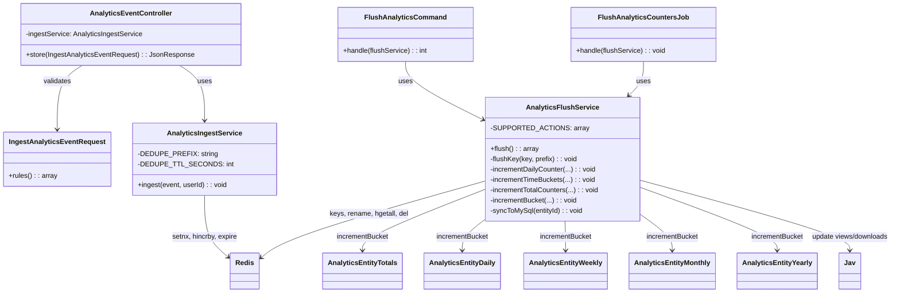

# Analytics Code Structure (FE / BE)

This document describes where analytics code lives, which classes and files are responsible for what, and how data flows through the layers. Use it to find the right place to change behavior or add features.

---

## Backend Structure

### Directory layout (Core + JAV)

```text
Modules/Core/
├── app/
│   ├── Enums/
│   │   ├── AnalyticsAction.php      # view, download
│   │   ├── AnalyticsDomain.php      # jav
│   │   └── AnalyticsEntityType.php  # movie, actor, tag
│   ├── Http/
│   │   ├── Controllers/Api/
│   │   │   └── AnalyticsEventController.php   # POST /api/v1/analytics/events
│   │   └── Requests/
│   │       └── IngestAnalyticsEventRequest.php
│   ├── Services/
│   │   ├── AnalyticsIngestService.php   # Redis dedupe + counter increment
│   │   ├── AnalyticsFlushService.php    # Redis → Mongo rollups + MySQL sync
│   │   ├── AnalyticsParityService.php   # Mongo vs MySQL comparison
│   │   └── AnalyticsArtifactSchemaService.php
│   ├── Models/Mongo/Analytics/
│   │   ├── AnalyticsEntityTotals.php
│   │   ├── AnalyticsEntityDaily.php
│   │   ├── AnalyticsEntityWeekly.php
│   │   ├── AnalyticsEntityMonthly.php
│   │   └── AnalyticsEntityYearly.php
│   ├── Console/
│   │   ├── FlushAnalyticsCommand.php
│   │   ├── AnalyticsParityCheckCommand.php
│   │   ├── AnalyticsReportGenerateCommand.php
│   │   └── AnalyticsReportVerifyCommand.php
│   └── Jobs/
│       └── FlushAnalyticsCountersJob.php   # Optional queue-based flush
├── routes/
│   └── api.php   # v1/analytics/events route
└── resources/js/Services/
    └── analyticsService.js   # FE singleton tracker

Modules/JAV/
├── app/
│   ├── Http/
│   │   ├── Controllers/Admin/
│   │   │   ├── AnalyticsController.php        # Page: /jav/admin/analytics
│   │   │   └── Api/
│   │   │       └── AnalyticsController.php    # API: overview, distribution, trends, etc.
│   │   └── Requests/
│   │       └── AnalyticsApiRequest.php
│   └── Services/
│       ├── AnalyticsReadService.php      # Snapshot from MySQL for admin page
│       ├── ActorAnalyticsService.php     # ES + MySQL for advanced admin APIs
│       └── JavAnalyticsTrackerService.php   # BE tracker (e.g. trackDownload)
└── resources/js/
    ├── Pages/Admin/Analytics.vue   # Admin analytics Vue page
    ├── Pages/Movies/Show.vue       # Consumer: track view on mount
    └── Components/ActorInsightsPanel.vue
```

Config and scheduling:

- **Config:** `config/analytics.php` (Redis prefix, flush interval, rate limit, evidence options).
- **Scheduling:** `Modules/Core/app/Providers/CoreServiceProvider.php` registers `analytics:flush` and evidence commands on the Laravel scheduler.

---

## Class Diagram (Backend)




---

## Frontend Structure


- **File:** `Modules/Core/resources/js/Services/analyticsService.js`
- **Export:** Single instance (singleton) as default export.
- **Consumers:** e.g. `Modules/JAV/resources/js/Pages/Movies/Show.vue` (calls `analyticsService.track('view', 'movie', jav.uuid)` on mount).
- **Constants:** `ALLOWED_ACTIONS` (`view`, `download`), `ALLOWED_ENTITY_TYPES` (`movie`, `actor`, `tag`), `SESSION_PREFIX` (`anl:track:v1:`).

---

## File-by-File Responsibilities

### Core – Ingest path

| File | Responsibility |
|------|----------------|
| `Core/routes/api.php` | Registers `POST /api/v1/analytics/events` with `throttle:analytics` and `AnalyticsEventController@store`. |
| `AnalyticsEventController` | Receives request, validates via `IngestAnalyticsEventRequest`, calls `AnalyticsIngestService::ingest()`, returns 202 JSON. |
| `IngestAnalyticsEventRequest` | Rules: `event_id`, `domain` (enum), `entity_type` (enum), `entity_id`, `action` (enum), `value` (optional 1–100), `occurred_at` (date). |
| `AnalyticsIngestService` | Dedupe by `anl:evt:{event_id}` (SETNX + EXPIRE 48h); then HINCRBY on Redis key `{prefix}:{domain}:{entity_type}:{entity_id}` for total and for `{action}:{date}`. |
| `AnalyticsAction`, `AnalyticsDomain`, `AnalyticsEntityType` | Enums used by validation and services so literals are not scattered. |

### Core – Flush and persistence

| File | Responsibility |
|------|----------------|
| `AnalyticsFlushService` | Scans Redis keys under prefix; for each key: rename to temp, HGETALL, parse total vs daily fields; increment Mongo totals/daily/weekly/monthly/yearly; for `jav`/`movie` sync `jav.views`/`jav.downloads` in MySQL; DEL temp key. |
| `FlushAnalyticsCommand` | CLI entry; calls `AnalyticsFlushService::flush()`, prints keys/errors. |
| `FlushAnalyticsCountersJob` | Queue job that runs the same flush; used if you want flush on queue instead of scheduler. |
| `AnalyticsEntityTotals` / `Daily` / `Weekly` / `Monthly` / `Yearly` | Mongo Eloquent models; collections hold per-entity, per-period counts (`view`, `download`). |

### Core – Parity and evidence

| File | Responsibility |
|------|----------------|
| `AnalyticsParityCheckCommand` | Compares MySQL `jav` counters with Mongo totals. |
| `AnalyticsReportGenerateCommand` | Generates evidence artifacts (e.g. parity JSON, rollback, archive). |
| `AnalyticsReportVerifyCommand` | Verifies artifact schema/integrity in a directory. |
| `AnalyticsParityService` / `AnalyticsArtifactSchemaService` | Used by report/verify commands for comparison and schema. |

### JAV – Admin page and read path

| File | Responsibility |
|------|----------------|
| `JAV/routes/web.php` | `GET /jav/admin/analytics` → `AnalyticsController@indexVue`; `GET /jav/admin/analytics/*-data` etc. → `Admin\Api\AnalyticsController`. |
| `AnalyticsController` | Inertia page; validates `AnalyticsRequest` (e.g. `days`), calls `AnalyticsReadService::getSnapshot($days)`, passes result as props to `Admin/Analytics.vue`. |
| `AnalyticsReadService` | Builds snapshot from MySQL: totals, today created, daily created, provider stats, top viewed/downloaded/rated, quality metrics, sync health. No Elasticsearch. |
| `Admin\Api\AnalyticsController` | JSON endpoints for overview, distribution, association, trends, predict, actor-insights, quality, suggest; delegates to `ActorAnalyticsService`; handles 503 for Elasticsearch. |
| `ActorAnalyticsService` | Implements distribution/association/trends/overview/actor-insights/quality/suggest/predict using MySQL and optionally Elasticsearch. |
| `AnalyticsApiRequest` | Validates query/body params for admin API (dimension, genre, size, type, q, actor_uuid, etc.). |

### JAV – Backend tracker

| File | Responsibility |
|------|----------------|
| `JavAnalyticsTrackerService` | Builds event array and calls `AnalyticsIngestService::ingest()`; used for server-side actions (e.g. `trackDownload($jav)`). |

### Frontend

| File | Responsibility |
|------|----------------|
| `analyticsService.js` | Singleton; validates action/entityType/entityId; session+memory dedupe; POST to `/api/v1/analytics/events`; returns boolean. |
| `Admin/Analytics.vue` | Renders charts and tables from snapshot + advanced API data. |
| `Movies/Show.vue` | Calls `analyticsService.track('view', 'movie', jav.uuid)` on mount. |
| `ActorInsightsPanel.vue` | Uses actor-insights API for a given actor. |

---

## Logic Flow by Layer (Summary)

1. **Produce event**  
   FE: `analyticsService.track(...)` → POST to ingest API. BE: `JavAnalyticsTrackerService::trackDownload($jav)` → `AnalyticsIngestService::ingest()`.

2. **Ingest**  
   API validates → IngestService dedupes by `event_id` → increments Redis hash (total + `action:date`).

3. **Flush (scheduled or manual)**  
   FlushCommand or Job → FlushService scans Redis keys → renames key, reads hash → writes Mongo totals + daily/weekly/monthly/yearly → for jav/movie updates MySQL `jav.views`/`jav.downloads`.

4. **Admin read**  
   Page load: AnalyticsController → AnalyticsReadService.getSnapshot(days) → MySQL only → Inertia props to Vue. Advanced: Vue calls Admin API → ActorAnalyticsService → MySQL + Elasticsearch → JSON for charts.

For the full request path with diagrams, see [Request lifecycle](request-lifecycle.md). For data shapes and collections, see [Data model](data-model.md).
