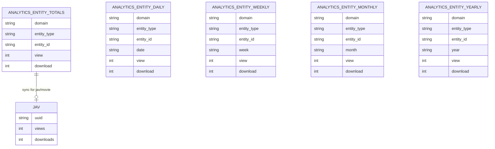

# Analytics Data Model

This document describes the **data structures** used by the analytics module: Redis keys, MongoDB collections, and MySQL fields. It is intended for developers who need to query, debug, or extend analytics storage.

---

## Redis

### Key patterns

| Key pattern | TTL | Purpose |
|-------------|-----|---------|
| `anl:evt:{event_id}` | 48 hours (172800 s) | Dedupe: same event_id is only counted once within the window. Value is `1`. |
| `{ANALYTICS_REDIS_PREFIX}:{domain}:{entity_type}:{entity_id}` | None (deleted after flush) | Hot counter hash. Default prefix: `anl:counters`. Example: `anl:counters:jav:movie:f6f7163c-4c8c-4ce8-bfe5-7dbd7574d273`. |

### Counter hash fields

Each counter key is a Redis hash. Fields are:

- **Total per action:** `view`, `download` (integer values).
- **Daily per action:** `view:YYYY-MM-DD`, `download:YYYY-MM-DD` (e.g. `view:2026-02-19`).

Example after a few events:

```text
HGETALL anl:counters:jav:movie:abc-123
  view       -> 5
  view:2026-02-19 -> 3
  view:2026-02-18 -> 2
  download   -> 1
  download:2026-02-19 -> 1
```

During flush, the key is renamed to a temporary key, read with HGETALL, then the temporary key is deleted. Totals are written to Mongo `analytics_entity_totals`; daily fields drive `analytics_entity_daily` and derived weekly/monthly/yearly buckets.

### Constraints

- Dedupe key uses `SETNX`; first writer wins. TTL ensures old event_ids do not stay forever.
- Counter key format must be exactly `{prefix}:{domain}:{entity_type}:{entity_id}` (three segments after prefix). Malformed keys are logged and skipped during flush.

---

## MongoDB (Laravel Eloquent models)

All analytics rollup models use the `mongodb` connection and live under `Modules\Core\Models\Mongo\Analytics\*`.

### analytics_entity_totals

- **Model:** `AnalyticsEntityTotals`
- **Collection:** `analytics_entity_totals`
- **Purpose:** Persistent total counts per entity (domain + entity_type + entity_id).
- **Unique key:** `(domain, entity_type, entity_id)`.
- **Fields:**

| Field | Type | Description |
|-------|------|-------------|
| domain | string | e.g. `jav` |
| entity_type | string | `movie`, `actor`, `tag` |
| entity_id | string | UUID of the entity |
| view | int | Total view count |
| download | int | Total download count |

### analytics_entity_daily

- **Model:** `AnalyticsEntityDaily`
- **Collection:** `analytics_entity_daily`
- **Purpose:** Counts per entity per calendar day.
- **Unique key:** `(domain, entity_type, entity_id, date)`.
- **Fields:** Same as totals, plus `date` (string `YYYY-MM-DD`).

### analytics_entity_weekly

- **Model:** `AnalyticsEntityWeekly`
- **Collection:** `analytics_entity_weekly`
- **Purpose:** Counts per entity per ISO week.
- **Unique key:** `(domain, entity_type, entity_id, week)`.
- **Fields:** Same as totals, plus `week` (string, e.g. `2026-W08`).

### analytics_entity_monthly

- **Model:** `AnalyticsEntityMonthly`
- **Collection:** `analytics_entity_monthly`
- **Purpose:** Counts per entity per month.
- **Unique key:** `(domain, entity_type, entity_id, month)`.
- **Fields:** Same as totals, plus `month` (string `YYYY-MM`).

### analytics_entity_yearly

- **Model:** `AnalyticsEntityYearly`
- **Collection:** `analytics_entity_yearly`
- **Purpose:** Counts per entity per year.
- **Unique key:** `(domain, entity_type, entity_id, year)`.
- **Fields:** Same as totals, plus `year` (string `YYYY`).

### ER-style relationship (conceptual)



Totals are the source of truth for “all time” per entity. Daily/weekly/monthly/yearly are derived from the same flush using the event date. MySQL `jav.views` and `jav.downloads` are synced from `analytics_entity_totals` for `domain=jav` and `entity_type=movie` only.

---

## MySQL

### jav (catalog table)

- **Purpose:** Movie catalog; user-facing and admin-facing views/download counts.
- **Analytics-related columns:**

| Column | Type | Description |
|--------|------|-------------|
| views | int | Total view count; updated by AnalyticsFlushService when flushing that movie’s entity_id. |
| downloads | int | Total download count; same source. |

These are **replicas** of the Mongo totals for `domain=jav`, `entity_type=movie`, and `entity_id = jav.uuid`. Parity check compares these to Mongo totals.

### Other tables used by admin snapshot

- **actors,** **tags:** totals and today/daily created counts.
- **favorites,** **watchlists,** **ratings,** **user_jav_history:** daily engagement series.
- **jav_actor,** **jav_tag:** link counts for quality metrics.
- **jobs,** **failed_jobs:** sync health (pending, failed 24h).

Schema details for these are in the main [Data model](../architecture/data-model.md).

---

## Data dictionary (analytics-specific)

| Term | Where | Meaning |
|------|--------|---------|
| Hot counter | Redis | Hash key under `ANALYTICS_REDIS_PREFIX` holding current increments before flush. |
| Dedupe key | Redis | `anl:evt:{event_id}`; prevents double count for same event within TTL. |
| Totals | Mongo | `analytics_entity_totals`; one document per (domain, entity_type, entity_id). |
| Daily bucket | Mongo | `analytics_entity_daily`; one document per (..., date). |
| Period bucket | Mongo | Weekly/monthly/yearly collections; same idea with week/month/year key. |
| Parity | MySQL vs Mongo | Equality of `jav.views`/`jav.downloads` with Mongo totals for that movie. |

---

## Indexes and performance

- **Redis:** No explicit index; keys are scanned by prefix during flush. Key count should be bounded by active entities.
- **Mongo:** Applications typically create unique compound indexes on (domain, entity_type, entity_id) and (domain, entity_type, entity_id, date|week|month|year) for upserts and lookups. Laravel MongoDB driver and migrations may define these; check the project’s migration or schema setup.
- **MySQL:** `jav.uuid` is used for updates during flush; ensure index on `uuid` for fast updates.

For request flow that uses this data, see [Request lifecycle](request-lifecycle.md). For code that reads/writes these structures, see [Code structure](code-structure.md).
