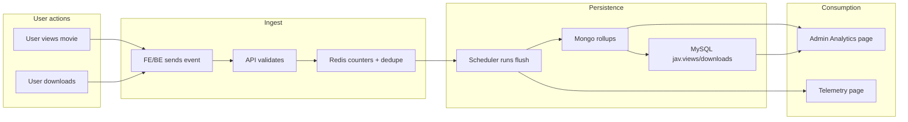

# Analytics Overview

This document explains **what** the analytics system is, **why** it exists, **how** it was developed, and how it delivers business value. It is written so that Business Analysts (BA), freshers, and technical leads can understand the analytics module without prior code knowledge.

---

## What Is Analytics?

XCrawlerII Analytics is a **hybrid tracking and reporting system** that does three things:

1. **Event ingest pipeline**  
   When a user views a movie or triggers a download, the system records that action as an "event." Events are counted and stored so we can measure engagement (views, downloads).

2. **Admin insights pipeline**  
   Admins see dashboards with catalog quality, top movies by views/downloads, actor/genre distributions, trends over time, and suggestions. This helps content strategy and quality decisions.

3. **Operational telemetry pipeline**  
   Queue jobs (sync, crawl) emit lifecycle events (started, completed, rate-limited). These are stored and shown on telemetry pages so operators can monitor queue health and spot issues quickly.

In short: **analytics = count user actions (view/download), store them efficiently, roll them up by time (day/week/month/year), sync totals to the catalog, and expose them to admins and operators.**

---

## Why Does Analytics Exist?

- **Product teams** need measurable engagement (who views what, what gets downloaded) and catalog quality metrics to prioritize improvements.
- **Operations teams** need fast feedback on queue and sync health (success rate, duration, rate limits) without digging through logs.
- **Admins** need segment analysis (e.g., by genre, actor age, source) to make content and quality decisions.

Without analytics, we would not know which content is popular, whether catalog quality is improving, or whether our sync pipelines are healthy.

---

## How It Was Developed (Evolution)

1. **Strict event contract**  
   Every event has: `domain`, `entity_type`, `action`, `occurred_at`, and `event_id`. This keeps ingestion consistent and testable.

2. **Fast ingest in Redis**  
   Events are first written to Redis as counters (in-memory, very fast). A dedupe key (`event_id`) prevents the same event from being counted twice within 48 hours.

3. **Scheduled flush into Mongo and MySQL**  
   A scheduled job runs periodically (e.g., every minute). It reads Redis counters, writes them into MongoDB collections (totals + daily/weekly/monthly/yearly rollups), and syncs movie totals to MySQL (`jav.views`, `jav.downloads`) so the catalog shows up-to-date numbers.

4. **Admin analytics APIs and Vue dashboards**  
   Admin pages request data from backend APIs. The backend reads from MySQL (snapshot, top lists, quality) and Elasticsearch (segment aggregations) and returns JSON for charts and tables.

5. **Parity and evidence commands**  
   Commands like `analytics:parity-check` and `analytics:report:generate` / `analytics:report:verify` ensure Mongo totals match MySQL and produce auditable evidence for compliance or debugging.

---

## User Stories / Use Cases

| Role | Goal | How analytics helps |
|------|------|----------------------|
| **End user** | Watch a movie detail page | View is tracked automatically; no extra action. |
| **End user** | Download a movie | Download is tracked server-side when the action completes. |
| **Admin** | See which movies are most viewed | Open Admin → Analytics; "Top viewed" and "Top downloaded" come from MySQL counters (synced from analytics). |
| **Admin** | Understand catalog quality | Quality section shows missing actors/tags/images/dates and orphan counts. |
| **Admin** | See trends by genre or segment | Advanced endpoints (distribution, trends, actor insights) use Elasticsearch and MySQL. |
| **Operator** | Check queue health | Job telemetry page shows job lifecycle events and rate-limit alerts. |
| **Developer** | Verify analytics pipeline | Run `analytics:flush`, `analytics:parity-check`, and `analytics:report:verify` locally or in CI. |

---

## Business Flow Diagram

High-level flow from user action to visible metrics:

---

## KPIs / Success Metrics (Analytics Module)

| Metric | What it means | Target |
|--------|----------------|--------|
| **Event ingest acceptance rate** | Share of ingest requests that return 202 (accepted) | High; rejections only for validation/throttle. |
| **Dedupe effectiveness** | Duplicate `event_id` requests are ignored | No double-counting within 48h window. |
| **Flush reliability** | Flush runs without errors | Error count per run should be 0 or minimal; errors logged. |
| **Parity mismatch count** | Differences between MySQL counters and Mongo totals | Zero or explained (e.g., timing). |
| **Admin dashboard responsiveness** | Time to load analytics page and charts | Acceptable for day range (e.g., 14 days); no timeouts. |

---

## Glossary (Analytics)

| Term | Definition |
|------|------------|
| **Event** | A single recorded action: e.g. one "view" or one "download" for a given entity (movie/actor/tag). |
| **Event ID** | Unique identifier for an event; used to deduplicate (same ID = same event, counted once). |
| **Domain** | Business domain of the entity; currently only `jav`. |
| **Entity type** | Kind of thing being tracked: `movie`, `actor`, or `tag`. |
| **Action** | What happened: `view` or `download`. |
| **Ingest** | Receiving an event via API and writing it to Redis counters. |
| **Hot counters** | Redis keys holding current increments (per entity and per day) before they are flushed. |
| **Dedupe** | Preventing the same event from being counted more than once (by `event_id`, 48h TTL). |
| **Flush** | Moving Redis counter values into Mongo rollups and syncing movie totals to MySQL. |
| **Rollup** | Aggregated bucket of counts by time period: daily, weekly, monthly, yearly, or total. |
| **Parity check** | Comparing MySQL `jav.views`/`jav.downloads` with Mongo totals to detect drift. |
| **Evidence** | Generated artifacts (e.g. parity JSON, archives) used for auditing or debugging. |
| **Telemetry event** | Queue/job lifecycle event (e.g. started, completed, rate_limit_exceeded) for operational monitoring. |

---

## Where to Go Next

- **How to use (FE/BE):** [Usage](usage.md)
- **Code structure and classes:** [Code structure](code-structure.md)
- **Request lifecycle and diagrams:** [Request lifecycle](request-lifecycle.md)
- **Analytics data model:** [Data model](data-model.md)
- **API details:** [../api/api-reference.md](../api/api-reference.md)
