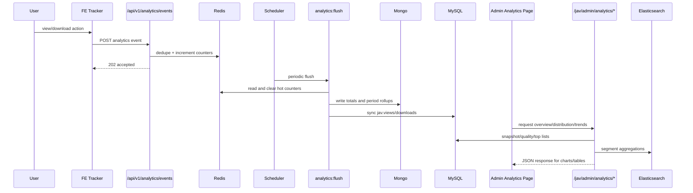

# Analytics Request Lifecycle

## End-to-End Flow

This flow covers both ingestion and admin consumption paths.

## Middleware, Validation, Boundaries

- Ingest middleware: `api` + `throttle:analytics`.
- Admin analytics middleware: `web` + `auth` + `role:admin`.
- Validation:
  - Ingest: `IngestAnalyticsEventRequest`
  - Admin analytics queries: `AnalyticsApiRequest`
- Transaction boundaries:
  - Ingest is counter-based and non-transactional.
  - Flush handles each counter key independently to limit blast radius.
- Error handling:
  - Validation: `422`
  - Unauthorized/forbidden: `401/403`
  - Rate limiting: `429`
  - Backend dependency issue: `503`
  - Unexpected failure: `500`
