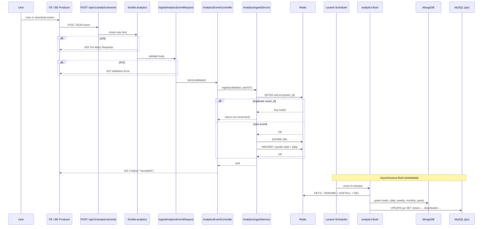
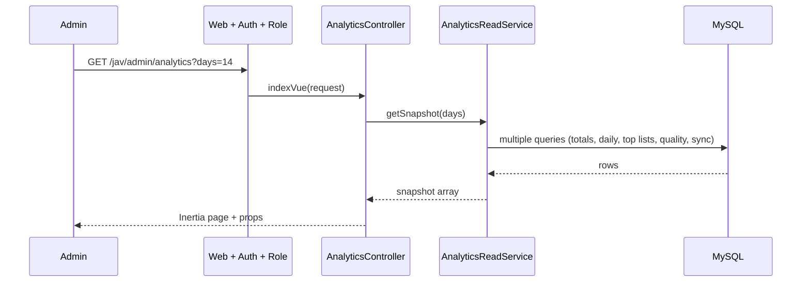
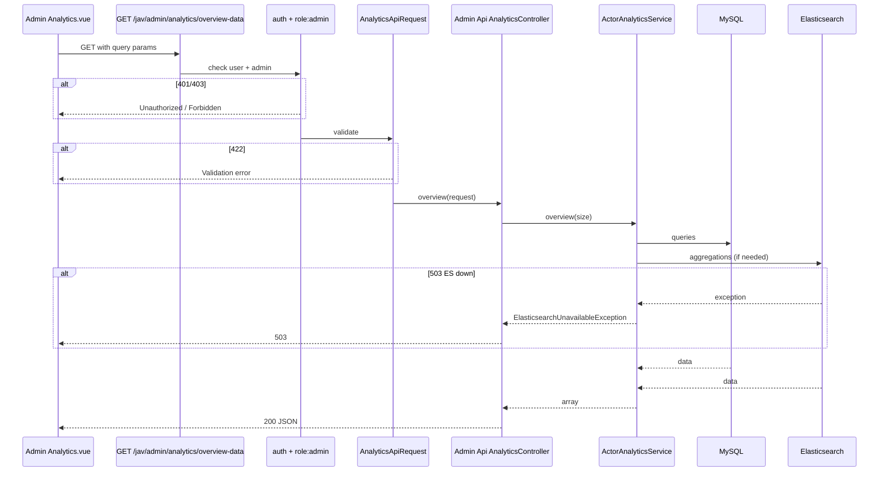
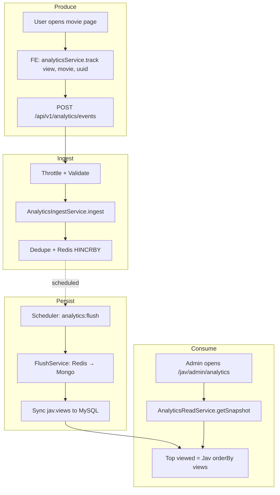

# Analytics Request Lifecycle

This document describes the **step-by-step path** of analytics-related requests from start to finish: ingest (event submission) and admin consumption. It includes middleware, validation, persistence, and error handling so developers and operators know exactly what happens at each stage.

---

## 1. Ingest Path: From User Action to 202 Accepted

This is the path when a **frontend or backend producer** sends an analytics event (e.g. one "view" or one "download") to the API.

### Step-by-step (ingest)

| Step | Where | What happens |
|------|--------|----------------|
| 1 | Client (FE or BE) | Sends `POST /api/v1/analytics/events` with JSON body (`event_id`, `domain`, `entity_type`, `entity_id`, `action`, `value?`, `occurred_at`). |
| 2 | Laravel router | Matches route under `v1/analytics` prefix; applies middleware group `api` (e.g. JSON, CORS, no session required for auth). |
| 3 | Throttle | Middleware `throttle:analytics` runs. Limit is from config (e.g. 60/min). If exceeded → **429 Too Many Requests**; body not processed. |
| 4 | Controller | `AnalyticsEventController@store` is invoked with `IngestAnalyticsEventRequest` as type-hint. |
| 5 | Validation | Laravel runs `IngestAnalyticsEventRequest::rules()`. Fails if e.g. missing required fields, wrong enum values, invalid date. On failure → **422 Unprocessable Entity** with validation messages. |
| 6 | Controller action | Controller gets `$request->validated()` and optional `auth()->id()`; calls `$this->ingestService->ingest($validated, $userId)`. |
| 7 | Ingest service | Dedupe: `Redis::setnx('anl:evt:' . event_id, 1)`; if key already existed, method returns (no increment). If new, `Redis::expire(..., 172800)` (48h). Then `Redis::hincrby(counterKey, action, value)` and `Redis::hincrby(counterKey, action . ':' . date, value)`. Counter key format: `{prefix}:{domain}:{entity_type}:{entity_id}`. |
| 8 | Response | Controller returns `response()->json(['status' => 'accepted'], 202)`. |
| 9 | (Later) Scheduler | Separate process: cron runs `php artisan schedule:run`; schedule runs `analytics:flush` every N minutes. Flush reads Redis counters, writes Mongo rollups, syncs MySQL, then deletes the counter keys. |

**Important:** The ingest path does **not** open a database transaction. It is idempotent per `event_id` (dedupe). Failures after Redis write (e.g. before 202 is sent) can still leave counters incremented; duplicate retries are then deduped.

### Ingest lifecycle diagram

---

## 2. Flush Path: From Redis to Mongo and MySQL

The flush does **not** start from an HTTP request; it runs from the Laravel scheduler (or manually via `php artisan analytics:flush`).

| Step | Where | What happens |
|------|--------|----------------|
| 1 | Scheduler or CLI | Runs `analytics:flush` (FlushAnalyticsCommand) or dispatches FlushAnalyticsCountersJob. |
| 2 | AnalyticsFlushService::flush() | `Redis::keys('{prefix}:*')` to get all counter keys. |
| 3 | Per key | For each key: parse `domain`, `entity_type`, `entity_id` from key string. Rename key to a temporary key (atomic). HGETALL; DEL temporary key. Parse hash fields: simple action name → add to total increments; `action:date` → increment daily and derive week/month/year, increment those buckets. |
| 4 | Mongo | For totals: firstOrCreate by (domain, entity_type, entity_id), then increment `view`/`download` and save. For daily/weekly/monthly/yearly: same pattern with period key (date, week, month, year). |
| 5 | MySQL | If domain is `jav` and entity_type is `movie`, load Mongo totals for that entity_id and update `Jav::where('uuid', entity_id)` with `views` and `downloads`. |
| 6 | Errors | If any key throws, error is logged and counted; loop continues. Command exits with non-zero if any errors. |

**Transaction boundaries:** Flush does not wrap the whole run in a single DB transaction. Each key is processed independently so one bad key does not roll back others.

---

## 3. Admin Snapshot Path: Page Load

When an **admin** opens the analytics page (`/jav/admin/analytics`), the following happens for the **initial snapshot** (no Elasticsearch).

| Step | Where | What happens |
|------|--------|----------------|
| 1 | Browser | GET `/jav/admin/analytics?days=14` (or default). |
| 2 | Web middleware | Session, cookie, CSRF. |
| 3 | Auth | User must be authenticated. |
| 4 | Role | Admin role required (`role:admin`). If not → **403 Forbidden**. |
| 5 | Controller | `AnalyticsController@indexVue`; request validated by `AnalyticsRequest` (e.g. `days`). |
| 6 | AnalyticsReadService::getSnapshot($days) | Builds snapshot from MySQL only: totals (jav, actors, tags), today created, daily created series, provider stats, top viewed/downloaded/rated, quality metrics, sync health. |
| 7 | Inertia | Controller returns `Inertia::render('Admin/Analytics', $props)`. Server sends HTML + JSON props. |
| 8 | Vue | Page renders; may later call advanced API endpoints (overview-data, distribution-data, etc.) which go through Admin API lifecycle below. |

### Admin snapshot diagram (simplified)

---

## 4. Admin API Path: Advanced Endpoints

When the **Vue app** calls endpoints like `GET /jav/admin/analytics/overview-data` or `GET /jav/admin/analytics/actor-insights`:

| Step | Where | What happens |
|------|--------|----------------|
| 1 | Browser | GET/POST to `/jav/admin/analytics/{action}` with query/body (e.g. dimension, genre, size, actor_uuid). |
| 2 | Middleware | `web`, `auth`, `role:admin`. 401/403 if not logged in or not admin. |
| 3 | Request | `AnalyticsApiRequest` validates query/body (dimension, genre, size, type, q, actor_uuid, etc.). |
| 4 | Controller | `Modules\JAV\Http\Controllers\Admin\Api\AnalyticsController` method (e.g. `overview`, `distribution`, `actorInsights`) extracts params and calls `ActorAnalyticsService`. |
| 5 | Service | ActorAnalyticsService runs MySQL and/or Elasticsearch queries; returns array. |
| 6 | Response | Controller returns `response()->json($result)`. On exception: Elasticsearch unavailable → **503**; HttpException → status from exception; other → **500** and report. |
| 7 | Vue | Consumes JSON for charts/tables. |

### Admin API lifecycle (one request)

---

## 5. End-to-End Request Circle (Single Event to Visible Metric)

One user view from "click" to "number on admin dashboard":

---

## 6. Middleware, Validation, and Error Summary

| Layer | Ingest API | Admin page | Admin API |
|-------|------------|------------|-----------|
| **Middleware** | `api`, `throttle:analytics` | `web`, `auth`, `role:admin` | `web`, `auth`, `role:admin` |
| **Validation** | `IngestAnalyticsEventRequest` (event_id, domain, entity_type, entity_id, action, value?, occurred_at) | `AnalyticsRequest` (e.g. days) | `AnalyticsApiRequest` (dimension, genre, size, type, q, actor_uuid, etc.) |
| **401** | N/A (public ingest) | Not logged in | Not logged in |
| **403** | N/A | Not admin | Not admin |
| **422** | Invalid payload | Invalid query | Invalid params |
| **429** | Throttle exceeded | N/A | N/A |
| **503** | Backend dependency (e.g. Redis down) | N/A | Elasticsearch unavailable |
| **500** | Unexpected server error | Unexpected | Unexpected (reported) |

**Transaction boundaries:**

- Ingest: no DB transaction; Redis operations are atomic per key.
- Flush: no single transaction; per-key processing; errors logged, batch continues.
- Admin read: normal MySQL/ES queries; no multi-step transaction required for snapshot.

For more on error handling and recovery, see [Troubleshooting / FAQ](../troubleshooting/faq.md).
