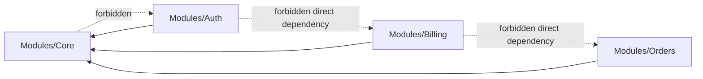

# 01 - Module Boundaries and Dependencies

## Dependency Diagram


## Core Scope
Rule `01-MOD-001`:
Core contains only shared/general assets: abstractions, contracts, shared DTOs/enums/constants, FE master layout/base/shared components/composables/http wrapper, logging wrapper, and error schema helpers.

Rationale:
Core is a stable platform layer, not a feature bucket.

Allowed:
```php
namespace Modules\Core\Contracts;
interface SmsGatewayPort { public function send(string $to, string $message): void; }
```

Forbidden:
```php
namespace Modules\Core\Services;
class BillingInvoiceService {}
```

Verification:
- Core classes are domain-agnostic.
- Feature-specific nouns are absent from Core except contract names.

## Dependency Direction
Rule `01-MOD-002`:
Feature modules MAY depend on Core. Core MUST NOT depend on feature modules.

Rationale:
One-way dependency prevents cycles and hidden coupling.

Allowed:
```php
use Modules\Core\Contracts\AuditLogger;
```

Forbidden:
```php
use Modules\Orders\app\Services\OrderService;
```

Verification:
- Static scan for feature imports in Core returns none.

## Inter-Feature Communication
Rule `01-MOD-003`:
Feature modules MUST NOT directly depend on each other. Cross-module interaction must go through explicit contracts in Core.

Rationale:
Contracts preserve replaceability and independent evolution.

Allowed:
```php
interface CustomerReadPort { public function findById(int $id): ?CustomerSummaryDto; }
```

Forbidden:
```php
use Modules\Customer\app\Repositories\CustomerRepository;
```

Verification:
- No direct inter-feature imports in feature modules.

## Public Contract Placement
Rule `01-MOD-004`:
Interfaces/enums/DTOs used by more than one module MUST live in Core.

Rationale:
Shared contracts need single ownership and version control.

Allowed:
```text
Modules/Core/app/Contracts/PaymentProviderPort.php
Modules/Core/app/DTO/PaymentResultDto.php
```

Forbidden:
```text
Modules/Billing/app/Contracts/PaymentProviderPort.php
```

Verification:
- Shared contract paths start with `Modules/Core/app`.

## Exception Link
Exceptions to this document MUST be registered in `11-exceptions-registry.md`.
