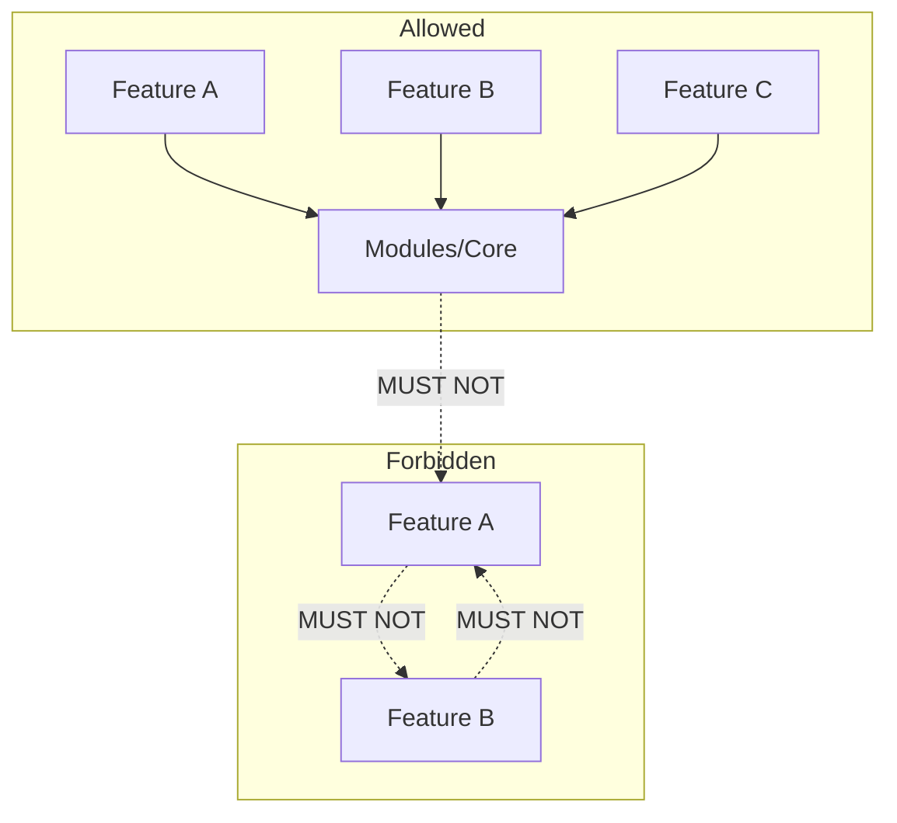

# 01 - Module Boundaries

## Purpose

Define dependency rules between modules so that Core remains domain-agnostic and feature modules stay independent and replaceable.

## Scope

- All code under `Modules/`
- Composer/autoload and runtime dependencies between modules

## Non-goals

- Package versioning or composer merge-plugin details (see project README/composer)
- Routing or controller layout inside a module (see [02-backend-layering](02-backend-layering.md))

## Definitions

| Term                  | Meaning                                                                                              |
| --------------------- | ---------------------------------------------------------------------------------------------------- |
| **Core**              | The single shared module: `Modules/Core`. Domain-agnostic contracts, base classes, shared FE assets. |
| **Feature module**    | Any other module under `Modules/` that implements a bounded feature (e.g. Auth, Crawler, Search).    |
| **Boundary contract** | Interface or abstract class in Core that defines how features or external systems interact.          |

---

## Dependency Diagram (allowed vs forbidden)



- **Allowed:** Feature → Core (one-way).
- **Forbidden:** Core → Feature; Feature → Feature (any direct dependency between two feature modules).

---

## Rules

### MOD-001: Core is the only shared module

**Rule:** `Modules/Core` is the ONLY shared module and MUST remain domain-agnostic. It must not contain feature-specific business logic or feature-specific nouns (except in contract/interface names that describe capabilities).

**Rationale:** Prevents Core from becoming a grab-bag of feature code and keeps the platform layer stable.

**Allowed:**

- Contracts in Core: `SmsGatewayPort`, `AuditLogger`, `CustomerReadPort`.
- Shared DTOs, enums, constants in Core.
- Base classes (e.g. `MongoDb` base model), shared HTTP client, master layout, shared Vue components.

**Anti-examples (forbidden):**

- `Modules\Core\Services\BillingInvoiceService` (feature-specific).
- `Modules\Core\Models\Order` (feature-specific; orders belong in an Orders or similar feature module).

**Enforcement:** Code review; static scan for feature-domain nouns in Core outside of Contracts/Interfaces.  
**References:** [02-backend-layering](02-backend-layering.md), [03-data-model-standards](03-data-model-standards.md).

---

### MOD-002: Feature modules may depend only on Core

**Rule:** Feature modules MAY depend on Core. They MUST NOT depend on any other feature module (no `use Modules\OtherFeature\...` from a feature module).

**Rationale:** Keeps features independently deployable and replaceable; avoids hidden coupling.

**Allowed:**

```php
// Inside Modules/Auth
use Modules\Core\Contracts\AuditLogger;
use Modules\Core\Dto\SomeSharedDto;
```

**Anti-examples (forbidden):**

```php
// Inside Modules/Auth
use Modules\Crawler\Services\CrawlerService;
use Modules\Billing\Repositories\InvoiceRepository;
```

**Enforcement:** Code review; Composer/autoload or static analysis to ensure no cross-feature `use` in `Modules/*` (except Core).  
**References:** [02-backend-layering](02-backend-layering.md).

---

### MOD-003: Inter-feature communication via Core contracts only

**Rule:** Inter-feature communication MUST be via Contracts/Interfaces (and optionally DTOs) defined in Core. Feature modules implement or consume these contracts; they must not call each other’s concrete classes.

**Rationale:** Preserves replaceability and keeps dependencies one-way (feature → Core).

**Allowed:**

- Core defines `CustomerReadPort`; Feature A implements it, Feature B consumes it via the interface (injected).
- Events/listeners if the event contract and payload are defined in Core or in a neutral namespace agreed in ADR.

**Anti-examples (forbidden):**

- Feature B importing and calling `FeatureA\Services\SomeService` directly.
- Feature B type-hinting `FeatureA\Dto\Something` in public API (DTOs crossing feature boundary should live in Core or be agreed in ADR).

**Enforcement:** Code review; dependency direction checks.  
**References:** [02-backend-layering](02-backend-layering.md), [06-code-review-checklist](06-code-review-checklist.md).

---

### MOD-004: Core must not depend on feature modules

**Rule:** Core MUST NOT depend on any feature module. No `use Modules\<Feature>\...` in Core code.

**Rationale:** Core is the stable platform; it must not be pulled into feature release cycles.

**Allowed:**

- Core only references its own namespace, framework, and third-party packages.

**Anti-examples (forbidden):**

```php
// In Modules/Core
use Modules\Auth\Services\AuthService;
```

**Enforcement:** Grep/static analysis: no imports from `Modules\*` in `Modules/Core` except `Modules\Core\*`.  
**References:** [06-code-review-checklist](06-code-review-checklist.md).

---

## Examples Summary

| Scenario                                          | Allowed? | Note              |
| ------------------------------------------------- | -------- | ----------------- |
| Auth uses `Modules\Core\Contracts\*`              | Yes      | Feature → Core    |
| Crawler uses `Modules\Core\Models\MongoDb` (base) | Yes      | Feature → Core    |
| Auth uses `Modules\Crawler\*`                     | No       | Feature → Feature |
| Core uses `Modules\Auth\*`                        | No       | Core → Feature    |
| Auth implements `Core\Contracts\AuditLogger`      | Yes      | Contract in Core  |

---

## Enforcement

- **PR:** Reviewers verify no new cross-feature or Core→Feature dependencies.
- **CI:** Optional: static analysis or custom rule to fail on forbidden `use` paths.
- **References:** [00-docs-classification](00-docs-classification.md), [02-backend-layering](02-backend-layering.md), [docs/reference/02-module-map](../reference/02-module-map.md).
