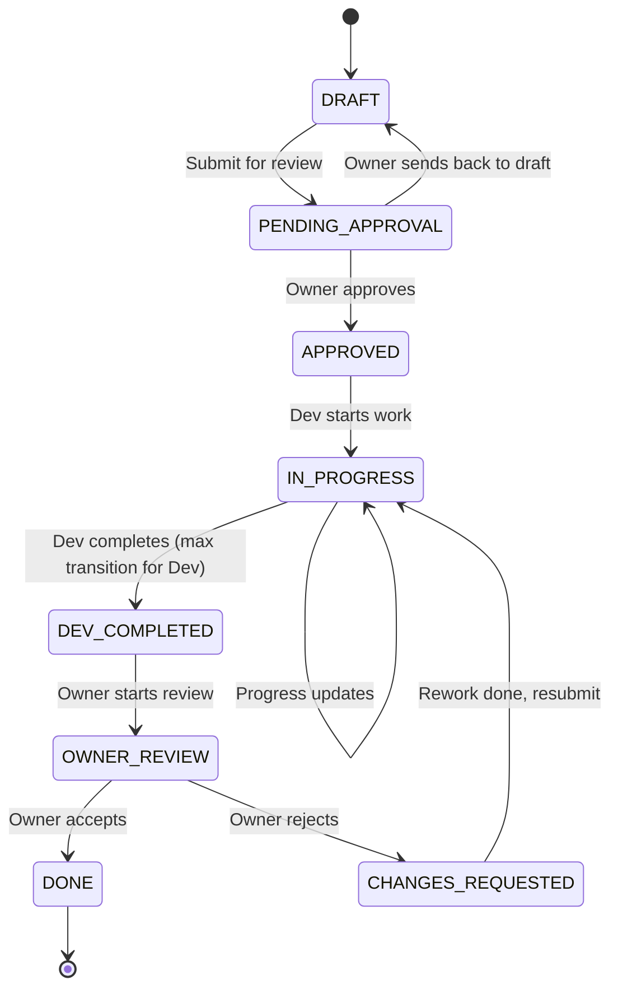

# 15 - Jira AI Workflow and Approval Gates

## Scope

This document defines the canonical AI-driven Jira workflow with strict Owner-gating. Implementation MUST NOT start before Owner approval. AI and Dev MUST NOT set tickets to DONE; only the Owner may do so.

References:

- [09 - Feature Definition of Done](./09-feature-definition-of-done.md) — DoD checklist and completion gate
- [12 - Git Hooks and Quality Gates](./12-git-hooks-and-quality-gates.md) — CI/quality gate contract
- [14 - Branch, Commit, and PR Rules](./14-branch-commit-pr-rules.md) — branch/PR flow

---

## 1. Core Workflow (Owner-Gated)

Rule `15-JIR-001`:
The following sequence MUST be followed. No implementation work (code/PR) is allowed before Owner approval.

1. **Owner requests feature** — Feature idea, constraints, stakeholders, and (optionally) deadline are provided.
2. **AI creates Jira tickets** — Epic/Story/Task/Subtask are created in **DRAFT** or **PENDING_APPROVAL**. NO implementation is allowed in this phase.
3. **Owner reviews and approves** — Only after Owner approval (transition to **APPROVED**) may processing start.
4. **During processing** — AI/Dev MUST push progress updates back to Jira (comments + status transitions per this doc).
5. **Dev completion** — Dev MAY move to **DEV_COMPLETED** but MUST NOT move to **DONE**.
6. **Owner review** — Owner (and in future, GitHub Actions quality gates) reviews; only Owner MAY set **DONE**.
7. **Rejection** — If Owner rejects, ticket moves to **CHANGES_REQUESTED** and back to **IN_PROGRESS** until fixed.

Rationale:
Owner-gating prevents scope creep, ensures business alignment, and keeps DONE semantics meaningful for stakeholders.

Verification:

- No PR linked to a ticket whose canonical status is DRAFT or PENDING_APPROVAL.
- No transition to DONE by any role other than Owner (enforced by Jira permissions or mapping).

---

## 2. Canonical Statuses (State Machine)

Rule `15-JIR-002`:
The following statuses are canonical. All transitions MUST respect the state machine below.

| Status                | Meaning                                      |
| --------------------- | -------------------------------------------- |
| **DRAFT**             | AI-proposed; not yet submitted for approval  |
| **PENDING_APPROVAL**  | Owner review required; no implementation     |
| **APPROVED**          | Owner approved; ready to process             |
| **IN_PROGRESS**       | Work in progress                             |
| **DEV_COMPLETED**     | Dev complete; ready for Owner QA             |
| **OWNER_REVIEW**      | Owner is reviewing (optional explicit state) |
| **DONE**              | Owner accepted; closed                       |
| **CHANGES_REQUESTED** | Owner rejected; bounce-back to rework        |

### 2.1 State Machine (Mermaid)



### 2.2 Allowed Transitions (Summary)

| From              | To                | Who               |
| ----------------- | ----------------- | ----------------- |
| DRAFT             | PENDING_APPROVAL  | AI, Owner         |
| PENDING_APPROVAL  | APPROVED          | Owner only        |
| PENDING_APPROVAL  | DRAFT             | Owner only        |
| APPROVED          | IN_PROGRESS       | Dev               |
| IN_PROGRESS       | DEV_COMPLETED     | Dev               |
| DEV_COMPLETED     | OWNER_REVIEW      | Owner (or system) |
| OWNER_REVIEW      | DONE              | Owner only        |
| OWNER_REVIEW      | CHANGES_REQUESTED | Owner only        |
| CHANGES_REQUESTED | IN_PROGRESS       | Dev               |

---

## 3. Mapping to Existing Jira Workflows

Rule `15-JIR-003`:
If Jira cannot support the exact canonical status names, a Mapping Table MUST be defined and documented so that gate semantics are preserved.

### 3.1 Mapping Table (Guidance)

Use one or more of the following without losing semantics:

| Approach                | Use Case                       | Example                                                                                                                               |
| ----------------------- | ------------------------------ | ------------------------------------------------------------------------------------------------------------------------------------- |
| **Labels**              | Status-like gates              | `AI-DRAFT`, `OWNER-APPROVAL-REQUIRED`, `DEV-COMPLETED`, `OWNER-REVIEW`                                                                |
| **Custom field**        | Single source of truth         | `CanonicalStatus` (select list): DRAFT, PENDING_APPROVAL, APPROVED, IN_PROGRESS, DEV_COMPLETED, OWNER_REVIEW, DONE, CHANGES_REQUESTED |
| **Components**          | Team/flow visibility           | Component `Owner-Gated` to filter tickets in this workflow                                                                            |
| **Jira status + label** | Map native status to canonical | Jira "In Progress" + label `CANONICAL-IN_PROGRESS`                                                                                    |

### 3.2 Preserving Gate Semantics

- **No implementation before approval**: Workflow MUST block transition from PENDING_APPROVAL to any "in progress" state unless transition is APPROVED. Use Jira workflow conditions: e.g. "Allow transition only if CustomField(ApprovedBy) is set" or "Only if user in role Owner."
- **Only Owner sets DONE**: Jira transition "Complete" / "Done" MUST be restricted to Owner role (or equivalent). If using labels, require label `OWNER-APPROVED` before allowing close.
- **Dev cannot set DONE**: Restrict the transition from DEV_COMPLETED/OWNER_REVIEW to DONE so that only Owner (or a service account used by Owner-only automation) can execute it.

Document the chosen mapping in project Confluence or in `docs/architecture/15-jira-ai-workflow-and-approval-gates.md` under "Project-specific mapping" so that AI and Dev use the same semantics.

---

## 4. Permissions and Transitions Matrix

Rule `15-JIR-004`:
The following permission matrix MUST be enforced (via Jira roles or mapping).

| Role            | Create tickets | Draft spec | Propose DRAFT ↔ PENDING_APPROVAL | APPROVED → IN_PROGRESS | IN_PROGRESS → DEV_COMPLETED | PENDING_APPROVAL → APPROVED | OWNER_REVIEW → DONE | OWNER_REVIEW → CHANGES_REQUESTED | Set DONE |
| --------------- | -------------- | ---------- | -------------------------------- | ---------------------- | --------------------------- | --------------------------- | ------------------- | -------------------------------- | -------- |
| **AI**          | Yes            | Yes        | Yes                              | No                     | No                          | No                          | No                  | No                               | **No**   |
| **Dev**         | No\*           | No         | No                               | Yes                    | Yes                         | No                          | No                  | No                               | **No**   |
| **Owner**       | Yes            | Yes        | Yes                              | No\*\*                 | No\*\*                      | Yes                         | Yes                 | Yes                              | **Yes**  |
| **Reviewer/QA** | No\*           | No         | No                               | No                     | No                          | No                          | No                  | No                               | **No**   |

\* Dev/QA may create sub-tasks or comments when allowed by project policy.  
\*\* Owner may move to IN_PROGRESS in exceptional cases (e.g. re-assignment); normally Dev does this.

- **AI**: Creates Epic/Story/Task/Subtask in DRAFT or PENDING_APPROVAL; proposes transitions only within Draft/Approval states.
- **Dev**: MAY transition APPROVED → IN_PROGRESS and IN_PROGRESS → DEV_COMPLETED. MUST NOT transition to DONE.
- **Owner**: Only role that MAY transition PENDING_APPROVAL → APPROVED and OWNER_REVIEW → DONE or CHANGES_REQUESTED.
- **Reviewer/QA**: MAY comment and update evidence; MUST NOT set DONE unless they hold the Owner role.

---

## 5. Exit Criteria per Status

Rule `15-JIR-005`:
Before transitioning from any status, the exit criteria for that status MUST be satisfied. Missing required fields or artifacts MUST be documented in the ticket (e.g. in "Open Questions" or a comment) and block transition until resolved.

### 5.1 DRAFT

| Item                   | Requirement                                                                                                                       |
| ---------------------- | --------------------------------------------------------------------------------------------------------------------------------- |
| **Required fields**    | Title, type (Epic/Story/Task/Subtask), role-based sections per [§7](#7-role-based-ticket-templates) filled to the extent possible |
| **Required artifacts** | None                                                                                                                              |
| **Who can transition** | AI, Owner                                                                                                                         |
| **Must never**         | Start implementation; link a PR; move to IN_PROGRESS                                                                              |

### 5.2 PENDING_APPROVAL

| Item                   | Requirement                                                                   |
| ---------------------- | ----------------------------------------------------------------------------- |
| **Required fields**    | Same as DRAFT; "Open Questions" and "Assumptions" populated for any ambiguity |
| **Required artifacts** | None                                                                          |
| **Who can transition** | Owner (to APPROVED or back to DRAFT)                                          |
| **Must never**         | Start implementation; link a PR; move to IN_PROGRESS                          |

### 5.3 APPROVED

| Item                   | Requirement                                           |
| ---------------------- | ----------------------------------------------------- |
| **Required fields**    | Owner approval recorded (comment or custom field)     |
| **Required artifacts** | None                                                  |
| **Who can transition** | Dev (to IN_PROGRESS)                                  |
| **Must never**         | Skip to DONE; move back to DRAFT without Owner action |

### 5.4 IN_PROGRESS

| Item                   | Requirement                                              |
| ---------------------- | -------------------------------------------------------- |
| **Required fields**    | Branch name, link to PR (when exists)                    |
| **Required artifacts** | START comment posted per [§8](#8-jira-comment-templates) |
| **Who can transition** | Dev (to DEV_COMPLETED) or Owner (e.g. reassign)          |
| **Must never**         | Move to DONE; remove required progress comments          |

### 5.5 DEV_COMPLETED

| Item                   | Requirement                                                                                                  |
| ---------------------- | ------------------------------------------------------------------------------------------------------------ |
| **Required fields**    | PR link, CI evidence (pass/fail + link)                                                                      |
| **Required artifacts** | DEV_COMPLETED comment per [§8](#8-jira-comment-templates)                                                    |
| **Who can transition** | Owner (or system) to OWNER_REVIEW                                                                            |
| **Must never**         | Dev moves to DONE; merge to production before Owner acceptance (unless project policy allows staged release) |

### 5.6 OWNER_REVIEW

| Item                   | Requirement                                                                                                    |
| ---------------------- | -------------------------------------------------------------------------------------------------------------- |
| **Required fields**    | All DoD items from [09-feature-definition-of-done](./09-feature-definition-of-done.md) addressed with evidence |
| **Required artifacts** | PR merged (or merge-ready); CI green; test summary                                                             |
| **Who can transition** | Owner only → DONE or CHANGES_REQUESTED                                                                         |
| **Must never**         | Dev or QA set DONE                                                                                             |

### 5.7 DONE

| Item                   | Requirement                                        |
| ---------------------- | -------------------------------------------------- |
| **Required fields**    | Owner acceptance recorded                          |
| **Required artifacts** | As per DoD; release/rollback plan if applicable    |
| **Who can transition** | N/A (terminal for completed work)                  |
| **Must never**         | Reopen without new ticket or formal change request |

### 5.8 CHANGES_REQUESTED

| Item                   | Requirement                                    |
| ---------------------- | ---------------------------------------------- |
| **Required fields**    | Owner comment describing what must change      |
| **Required artifacts** | None                                           |
| **Who can transition** | Dev → IN_PROGRESS after rework                 |
| **Must never**         | Move to DONE without addressing Owner feedback |

---

## 6. Update-Back to Jira Standard (Comments)

Rule `15-JIR-006`:
Progress and completion MUST be reflected in Jira using the following comment templates. Each template MUST be posted at the defined time.

### 6.1 START (Mandatory when Dev moves to IN_PROGRESS)

**When**: Before or immediately when development starts (branch created).

```markdown
## [START] Development started

- **Started by:** @{username}
- **Time:** {ISO8601}
- **Branch:** {branch name}
- **Ticket:** {ticket key}
- **Links:** (optional) draft PR / design doc
```

### 6.2 PROGRESS (Recommended on significant change or blocker)

**When**: On meaningful progress or when blocking issue arises.

```markdown
## [PROGRESS] Update

- **Updated by:** @{username}
- **Time:** {ISO8601}
- **What changed:** {short description}
- **Files touched:** {paths or "see PR"}
- **Status:** {current status}
- **Blockers:** {none | description}
```

### 6.3 DEV_COMPLETED (Mandatory when Dev moves to DEV_COMPLETED)

**When**: When transitioning to DEV_COMPLETED.

```markdown
## [DEV_COMPLETED] Ready for Owner QA

- **Completed by:** @{username}
- **Time:** {ISO8601}
- **PR:** {url}
- **CI:** {pass/fail} — {url}
- **Tests summary:** {e.g. Feature 3, Unit 5, all green}
- **How to verify:**
    1. {step}
    2. {step}
    3. … (3–7 steps)
- **DB migration notes:** {if any}
- **Rollback plan:** {short}
- **Remaining risks:** {if any}
```

---

## 7. Role-Based Ticket Templates

Rule `15-JIR-007`:
All tickets MUST follow the role-based structure below so that business stakeholders can read without technical noise, and junior developers can implement with minimal ambiguity. Any ambiguity MUST be captured under "Open Questions" and "Assumptions."

### 7.1 Epic

- **A. Business / Stakeholder Summary** — Non-technical; 2–4 sentences.
- **B. Problem Statement + Goal** — What problem and what success looks like.
- **C. Scope / Out of Scope** — Clear boundaries.
- **D. Personas / Users impacted** — Who is affected.
- **E. Success Metrics / KPIs** — If applicable.
- **F. Risks** — Business and delivery risks.
- **G. Dependencies** — Other teams, systems, or tickets.
- **H. Milestones** — List of Stories (links or titles).
- **I. Open Questions + Assumptions** — Explicit, testable assumptions; open questions listed.
- **J. Reference links** — Internal docs only.

### 7.2 Story

Strict order of sections:

1. **Business (for PO/BA)**
    - User Story (As… I want… So that…)
    - Background / Context
    - Business Rules (numbered)
    - Edge Cases (business)
    - Roles & Permissions
    - UX / Copy / i18n notes (if any)
    - Analytics/Tracking needs (if any)

2. **Acceptance Criteria (Given/When/Then)**
    - Minimum 8 AC bullets:
        - At least 3 happy paths
        - At least 3 unhappy/validation/permission paths
        - At least 1 edge/weird case
        - At least 1 security/abuse case if relevant

3. **Non-Functional Requirements** (as applicable)
    - Performance (latency, throughput)
    - Reliability (retry, idempotency)
    - Observability (logs/metrics/traces)
    - Security (PII, authz, rate limits)

4. **Technical (for SA/Dev) — Implementation Contract**
    - Architecture notes (module boundaries)
    - Data model changes (DB/Mongo/ES) + migration/index notes
    - API Contract: endpoint(s), method, auth, request/response schema, error codes
    - Domain objects / DTOs / Enums (fields + constraints)
    - Sequence / Flow (text + optional Mermaid)
    - Skeleton: file paths to create/change; class names + responsibilities; method signatures (inputs/outputs)
    - Backward compatibility notes

5. **Tasks Breakdown** — List of Tasks/Subtasks with clear DoD

6. **Testing Requirements (QA/Dev)**
    - Feature tests (full flow)
    - Unit tests (per class)
    - Security/exploit tests where applicable
    - Test data setup (factories)
    - Coverage expectations (if policy exists)

7. **Definition of Done** — Reference to [09-feature-definition-of-done](./09-feature-definition-of-done.md) + story-specific DoD

8. **Rollout / Release Plan** — Feature flags, migration order, rollback plan (if needed)

9. **Open Questions + Assumptions**

### 7.3 Task / Subtask

- **Goal** — One sentence
- **Implementation Steps** — Numbered, low ambiguity
- **Files to touch** — Paths
- **Code Skeleton** — Classes/method signatures
- **Edge cases to handle**
- **Tests to add/update**
- **DoD checklist**

---

## 8. Example: One Epic, One Story, Three Tasks (Hypothetical)

### Epic: XC-EPIC-001 — Export Crawl Results for Stakeholders

**A. Business / Stakeholder Summary**  
Stakeholders need to download crawl results (jobs and items) as CSV from the UI for ad-hoc analysis and reporting. No technical knowledge required.

**B. Problem Statement + Goal**  
Today, data is only visible in the app. Goal: allow "Export to CSV" from the crawl job detail screen with configurable columns and date range.

**C. Scope / Out of Scope**

- In scope: Single crawl job export; CSV; column selection; date filter.
- Out of scope: Bulk export across jobs; Excel; scheduled exports.

**D. Personas**  
PO, BA, internal ops.

**E. Success Metrics**  
Usage of export button; zero PII leakage in export.

**F. Risks**  
Large exports may timeout; mitigate with row limit and async in future.

**G. Dependencies**  
None.

**H. Milestones**

- XC-STORY-001: Export crawl results to CSV (single job)

**I. Open Questions + Assumptions**

- Assumption: Max 50k rows per export.
- Open: Should we add "Export history" in a later phase?

**J. Reference links**

- [05-api-contracts-restful](./05-api-contracts-restful.md)

---

### Story: XC-STORY-001 — Export Crawl Results to CSV (Single Job)

**1) Business**

- **User Story:** As a PO I want to export one crawl job’s results to CSV so that I can analyze them in a spreadsheet.
- **Background:** Crawl results are stored in DB; we add an export action.
- **Business Rules:**
    1. Only job owner or admin can export.
    2. Max 50k rows.
    3. Columns: id, url, status, created_at (default); optional columns configurable.
- **Edge Cases:** Empty result set → empty CSV with headers.
- **Roles & Permissions:** Job owner, Admin.
- **UX:** Button "Export CSV" on job detail page; progress indicator for large exports.

**2) Acceptance Criteria (8)**

- AC1 (happy): Given I am job owner, When I click Export CSV with default columns, Then I get a CSV file with headers and data.
- AC2 (happy): Given I am admin, When I export any job, Then I get the same.
- AC3 (happy): Given I select optional columns, When I export, Then CSV contains only selected columns.
- AC4 (unhappy): Given I am not owner nor admin, When I click Export, Then I get 403.
- AC5 (unhappy): Given job has >50k rows, When I export, Then I get a message "Limit 50k rows" and partial export or error per product decision.
- AC6 (unhappy): Given invalid job id, When I request export, Then 404.
- AC7 (edge): Given job has zero items, When I export, Then file has headers only.
- AC8 (security): Given unauthenticated user, When calling export API, Then 401.

**3) Non-Functional**

- Performance: Export < 30s for 10k rows.
- Observability: Log export request with job_id, user_id, row_count.

**4) Technical**

- Module: Core or Crawl (per [00-project-structure](./00-project-structure.md)).
- New endpoint: `GET /api/v1/crawl/jobs/{id}/export?columns=...` (or POST with body); auth required; response CSV attachment.
- Service: `CrawlExportService::exportJob(User, Job, array $columns): StreamedResponse`.
- Files: `CrawlExportController`, `CrawlExportService`, `CrawlExportRequest` (FormRequest), route in module.

**5) Tasks**

- XC-TASK-001: Add export route and controller
- XC-TASK-002: Implement CrawlExportService and streaming CSV
- XC-TASK-003: Add Export button and column picker on job detail (FE)

**6) Testing**

- Feature: Export as owner (happy), as non-owner (403), invalid job (404), empty job (headers only).
- Unit: CrawlExportService, FormRequest validation.
- Security: Unauthenticated export returns 401.

**7) DoD**

- Per [09-feature-definition-of-done](./09-feature-definition-of-done.md); plus: AC1–AC8 verified, export logged.

**8) Rollout**

- Feature flag `crawl.export.enabled`; rollback: disable flag.

**9) Open Questions + Assumptions**

- Assumption: 50k row cap; Open: Async export for larger jobs in future.

---

### Task: XC-TASK-001 — Add export route and controller

- **Goal:** Expose authenticated GET (or POST) endpoint for job export that delegates to service.
- **Steps:** 1) Add route in module. 2) Create CrawlExportRequest (validate job_id, columns). 3) Create CrawlExportController::export(Job $job, CrawlExportRequest $request). 4) Return service stream response.
- **Files:** `routes/api.php`, `Http/Controllers/CrawlExportController.php`, `Http/Requests/CrawlExportRequest.php`.
- **Skeleton:** `CrawlExportController::export(CrawlExportRequest $request, CrawlExportService $service): StreamedResponse`.
- **Edge cases:** Job not found 404; user not allowed 403.
- **Tests:** Feature test for 200/403/404; unit for CrawlExportRequest.
- **DoD:** Route named; controller thin; FormRequest validates; test green.

---

### Task: XC-TASK-002 — Implement CrawlExportService and streaming CSV

- **Goal:** Generate CSV stream for a job’s items with selected columns.
- **Steps:** 1) Create CrawlExportService. 2) Use repository to stream items. 3) Write CSV headers then rows; respect 50k limit. 4) Log export.
- **Files:** `Services/CrawlExportService.php`, possibly `Exports/CrawlCsvExporter.php`.
- **Skeleton:** `CrawlExportService::exportJob(User $user, Job $job, array $columns): StreamedResponse`.
- **Edge cases:** Empty result set; exactly 50k rows.
- **Tests:** Unit tests for service; feature test for content.
- **DoD:** Streams CSV; 50k cap; log with job_id, user_id, row_count.

---

### Task: XC-TASK-003 — Add Export button and column picker on job detail (FE)

- **Goal:** User can trigger export and choose columns from job detail page.
- **Steps:** 1) Add "Export CSV" button. 2) Modal or inline column picker (default columns checked). 3) Call export API and trigger download. 4) Loading state.
- **Files:** Job detail Vue component, API client method.
- **Skeleton:** `exportCrawlJob(jobId, columns): Promise<void>`.
- **Edge cases:** API error → show message; empty columns → use defaults.
- **Tests:** Component test for button and picker; E2E optional.
- **DoD:** Button visible to owner/admin; download works; i18n for labels.

---

## 9. Future GitHub Actions Gate (Placeholder)

Rule `15-JIR-008`:
A future automation MAY gate the transition from OWNER_REVIEW to DONE. This section defines the contract only; implementation is not required by this doc.

**Conditions (all required when implemented):**

- CI pipeline green (build, lint, tests).
- Lint pass (Pint, PHPCS, PHPStan, PHPMD per [12-git-hooks-and-quality-gates](./12-git-hooks-and-quality-gates.md)).
- Test suite pass (PHPUnit, FE tests as per [07-testing-constitution](./07-testing-constitution.md)).
- Optional: coverage threshold for changed scope (see [13-coverage-policy](./13-coverage-policy.md)).

**Behavior:**

- If conditions fail, a comment MAY be posted on the ticket and the transition to DONE MAY be blocked until Owner override or until conditions pass.
- Only Owner MAY transition to DONE; the gate does not replace Owner approval.

---

## 10. Compatibility / Conflicts with Existing Docs

- **09-feature-definition-of-done:** DoD checklist in 09 remains mandatory. Stories MUST reference 09 and add story-specific DoD. No weakening: 15 adds Jira workflow around when "done" can be set (only by Owner), not a replacement for the checklist.
- **12-git-hooks-and-quality-gates:** Full quality gate remains required for merge. 15’s future GitHub Actions gate is an optional addition that may block OWNER_REVIEW → DONE; it does not replace 12’s PR merge gates.
- **14-branch-commit-pr-rules:** Branch naming and PR flow remain. Jira comments (START, PROGRESS, DEV_COMPLETED) MUST include branch and PR links where applicable; 15 does not change 14’s rules.
- **07-testing-constitution:** Feature/unit test rules and no-mocking-internal-services policy remain. Story "Testing Requirements" in 15 must align with 07 (factories, TestCase base, correct classification).
- **03-backend-architecture-rules:** Thin controllers, 1 Model ↔ 1 Repository, Services own logic — unchanged. Ticket "Technical" section MUST reflect these; 15 does not introduce exceptions.

If a conflict is discovered later, it MUST be resolved by: (1) adding a "Compatibility / Conflicts" subsection here, (2) proposing resolution that preserves existing principles, and (3) updating the Exception Registry ([11-exceptions-registry](./11-exceptions-registry.md)) if a time-boxed deviation is approved.
