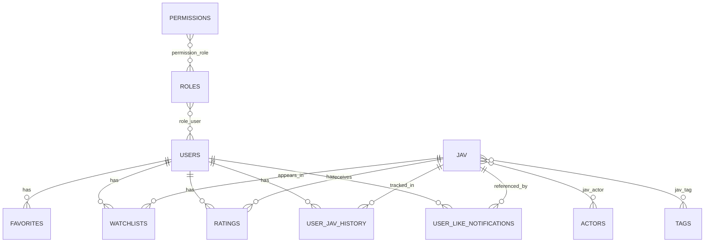

# Data Model

## ER Diagram (Core Domain)

## Data Dictionary (Selected)

### `users`
- Purpose: platform identity and preferences.
- Key fields: `id`, `name`, `username`, `email`, `password`, `avatar_path`, `preferences`.

### `jav`
- Purpose: normalized movie entity.
- Key fields: `id`, `uuid`, `code`, `title`, `image`, `date`, `views`, `source`.

### `actors`
- Purpose: performer profile.
- Key fields: `id`, `uuid`, `name`, `birth_date`, `xcity_blood_type`, `xcity_city_of_birth`.

### `tags`
- Purpose: genre/category taxonomy.
- Key fields: `id`, `name`.

### `ratings`
- Purpose: per-user rating and optional review for a movie.
- Key fields: `id`, `user_id`, `jav_id`, `rating`, `review`.

### `watchlists`
- Purpose: user watch tracking with state.
- Key fields: `id`, `user_id`, `jav_id`, `status`.

### `user_like_notifications`
- Purpose: notification feed entries.
- Key fields: `id`, `user_id`, `jav_id`, `title`, `message`, `payload`, `read_at`.

### `job_events` (Mongo)
- Purpose: queue telemetry and rate alerts.
- Key fields: `event_type`, `status`, `timestamp`, `job_name`, `queue`, `duration_ms`, `site`.

## Data Constraints and Notes

- Many-to-many pivots (`jav_actor`, `jav_tag`) support faceted discovery.
- `users.preferences` stores UI behavior and saved presets.
- Telemetry in Mongo uses TTL index via `expire_at` to enforce retention.
