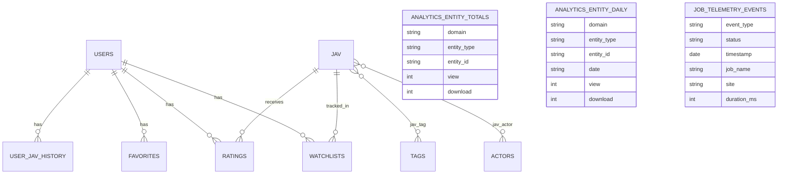

# Data Model

## ER Diagram (Domain + Analytics)

## Data Dictionary

### MySQL `jav`
- Purpose: movie catalog and UI-visible counters.
- Key fields: `uuid`, `code`, `title`, `source`, `views`, `downloads`, `date`.

### MySQL `actors`
- Purpose: actor profiles and demographic metadata.
- Key fields: `uuid`, `name`, `birth_date`, `xcity_blood_type`, `xcity_city_of_birth`.

### MySQL `tags`
- Purpose: genre/category taxonomy.
- Key fields: `id`, `name`.

### Mongo `analytics_entity_totals`
- Purpose: persistent totals by domain/entity/action.
- Key fields: `domain`, `entity_type`, `entity_id`, `view`, `download`.

### Mongo `analytics_entity_daily|weekly|monthly|yearly`
- Purpose: period rollups for trend/reporting use.
- Key fields: period key (`date|week|month|year`) + action counters.

### Mongo `job_telemetry_events`
- Purpose: queue lifecycle and rate-limit operational insights.
- Key fields: `event_type`, `status`, `timestamp`, `site`, `job_name`, `duration_ms`.

## Constraints and Notes

- Analytics dedupe key (`anl:evt:{event_id}`) prevents double counting for 48h.
- Daily action bucket key format: `{action}:{YYYY-MM-DD}`.
- MySQL `jav.views/downloads` is synchronized from Mongo totals during flush.
