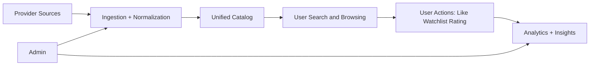

# Architecture Overview (Business View)

## Project Goal

XCrawlerII provides a single, reliable platform to ingest JAV metadata from multiple providers, normalize it, and deliver searchable/discoverable content for end-users and operators.

## Why This Exists

- Source sites are inconsistent and change frequently.
- Manual metadata curation does not scale.
- Product teams need stable catalog quality and analytics visibility.
- Operations teams need measurable queue health and ingest reliability.

## What It Delivers

- Automated ingest and normalization pipeline.
- Unified catalog for movies, actors, and tags.
- User engagement features: favorites, watchlist, ratings, history.
- Admin analytics and telemetry pages for operational decisions.

## User Stories / Use Cases

1. As a viewer, I search by keyword/actor/tag and quickly find relevant content.
2. As a viewer, I track content with watchlist and ratings.
3. As an admin, I run provider sync and verify data quality.
4. As an admin, I use analytics and telemetry to identify performance or data issues.

## Business Flow Diagram

## KPIs / Success Metrics

- Catalog freshness within target ingest window.
- Search success in first page/session.
- Engagement growth in watchlist/ratings/favorites.
- Queue stability (failure rate, p95 duration, timeout rate).
- Metadata quality (missing actor/tag/image/date ratios).

## Glossary

- **Catalog:** Normalized data store for movies, actors, tags.
- **Source sync:** Scheduled or manual pipeline that imports provider data.
- **Telemetry event:** Queue lifecycle event (e.g. `started`, `completed`, `rate_limit_exceeded`) for operational monitoring.
- **Rollup:** Aggregated analytics buckets (daily, weekly, monthly, yearly) stored in MongoDB.
- **Parity check:** Comparison between MySQL catalog counters (`jav.views`/`jav.downloads`) and Mongo analytics totals to detect drift.
- **Analytics (module):** Event ingest (view/download), Redis hot counters, flush to Mongo rollups, MySQL sync, and admin/telemetry dashboards. See [../analytics/README.md](../analytics/README.md) for full analytics documentation.
