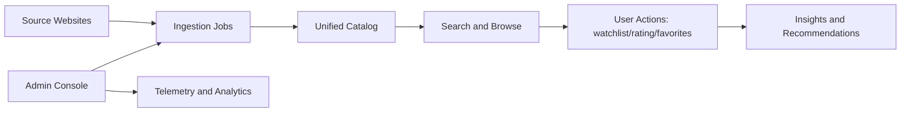

# Architecture Overview (Business View)

## Project Goal

XCrawlerII helps teams collect and manage JAV metadata at scale with reliable ingestion, searchable content, and user-facing discovery features.

## Why This Product Exists

- Multiple source sites provide inconsistent metadata formats.
- Manual curation is too slow for daily updates.
- Users need one place to search, rate, track, and discover content.
- Operations teams need observability for crawler and queue reliability.

## What the Product Delivers

- Automated source sync from multiple providers.
- Normalized catalog of movies, actors, and tags.
- Personalized features (favorites, watchlist, ratings, history, notifications).
- Admin controls for sync, analytics, and telemetry.

## Core User Stories

1. As a viewer, I want to search by keyword/actor/tag so I can find content quickly.
2. As a viewer, I want to save watchlist states so I can continue later.
3. As a viewer, I want rating and history so recommendations become relevant.
4. As an admin, I want to trigger source sync safely and monitor progress.
5. As an admin, I want queue telemetry so I can detect failures and bottlenecks fast.

## Business Flow (Non-Technical)

## KPIs / Success Metrics

- Ingestion freshness: new source items reflected in catalog within target window.
- Search success rate: users find target item in first page/session.
- User engagement: watchlist, rating, favorites conversion.
- Queue reliability: failed jobs %, retry recovery %, p95 job duration.
- Data quality: completeness of actor/tag metadata and duplicate rate.

## Glossary

- Catalog: unified normalized content store for movies/actors/tags.
- Source sync: scheduled or manual fetch-and-normalize process.
- Telemetry event: queue lifecycle record (`started`, `completed`, `rate_limit_exceeded`).
- Preset: saved set of search/filter options for dashboard reuse.
- Quality gate: automated checks (format, lint, static analysis, tests).
