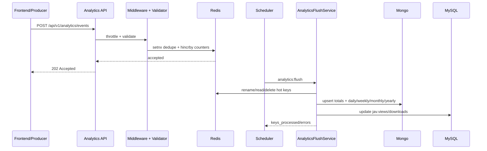

# Request Lifecycle

## HTTP Lifecycle (Example: Analytics Event Ingest)

1. Client sends `POST /api/v1/analytics/events`.
2. Route middleware chain applies: `api` then `throttle:analytics`.
3. `IngestAnalyticsEventRequest` validates enum/type/date constraints.
4. `AnalyticsEventController@store` forwards validated payload to `AnalyticsIngestService`.
5. Service deduplicates by `event_id`, then increments Redis hashes (total + daily).
6. API returns `202 Accepted`.
7. Scheduled `analytics:flush` moves Redis counters to Mongo rollups.
8. Flush syncs movie totals back to MySQL and logs flush errors.

## Lifecycle Diagram

## Transaction and Error Boundaries

- Ingest is non-transactional, idempotent by dedupe key.
- Validation failures return `422`.
- Rate-limited requests return `429`.
- Flush catches per-key exceptions and records warnings without halting full batch.
