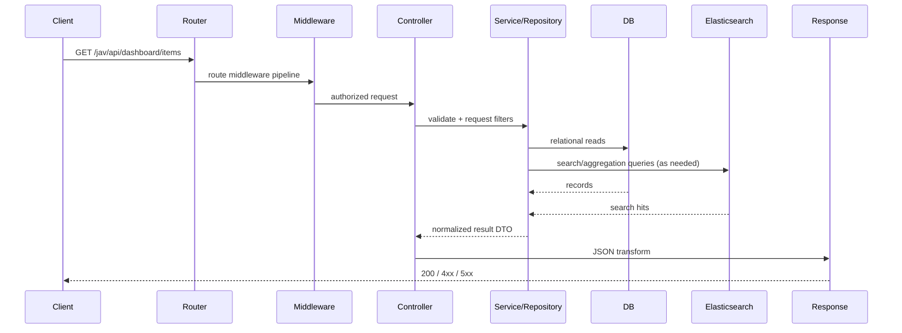
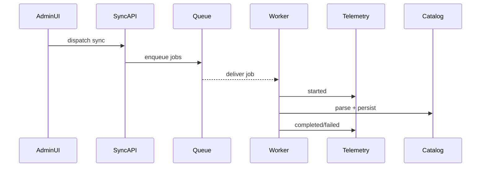

# Request Lifecycle

## End-to-End Path (Authenticated API Example)

Example route: `GET /jav/api/dashboard/items`

1. Request enters Laravel kernel.
2. Middleware chain executes:
   - `web` bootstraps session/cookies/csrf context.
   - `auth` ensures authenticated identity.
3. Controller method validates/filter inputs.
4. Repository/service builds query and applies business rules.
5. Data fetched from DB and/or search engine.
6. Domain decoration layer enriches items (liked, watchlist, rating state).
7. Response transformed to JSON contract.
8. Errors mapped to HTTP status with validation/error payloads.

## Lifecycle Diagram

## Transaction and Error Boundaries

- Read-only endpoints avoid DB transactions unless explicitly needed.
- Write endpoints (`store`, `update`, `destroy`) should keep business updates atomic.
- Validation errors return 422 with field-level messages.
- Authorization errors return 401/403.
- Not-found resources return 404.
- Unexpected failures are logged and surfaced as safe 500 responses.

## Queue-Driven Lifecycle (Sync)

This flow isolates long-running source operations from HTTP response time.
