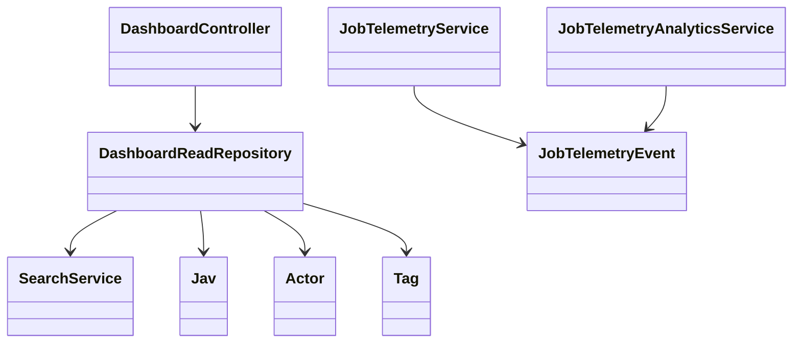

# System Design

## Module and Directory Boundaries

- `app/`: platform-level Laravel concerns (auth, middleware, providers).
- `Modules/Core`: cross-cutting infrastructure (telemetry listeners/services).
- `Modules/JAV`: domain logic (crawl, search, user features, admin features).
- `resources/` + `Modules/JAV/resources/`: Inertia/Vue pages and components.
- `database/` + `Modules/JAV/database/`: migrations, factories, seeders.

## Class Relationship Snapshot



## Architecture Decision Records (ADRs)

### ADR-001: Modular Monolith
- Decision: keep one deployable Laravel app with bounded modules (`Core`, `JAV`).
- Why: lower operational complexity than microservices while preserving boundaries.
- Tradeoff: stronger discipline required to prevent module coupling.

### ADR-002: Redis + Horizon for Queues
- Decision: execute crawler/sync workloads through Redis queues with Horizon.
- Why: queue-level isolation, retries, visibility, and simpler scaling.
- Tradeoff: requires queue tuning and worker profile management.

### ADR-003: Elasticsearch for Search
- Decision: use Scout + Elasticsearch for catalog search and aggregation.
- Why: better relevance, filter performance, and analytics-style query capability.
- Tradeoff: index lifecycle and sync consistency management required.

### ADR-004: MongoDB for Telemetry Events
- Decision: record high-volume queue telemetry in Mongo.
- Why: document model fits event data, TTL index enables retention control.
- Tradeoff: dual-database operational overhead.

## NFRs (Security, Performance, Scalability)

### Security
- Auth required on user APIs and admin routes.
- Role middleware (`admin`) gates privileged operations.
- Request validation at boundaries (Form Requests + controller validation).
- No secrets in repository; environment variables per environment.

### Performance
- Queue processing for heavy sync workloads.
- Search queries backed by Elasticsearch indices.
- Caching used for high-frequency suggestions and dashboard helpers.
- Quality telemetry used to track p95/p99 and timeout trends.

### Scalability
- Horizontal worker scaling via Horizon supervisors.
- Queue separation for crawler classes reduces contention.
- Telemetry retention and index strategy prevent unbounded growth.

## Architectural Skeleton (High-Level Interfaces)

```php
interface SourceIngestionService
{
	/** @return array<int, array<string, mixed>> */
	public function fetchBatch(string $source, int $page): array;
}

interface CatalogNormalizationService
{
	/** @param array<int, array<string, mixed>> $raw */
	public function normalize(array $raw): array;
}

interface CatalogWriteRepository
{
	/** @param array<string, mixed> $item */
	public function upsertMovie(array $item): void;
}

interface TelemetryRecorder
{
	/** @param array<string, mixed> $event */
	public function record(array $event): void;
}
```

These contracts illustrate responsibility boundaries: ingestion, normalization, persistence, and observability remain independently testable.
