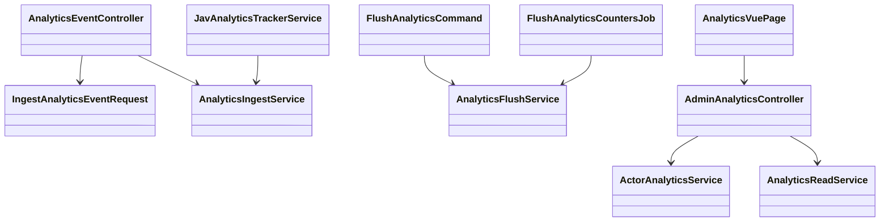

# System Design

## Directory and Module Boundaries

- `app/`: framework-level concerns and shared middleware aliases.
- `Modules/Core`: cross-cutting infrastructure (analytics ingest/flush/reporting, observability).
- `Modules/JAV`: domain logic (catalog, user features, admin analytics UI/APIs).
- `Modules/*/routes`: module-owned web/api route definitions.
- `Modules/JAV/resources/js`: Inertia/Vue frontend pages and components.

## Class Structure (Snapshot)



## ADRs

### ADR-001 Modular Monolith
- Decision: Keep one Laravel deployable with strict module boundaries (`Core`, `JAV`).
- Why: Faster delivery than microservices while preserving separation of concerns.

### ADR-002 Redis Hot Counters + Mongo Rollups
- Decision: Write analytics events to Redis first, then flush to Mongo rollups.
- Why: Fast write path for high event volume and efficient read models by window.

### ADR-003 MySQL Counter Parity
- Decision: Sync movie totals (`views`, `downloads`) back to MySQL from Mongo totals.
- Why: Keep user-facing catalog counters fast and query-friendly.

### ADR-004 Admin Insights on Elasticsearch + MySQL
- Decision: Use Elasticsearch for segment analytics and MySQL for platform snapshot metrics.
- Why: Elasticsearch fits aggregations; MySQL fits transactional/reporting counts.

## NFRs

### Security
- Public analytics ingest endpoint throttled by `throttle:analytics`.
- Admin analytics endpoints protected by `auth` + `role:admin`.
- Request validation via form requests before service execution.

### Performance
- Analytics writes are O(1) Redis increments.
- Flush jobs scheduled every configurable minute interval.
- Aggregated admin queries avoid scanning raw event streams.

### Scalability
- Flush runs from scheduler and can be horizontally scaled via workers.
- Rollups split by day/week/month/year for predictable query surfaces.
- Rate limiting protects ingest from abuse and accidental spikes.

## Architectural Skeleton (Interfaces)

```php
<?php

interface AnalyticsEventIngestor
{
    /**
     * Accept one validated analytics event and write to hot counters.
     */
    public function ingest(array $event, ?int $userId = null): void;
}

interface AnalyticsRollupFlusher
{
    /**
     * Move Redis counters into persistent rollups and return run metrics.
     *
     * @return array{keys_processed:int, errors:int}
     */
    public function flush(): array;
}

interface AdminAnalyticsReader
{
    /**
     * Build dashboard-ready analytics snapshot for a selected day window.
     */
    public function getSnapshot(int $days): array;
}
```
