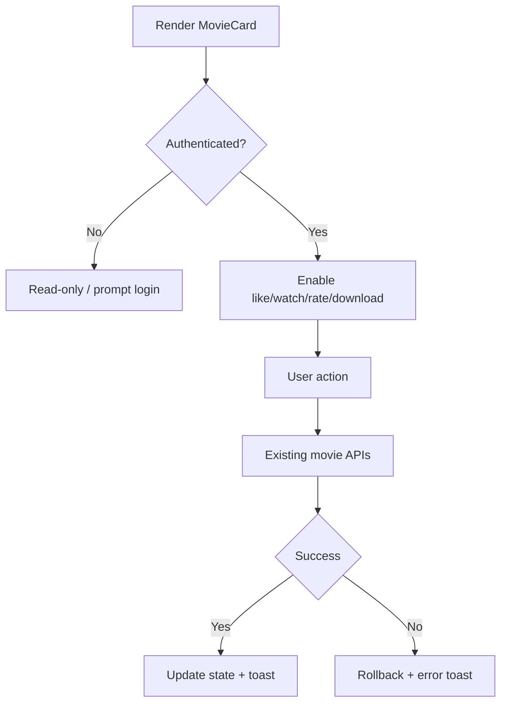

# Movie Card Refactor + Curations Handover Plan (V2)

## 1) Why this document exists

This is a **continuation-safe handover** for a developer or AI with **zero prior context**.

This plan explains in detail:
- What problem we are solving.
- What architecture decision has already been made.
- What to build, in what order, and why.
- How to test and verify without ambiguity.
- What can go wrong and how to recover.

If the current implementer is blocked, this document should allow immediate takeover.

---

## 2) Executive summary (one-minute read)

We are refactoring **Movie Card** first (not Actor/Tag yet) and introducing a **generic curation system** that can support `featured`, `trending`, `editor_pick`, and future types.

### Confirmed decisions
1. Use table name: `curated_items`.
2. Use API base: `/api/v1/curations`.
3. All movie interactions are auth-required.
4. Curation write actions are admin-only.

### Important design direction
Do **not** implement a movie-only `is_featured` column. Instead, use generic curation entries tied to polymorphic items.

---

## 3) Scope and non-scope

## 3.1 In scope
- Movie Card refactor to base structure (`BaseCard` + `MovieCard`).
- Generic curation backend (`curated_items`) usable by movie now and actor/tag later.
- Admin API for create/remove/list curations.
- FE Movie Card support for admin curation action (for type `featured` initially).
- Tests and docs for above.

## 3.2 Out of scope (for this branch)
- Actor card refactor.
- Tag card refactor.
- Curation UI pages for actor/tag.
- Reworking recommendation engine.

---

## 4) Current state (as-is)

### Existing movie interactions already implemented
- Like/unlike movie.
- Watchlist add/remove/check.
- Rating create/update/check.
- Movie detail view route and render flow.
- View count tracked during detail view flow.
- Download endpoint and download tracking.

### Existing key files
- FE card: `Modules/JAV/resources/js/Components/MovieCard.vue`
- Routes: `Modules/JAV/routes/web.php`
- Like API controller: `Modules/JAV/app/Http/Controllers/Users/Api/LibraryController.php`
- Watchlist API controller: `Modules/JAV/app/Http/Controllers/Users/Api/WatchlistController.php`
- Rating API controller: `Modules/JAV/app/Http/Controllers/Users/Api/RatingController.php`
- Movie detail flow: `Modules/JAV/app/Http/Controllers/Users/JAVController.php`
- Download flow: `Modules/JAV/app/Http/Controllers/Users/MovieController.php`

### Existing gap
- No generic curation table/API currently wired for movie card admin toggle.

---

## 5) Architecture decisions (ADR-style)

## Decision A — Use `curated_items`
**Why**
- Future-proof for multiple item types and curation types.
- Avoid creating one-off columns (`is_featured`) that do not scale.

**How**
- Polymorphic item link (`item_type`, `item_id`) or Laravel morph alias equivalent.
- `curation_type` for semantic type (`featured`, `trending`, ...).

## Decision B — Use `/api/v1/curations`
**Why**
- Stable API namespace, reusable across modules and entities.

**How**
- Place routes under Core-facing API namespace (or common route group) but still enforce auth + admin role on write operations.

## Decision C — Keep Movie Card behavior backward compatible
**Why**
- Refactor should not break existing user flows.

**How**
- Preserve existing action handlers and props contract in `MovieCard`; only extract structural shell into `BaseCard`.

---

## 6) Target data model (`curated_items`)

## 6.1 Table proposal
`curated_items`

Columns:
- `id` (bigint primary key)
- `uuid` (uuid unique)
- `item_type` (string; morph alias preferred like `jav`, `actor`, `tag`)
- `item_id` (unsigned bigint)
- `curation_type` (string; e.g., `featured`, `trending`, `editor_pick`)
- `position` (integer nullable; optional manual ordering)
- `starts_at` (timestamp nullable)
- `ends_at` (timestamp nullable)
- `meta` (json nullable)
- `user_id` (unsigned bigint; who curated)
- `created_at`, `updated_at`
- optional `deleted_at` (if soft-deletes are required)

## 6.2 Constraints and indexes
- Unique: (`curation_type`, `item_type`, `item_id`) for active non-deleted rows.
- Index: (`curation_type`, `created_at`)
- Index: (`item_type`, `item_id`)
- Index: (`user_id`)
- Optional index: (`curation_type`, `position`)

## 6.3 Notes to avoid future confusion
- Use `curation_type` (not `type`) to avoid collision with `item_type`.
- Prefer morph aliases over raw class names.
- If soft deletes enabled, unique constraint strategy must account for deleted rows.

---

## 7) API contract (`/api/v1/curations`)

## 7.1 Endpoints (minimum)
1. `POST /api/v1/curations`
   - Create curation entry (admin only).
2. `DELETE /api/v1/curations/{curation}`
   - Remove curation entry (admin only).
3. `GET /api/v1/curations`
   - List/filter entries (auth; can be public later if needed).

## 7.2 Request payload for create
```json
{
  "item_type": "jav",
  "item_id": 123,
  "curation_type": "featured",
  "position": 10,
  "starts_at": "2026-02-20T00:00:00Z",
  "ends_at": null,
  "meta": {
    "source": "admin_movie_card"
  }
}
```

## 7.3 Response payload example
```json
{
  "success": true,
  "data": {
    "id": 1,
    "uuid": "...",
    "item_type": "jav",
    "item_id": 123,
    "curation_type": "featured",
    "position": 10,
    "starts_at": "2026-02-20T00:00:00Z",
    "ends_at": null,
    "meta": { "source": "admin_movie_card" },
    "user_id": 9
  }
}
```

## 7.4 Behavioral requirements
- POST should be idempotent for duplicate tuple (`curation_type`, `item_type`, `item_id`) where practical.
- DELETE should be safe if entry already removed (return consistent response strategy).
- Validation should reject unsupported `item_type` or `curation_type`.

---

## 8) Authorization matrix

- Guest:
  - Cannot call protected movie actions.
  - Cannot create/delete curations.

- Authenticated user (non-admin):
  - Can like/watch/rate/download/view detail according to existing behavior.
  - Cannot create/delete curations.

- Admin:
  - Has all user actions.
  - Can create/delete curations (e.g., toggle `featured`).

Server-side authorization is mandatory even if FE hides controls.

---

## 9) Phased implementation plan

Each phase contains: Objective, Why, Tasks, Files, Definition of Done.

## Phase 0 — Baseline and branch hygiene

### Objective
Prepare safe baseline and remove ambiguity.

### Why
Refactor/regression work without baseline leads to false assumptions.

### Tasks
1. Sync branch with latest `develop`.
2. Record current movie behavior (video or screenshots).
3. Confirm routes for like/watch/rating/download/view.
4. Confirm current auth behavior on download route.

### Files
- No code files mandatory.

### DoD
- Baseline captured.
- Route inventory documented.

---

## Phase 1 — Backend foundation for curations

### Objective
Create reusable curation domain in backend.

### Why
Movie `featured` should not be hardcoded to movie model.

### Tasks
1. Add migration for `curated_items`.
2. Add model `CuratedItem`.
3. Add belongsTo relation to `User` and morph relation to target item.
4. Add request validators:
   - Create Curation request
   - List filter request (optional)
5. Add API controller for `POST/GET/DELETE`.
6. Register routes under `/api/v1/curations`.
7. Enforce admin role on create/delete.
8. Add resource/transformer if project pattern uses it.

### Suggested file map
- `Modules/Core/database/migrations/*_create_curated_items_table.php` (preferred shared module)
- `Modules/Core/app/Models/CuratedItem.php`
- `Modules/Core/app/Http/Requests/Api/V1/StoreCurationRequest.php`
- `Modules/Core/app/Http/Requests/Api/V1/ListCurationsRequest.php` (optional)
- `Modules/Core/app/Http/Controllers/Api/V1/CurationController.php`
- `Modules/Core/routes/api.php` or shared API route file used by project

### DoD
- Migration up/down works.
- POST/GET/DELETE endpoints exist and return stable schema.
- Non-admin create/delete blocked with 403.
- Duplicate curation behavior is deterministic.

---

## Phase 2 — Integrate curations with movie card behavior

### Objective
Allow admin to curate movie as `featured` from card-level actions.

### Why
Deliver immediate product value while keeping backend generic.

### Tasks
1. Add FE API client calls for curations create/delete.
2. Derive initial curated state for each movie item:
   - Either include `is_featured` computed from joined curation data,
   - Or include `curations` array and compute in FE.
3. Show admin-only featured toggle in `MovieCard`.
4. Implement optimistic update with rollback on API failure.

### Suggested files
- `Modules/JAV/resources/js/Components/MovieCard.vue`
- `Modules/JAV/resources/js/Components/BaseCard.vue` (if refactor done in same phase)
- `Modules/JAV/resources/js/Composables/useMovieCardActions.js` (optional)
- Dashboard/movie item payload assembler in BE (where item DTO is prepared)

### DoD
- Admin can toggle featured on movie card.
- Non-admin never sees actionable featured toggle.
- Toggle state persists after refresh.

---

## Phase 3 — BaseCard + MovieCard refactor

### Objective
Refactor card structure with zero functional regression.

### Why
Prepare scalable component pattern for later actor/tag phases.

### Tasks
1. Create `BaseCard.vue` with slots (`header`, default body, `footer`).
2. Move layout-only structure from `MovieCard` to `BaseCard`.
3. Keep movie business logic in `MovieCard` (or dedicated composable).
4. Verify all pages using `MovieCard` still render and behave correctly.

### Key pages to test
- `Modules/JAV/resources/js/Pages/Dashboard/Index.vue`
- `Modules/JAV/resources/js/Pages/Movies/Show.vue`
- `Modules/JAV/resources/js/Pages/User/Favorites.vue`
- `Modules/JAV/resources/js/Pages/User/Recommendations.vue`
- `Modules/JAV/resources/js/Pages/Actors/Bio.vue`

### DoD
- Card structure refactored.
- Existing like/watch/rating/detail/download behaviors unchanged.

---

## Phase 4 — Test hardening

### Objective
Protect future contributors from regressions.

### Why
This feature touches auth, role, data model, and FE interaction.

### Backend feature tests
1. Admin can create curation.
2. Admin can delete curation.
3. Non-admin create/delete forbidden.
4. Invalid `item_type` rejected.
5. Invalid `curation_type` rejected.
6. Duplicate create behavior (idempotent or conflict) validated.
7. Existing movie APIs still pass contracts.

### Backend unit tests
1. `CuratedItem` model relationships.
2. Any resolver/helper for curated status mapping.

### Frontend tests
1. Admin sees featured control.
2. Non-admin/guest does not see featured action.
3. Optimistic toggle rollback on request failure.
4. Click handling still avoids navigation when button clicked.

### Manual test checklist
- Login as user: all existing movie actions work.
- Login as admin: featured toggle appears and persists.
- Login as user (non-admin): featured action unavailable.
- Guest: protected actions blocked per current auth strategy.

### DoD
- Relevant tests green.
- Manual checklist completed with notes.

---

## Phase 5 — Documentation and handoff closure

### Objective
Leave complete continuation context.

### Tasks
1. Update API docs for `/api/v1/curations`.
2. Update implementation guide with curation pattern.
3. Add FAQ entries for common failures.
4. Attach migration rollback note.

### Files
- `docs/api/api-reference.md`
- `docs/guides/implementation-guide.md`
- `docs/troubleshooting/faq.md`

### DoD
- New developer can implement follow-up curation types without oral handoff.

---

## 10) Implementation skeletons

## 10.1 Migration skeleton
```php
Schema::create('curated_items', function (Blueprint $table) {
    $table->id();
    $table->uuid('uuid')->unique();
    $table->string('item_type', 120);
    $table->unsignedBigInteger('item_id');
    $table->string('curation_type', 80);
    $table->integer('position')->nullable();
    $table->timestamp('starts_at')->nullable();
    $table->timestamp('ends_at')->nullable();
    $table->json('meta')->nullable();
    $table->foreignId('user_id')->constrained()->cascadeOnDelete();
    $table->timestamps();

    $table->unique(['curation_type', 'item_type', 'item_id'], 'uniq_curation_item');
    $table->index(['curation_type', 'created_at'], 'idx_curation_created');
    $table->index(['item_type', 'item_id'], 'idx_item_lookup');
});
```

## 10.2 Model skeleton
```php
class CuratedItem extends Model
{
    use HasFactory;

    protected $fillable = [
        'uuid',
        'item_type',
        'item_id',
        'curation_type',
        'position',
        'starts_at',
        'ends_at',
        'meta',
        'user_id',
    ];

    protected $casts = [
        'starts_at' => 'datetime',
        'ends_at' => 'datetime',
        'meta' => 'array',
    ];

    public function item(): MorphTo
    {
        return $this->morphTo('item', 'item_type', 'item_id');
    }

    public function user(): BelongsTo
    {
        return $this->belongsTo(User::class);
    }
}
```

## 10.3 Request validation skeleton
```php
public function rules(): array
{
    return [
        'item_type' => ['required', 'string', Rule::in(['jav', 'actor', 'tag'])],
        'item_id' => ['required', 'integer', 'min:1'],
        'curation_type' => ['required', 'string', Rule::in(['featured', 'trending', 'editor_pick'])],
        'position' => ['nullable', 'integer'],
        'starts_at' => ['nullable', 'date'],
        'ends_at' => ['nullable', 'date', 'after_or_equal:starts_at'],
        'meta' => ['nullable', 'array'],
    ];
}
```

## 10.4 Controller skeleton
```php
public function store(StoreCurationRequest $request): JsonResponse
{
    $payload = $request->validated();

    $curation = CuratedItem::query()->firstOrCreate(
        [
            'curation_type' => $payload['curation_type'],
            'item_type' => $payload['item_type'],
            'item_id' => $payload['item_id'],
        ],
        [
            'uuid' => (string) Str::uuid(),
            'position' => $payload['position'] ?? null,
            'starts_at' => $payload['starts_at'] ?? null,
            'ends_at' => $payload['ends_at'] ?? null,
            'meta' => $payload['meta'] ?? null,
            'user_id' => (int) $request->user()->id,
        ]
    );

    return response()->json(['success' => true, 'data' => $curation]);
}
```

## 10.5 Route skeleton
```php
Route::prefix('api/v1/curations')->middleware(['web', 'auth'])->group(function () {
    Route::get('/', [CurationController::class, 'index']);

    Route::middleware(['role:admin'])->group(function () {
        Route::post('/', [CurationController::class, 'store']);
        Route::delete('/{curation}', [CurationController::class, 'destroy']);
    });
});
```

## 10.6 FE toggle skeleton
```js
const canManageCurations = computed(() => {
  const user = page.props.auth?.user;
  return Boolean(user) && Array.isArray(user.roles) && user.roles.includes('admin');
});

const toggleFeatured = async () => {
  if (!canManageCurations.value) return;

  const previous = isFeatured.value;
  isFeatured.value = !previous;

  try {
    if (isFeatured.value) {
      await axios.post('/api/v1/curations', {
        item_type: 'jav',
        item_id: props.item.id,
        curation_type: 'featured',
      });
    } else {
      await axios.delete(`/api/v1/curations/${featuredCurationId.value}`);
    }
  } catch (error) {
    isFeatured.value = previous;
    uiStore.showToast('Failed to update featured state', 'error');
  }
};
```

---

## 11) Logic flow diagrams

## 11.1 Movie action flow (existing behavior)


## 11.2 Admin curation flow
```mermaid
flowchart TD
  A[Render MovieCard] --> B{Role admin?}
  B -- No --> C[Hide curation action]
  B -- Yes --> D[Show featured toggle]
  D --> E[Toggle action]
  E --> F{Target state}
  F -- On --> G[POST /api/v1/curations]
  F -- Off --> H[DELETE /api/v1/curations/{id}]
  G --> I{Success?}
  H --> I
  I -- Yes --> J[Persist UI state]
  I -- No --> K[Rollback UI state]
```

---

## 12) Risks and mitigation

## Risk 1: Type alias drift
- Problem: FE sends `item_type='jav'` but backend expects class string.
- Mitigation: define shared mapping in one place; validate strictly.

## Risk 2: Duplicate curations
- Problem: race creates duplicate rows.
- Mitigation: DB unique index + idempotent create logic.

## Risk 3: Role shape mismatch in FE props
- Problem: admin toggle hidden accidentally.
- Mitigation: use robust role extraction; always enforce backend authorization.

## Risk 4: Refactor breaks existing card interactions
- Problem: click/action conflicts or route regressions.
- Mitigation: keep behavior tests and per-action pending flags.

## Risk 5: API namespace collision
- Problem: existing APIs may use different base conventions.
- Mitigation: confirm route prefix in project before coding; update docs accordingly.

---

## 13) Edge cases checklist

1. Create featured twice for same movie.
2. Delete curation that no longer exists.
3. `ends_at` before `starts_at`.
4. Unsupported `curation_type`.
5. Unsupported `item_type`.
6. Non-admin calls create/delete directly.
7. Session expires during toggle action.
8. Movie payload has no curated metadata; FE default state must be false.

---

## 14) PR strategy

## PR-A Backend Curations
- Migration + model + API + authz + tests.

## PR-B FE Movie Integration
- Movie card curation toggle + payload mapping + tests.

## PR-C BaseCard Refactor + Docs
- BaseCard extraction + regression checks + docs updates.

Keep PRs small and independently testable.

---

## 15) Recovery protocol if blocked

When stuck, record these six fields in issue/PR note:
1. What was attempted.
2. Expected result.
3. Actual result.
4. Files changed.
5. Repro command.
6. Best next action.

Attach:
- Current branch.
- Last passing tests.
- Failing logs.
- Pending checklist items.

---

## 16) Global Definition of Done

All items below must be true:
- [ ] `/api/v1/curations` implemented with create/list/delete.
- [ ] `curated_items` migration deployed and reversible.
- [ ] Admin-only write authorization enforced server-side.
- [ ] Movie card supports `featured` via curations without breaking existing features.
- [ ] Existing movie actions still pass regression tests.
- [ ] Documentation updated for future developer continuation.

---

## 17) Quick start for a new developer

1. Read this file once fully.
2. Implement Phase 1 backend first.
3. Add backend tests and make them pass.
4. Integrate FE toggle in MovieCard.
5. Execute manual checklist and fix regressions.
6. Complete docs update and handoff notes.

Do not expand to actor/tag in this branch.
