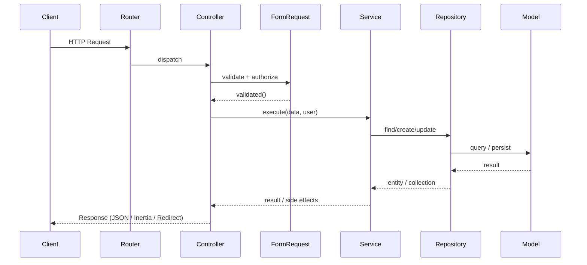
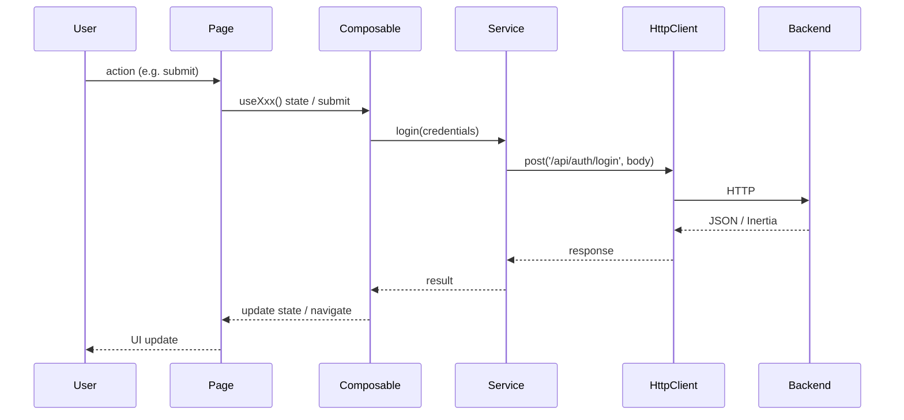

# 01 - Request Lifecycle

This document walks through how a typical HTTP request flows through the backend and how the frontend ties in. It is descriptive (“how it works now”); the enforceable rules are in [docs/architecture/02-backend-layering.md](../architecture/02-backend-layering.md) and [04-frontend-standards.md](../architecture/04-frontend-standards.md).

---

## Backend request flow

A typical API or web request follows this path:

1. **HTTP** → Laravel router selects a **Controller** action.
2. **Controller** receives the request and uses a **FormRequest** for validation and authorization.
3. **FormRequest** runs `authorize()` (e.g. Policy/Gate) and `rules()`; validated input is available as `$request->validated()`.
4. **Controller** calls a **Service** (or UseCase) with the validated data and authorized context (e.g. user).
5. **Service** performs business logic; if needed, it runs **transactions** and calls **Repositories**.
6. **Repository** talks to the **Model** (Eloquent SQL or MongoDB) for persistence and queries.
7. **Controller** returns the response (JSON, redirect, or Inertia page).

No business logic or DB access lives in the Controller; no authorization in the Service. Transactions are only in the Service layer.

---

## Backend sequence (Mermaid)

---

## Frontend flow (page → service)

For an Inertia + Vue frontend:

1. **User** triggers an action (e.g. submit form, click).
2. **Page** (Inertia page component) may use a **Composable** for form state and validation feedback.
3. **Page** or **Composable** calls a **Service** (API client wrapper).
4. **Service** uses the shared **httpClient** (from Core) to send a request to the Laravel backend (e.g. `POST /api/auth/login`).
5. **Backend** runs the flow above and returns JSON (or Inertia response).
6. **Service** returns data to the **Page/Composable**.
7. **Page** updates state and/or navigates (e.g. `router.visit(...)`).

Components are presentational only; they do not call the API. The “API client” is the frontend Service layer.

---

## Frontend → Backend sequence (Mermaid)

---

## References

- [02-backend-layering](../architecture/02-backend-layering.md) — Rules for Controller/Service/Repository/Model
- [04-frontend-standards](../architecture/04-frontend-standards.md) — Page / Component / Composable / Service
- [diagrams/request-flow.mmd](diagrams/request-flow.mmd) — Mermaid source for request flow
