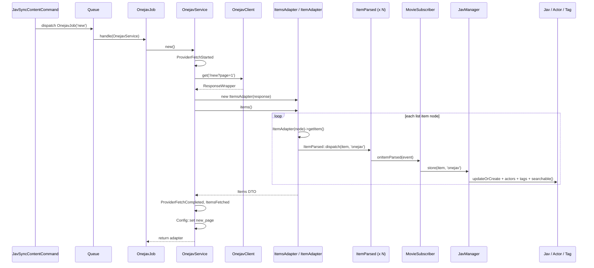
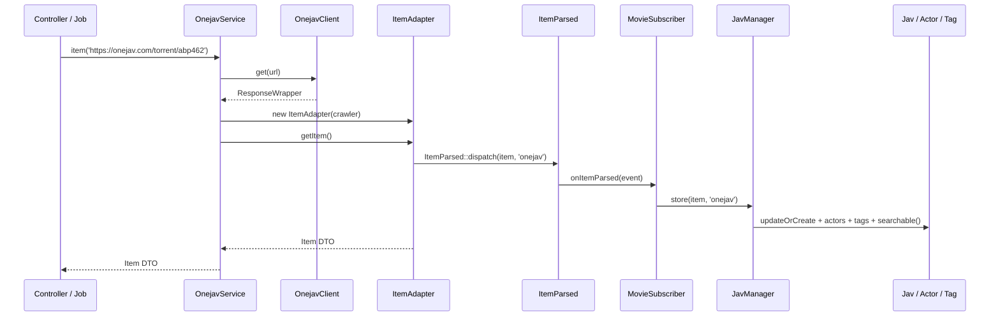
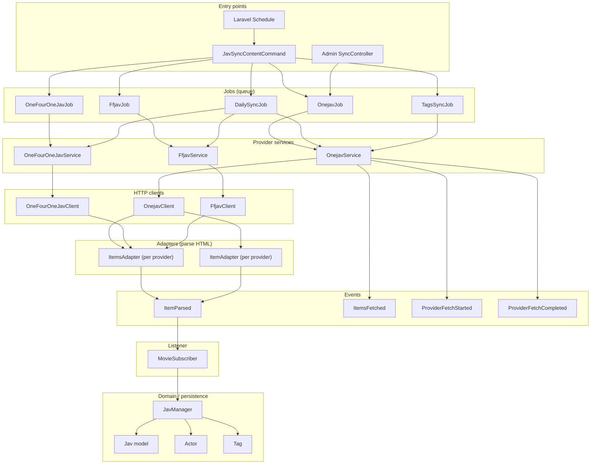
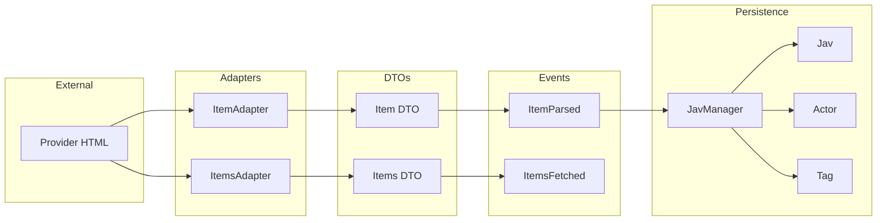
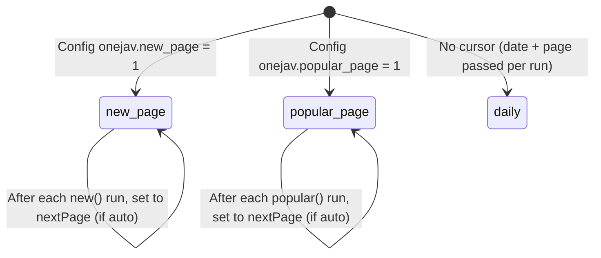

# 03 - JAV Fetch and Parse: Full Plan and Reference

This document is the **single reference** for the fetch-and-parse flow of **movies** inside the **JAV** module, from providers **onejav**, **141jav**, and **ffjav**. It describes the current implementation (process flow, logic flow, events, data structures) and includes diagrams and extension options. It does not introduce new architecture rules; those remain in `docs/architecture/`.

---

## Terminology (avoid confusion)

| Term | Meaning |
|------|--------|
| **JAV** | The **module name** — the Laravel/nwidart feature module at `Modules/JAV`. Use when referring to the module itself (e.g. “the JAV module”, “JAVServiceProvider”). |
| **Movie** / **movie** | The content entity (one video). Stored in the `movies` table; model `Movie`. “jav” in legacy code = same concept (movie). |
| **Movies** | Content (videos) that come from the three providers. “Movies” = the same thing as “jav records” in this context. |
| **onejav**, **141jav**, **ffjav** | The three **content providers/sources**. They are external sites we fetch from; movies are ingested from these sources into the JAV module. |

**In short:** **JAV** = module. **Inside JAV**, we have **movies**; those movies come from **onejav**, **141jav**, and **ffjav**.

---

## Table of Contents

1. [Terminology](#terminology-avoid-confusion)
2. [Executive Summary](#1-executive-summary)
3. [Current State: Components and Responsibilities](#2-current-state-components-and-responsibilities)
4. [Data Structures](#3-data-structures)
5. [Process Flow](#4-process-flow-step-by-step)
6. [Logic Flow](#5-logic-flow-decisions-and-branches)
7. [Diagrams](#6-diagrams)
8. [URL and Path Mapping](#7-url-and-path-mapping)
9. [Event Lifecycle](#8-event-lifecycle)
10. [Configuration and Queues](#9-configuration-and-queues)
11. [Extension Options](#10-extension-options-planning)
12. [Alignment with Project Policies](#11-alignment-with-project-policies)
13. [File and Class Index](#12-file-and-class-index)

---

## 1. Executive Summary

| Aspect | Description |
|--------|-------------|
| **Purpose** | Fetch HTML from external movie listing sites (onejav.com, 141jav.com, ffjav.com), parse into structured items, and persist **movies** to the database with actors and tags. |
| **Providers** | **onejav**, **141jav**, **ffjav** — each has a dedicated Service, Client, and Adapters. |
| **Trigger** | CLI (`jav:sync:content`), scheduled jobs, or Admin API sync. |
| **Outcome** | `jav` records (and related `actors`, `tags`) created/updated; search index updated; optional user notifications. |

**High-level flow:**  
Trigger (CLI/Job) → Provider Job (e.g. `OnejavJob`) → Provider Service (e.g. `OnejavService`) → HTTP Client → **ItemsAdapter** (list page) or **ItemAdapter** (detail page) → **Item(s) DTO** → **ItemParsed** / **ItemsFetched** events → **MovieSubscriber** → **JavManager** → **Jav** model (one movie per row; Actor/Tag sync) → Scout search index.

---

## 2. Current State: Components and Responsibilities

### 2.1 Layer Overview

| Layer | Role | Examples |
|-------|------|----------|
| **Entry** | CLI, Schedule, Admin API | `JavSyncContentCommand`, `JAVServiceProvider` (schedule; **JAV** = module name), `SyncController` |
| **Job** | Queue unit of work, retries, uniqueness | `OnejavJob`, `OneFourOneJavJob`, `FfjavJob`, `DailySyncJob`, `TagsSyncJob` |
| **Service** | Orchestration: build path, call client, parse, dispatch events, update config | `OnejavService`, `OneFourOneJavService`, `FfjavService` |
| **Client** | HTTP GET to provider base URL | `OnejavClient`, `OneFourOneJavClient`, `FfjavClient` |
| **Adapter** | Parse HTML → DTO (list or single item) | `Onejav\ItemsAdapter`, `Onejav\ItemAdapter` (and 141jav/ffjav equivalents) |
| **DTO** | Immutable data shape | `Item`, `Items` |
| **Event** | Decouple parsing from persistence | `ItemParsed`, `ItemsFetched`, `ProviderFetchStarted`, `ProviderFetchCompleted`, `ProviderFetchFailed` |
| **Listener** | React to events; call domain logic | `MovieSubscriber` (listens to `ItemParsed`) |
| **Manager** | Domain orchestration: normalize code, upsert movie (Jav), sync actors/tags, re-index | `JavManager` |
| **Persistence** | Eloquent models | `Movie`, `Actor`, `Tag`, `MovieActor`, `MovieTag` |

### 2.2 Per-Provider Components

| Provider | Service | Client | ItemsAdapter | ItemAdapter | Config namespace |
|----------|---------|--------|--------------|-------------|------------------|
| onejav | `OnejavService` | `OnejavClient` | `Onejav\ItemsAdapter` | `Onejav\ItemAdapter` | `onejav` |
| 141jav | `OneFourOneJavService` | `OneFourOneJavClient` | `OneFourOneJav\ItemsAdapter` | `OneFourOneJav\ItemAdapter` | `onefourone` |
| ffjav | `FfjavService` | `FfjavClient` | `Ffjav\ItemsAdapter` | `Ffjav\ItemAdapter` | `ffjav` |

All three services expose the same logical interface: `new(?int $page)`, `popular(?int $page)`, `daily(?string $date, ?int $page)`, `tags()`, `item(string $url)`.

### 2.3 Shared / Cross-Provider

- **JavManager** (or MovieManager) — used by all providers via `ItemParsed` → `MovieSubscriber` → `store(Item $item, string $source)`; calls MovieRepository, ActorRepository, TagRepository, MovieActorRepository, MovieTagRepository only (no direct Eloquent).
- **CodeNormalizer** — normalizes product codes (e.g. `abp462` → `ABP-462`, FC2-PPV handling).
- **Item**, **Items** DTOs — same shape for all providers.
- **Contracts**: `IItems` (list adapter), `IItemParsed` (event contract).

---

## 3. Data Structures

### 3.1 Item (single movie)

```text
Item (DTO)
├── id: ?string          # Provider-specific item id (e.g. slug)
├── title: ?string
├── url: ?string         # Relative or absolute link to detail page
├── image: ?string       # Cover image URL
├── date: ?Carbon
├── code: ?string        # Normalized product code (e.g. ABP-462)
├── tags: Collection     # of tag name strings
├── size: ?float         # GB
├── description: ?string
├── actresses: Collection # of actress name strings
└── download: ?string    # Relative path to .torrent
```

### 3.2 Items (list of movies + pagination)

```text
Items (DTO)
├── items: Collection<int, Item>
├── hasNextPage: bool
└── nextPage: int
```

### 3.3 Models (persistence)

In the JAV module we have **exactly these 5 models** for core content and their relationships:

| # | Model | Table | Purpose |
|---|--------|--------|---------|
| 1 | **Movie** | `movies` | One record = one movie. |
| 2 | **Actor** | `actors` | One record = one actor (actress). |
| 3 | **Tag** | `tags` | One record = one tag (genre/category). |
| 4 | **MovieActor** | `movie_actor` | Relationship: which actors belong to which movie (many-to-many pivot). |
| 5 | **MovieTag** | `movie_tag` | Relationship: which tags belong to which movie (many-to-many pivot). |

We use the **`movies`** table (not `jav`). There is **one repository per model** (see skeleton below).

Anything else? The current XCrawlerII JAV module also has models for **user-related** and **auxiliary** data (e.g. UserHistory, UserReaction, Watchlist, Rating, UserLikeNotification, ActorProfileSource, ActorProfileAttribute, RecommendationSnapshot). Those are out of scope for the “5 models” above; include them only if the product needs them in Cursor.

### 3.4 Model and repository skeleton (detail)

One repository per model. Services and JavManager call repositories only; no direct Eloquent in controllers.

---

#### Model 1: Movie

- **Table:** `movies`
- **Class:** `Modules\JAV\Models\Movie`
- **Fillable:** `uuid`, `item_id`, `code`, `title`, `url`, `image`, `date`, `size`, `description`, `download`, `source`, `views`, `downloads`
- **Casts:** `uuid` => string, `date` => datetime, `size` => float, `views` => integer, `downloads` => integer
- **Relations:**
  - `actors()` → BelongsToMany(Actor::class, 'movie_actor') — via pivot table `movie_actor`
  - `tags()` → BelongsToMany(Tag::class, 'movie_tag') — via pivot table `movie_tag`
- **Other:** route key `uuid`; boot: set `uuid` on creating if empty.

**Repository:** `Modules\JAV\Repositories\MovieRepository`

- `query(): Builder`
- `queryWithRelations(): Builder` — `with(['actors', 'tags'])`
- `findById(int $id): ?Movie`
- `findByUuid(string $uuid): ?Movie`
- `findByCodeAndSource(string $code, string $source): ?Movie` — unique per (code, source)
- `create(array $data): Movie`
- `updateOrCreate(array $attributes, array $values = []): Movie` — attributes = [code, source]
- `loadRelations(Movie $movie): Movie` — load actors, tags

---

#### Model 2: Actor

- **Table:** `actors`
- **Class:** `Modules\JAV\Models\Actor`
- **Fillable:** `uuid`, `name`, `views`, (and any xcity_* fields if kept)
- **Casts:** `uuid` => string, `views` => integer, etc.
- **Relations:**
  - `movies()` → BelongsToMany(Movie::class, 'movie_actor') — via pivot `movie_actor`

**Repository:** `Modules\JAV\Repositories\ActorRepository`

- `query(): Builder`
- `findById(int $id): ?Actor`
- `findByUuid(string $uuid): ?Actor`
- `findByName(string $name): ?Actor` — or first match
- `findOrCreateByName(string $name): Actor` — create if not exists (for ingest)
- `getByIds(array $ids): Collection` — whereIn id
- `create(array $data): Actor`
- `updateOrCreate(array $attributes, array $values = []): Actor`

---

#### Model 3: Tag

- **Table:** `tags`
- **Class:** `Modules\JAV\Models\Tag`
- **Fillable:** `name`
- **Relations:**
  - `movies()` → BelongsToMany(Movie::class, 'movie_tag') — via pivot `movie_tag`

**Repository:** `Modules\JAV\Repositories\TagRepository`

- `query(): Builder`
- `findById(int $id): ?Tag`
- `findByName(string $name): ?Tag`
- `findOrCreateByName(string $name): Tag` — create if not exists (for ingest)
- `getByIds(array $ids): Collection`
- `create(array $data): Tag`
- `updateOrCreate(array $attributes, array $values = []): Tag`

---

#### Model 4: MovieActor (pivot)

- **Table:** `movie_actor`
- **Class:** `Modules\JAV\Models\MovieActor` (extends `Model` or `Pivot`; if Pivot, use custom pivot model so it can have its own repository)
- **Columns:** `movie_id`, `actor_id` (foreign keys); unique `['movie_id', 'actor_id']`
- **Relations:**
  - `movie()` → BelongsTo(Movie::class)
  - `actor()` → BelongsTo(Actor::class)

**Repository:** `Modules\JAV\Repositories\MovieActorRepository`

- `query(): Builder`
- `findByMovieAndActor(int $movieId, int $actorId): ?MovieActor`
- `attach(int $movieId, int $actorId): MovieActor` — firstOrCreate / insert if not exists
- `syncForMovie(int $movieId, array $actorIds): void` — replace all actors for a movie (detach missing, attach new)
- `detach(int $movieId, int $actorId): bool`
- `getActorIdsByMovieId(int $movieId): Collection` — pluck actor_id

---

#### Model 5: MovieTag (pivot)

- **Table:** `movie_tag`
- **Class:** `Modules\JAV\Models\MovieTag`
- **Columns:** `movie_id`, `tag_id`; unique `['movie_id', 'tag_id']`
- **Relations:**
  - `movie()` → BelongsTo(Movie::class)
  - `tag()` → BelongsTo(Tag::class)

**Repository:** `Modules\JAV\Repositories\MovieTagRepository`

- `query(): Builder`
- `findByMovieAndTag(int $movieId, int $tagId): ?MovieTag`
- `attach(int $movieId, int $tagId): MovieTag`
- `syncForMovie(int $movieId, array $tagIds): void` — replace all tags for a movie
- `detach(int $movieId, int $tagId): bool`
- `getTagIdsByMovieId(int $movieId): Collection` — pluck tag_id

---

#### How JavManager uses the repositories

1. **Store movie (from Item DTO):**
   - Normalize code (CodeNormalizer).
   - **MovieRepository::updateOrCreate** by `['code' => $code, 'source' => $source]` with movie data.
   - Resolve actor IDs: for each actress name, **ActorRepository::findOrCreateByName**; collect IDs.
   - **MovieActorRepository::syncForMovie**($movieId, $actorIds).
   - Resolve tag IDs: for each tag name, **TagRepository::findOrCreateByName**; collect IDs.
   - **MovieTagRepository::syncForMovie**($movieId, $tagIds).
   - Trigger search index update (e.g. `$movie->searchable()`) if applicable.
   - Dispatch JavStored (or MovieStored).

No direct `Movie::query()`, `Actor::create()`, etc. in JavManager — only repository calls.

**Migrations (skeleton):**

- `create_movies_table`: id, uuid (nullable then backfill + unique), item_id, code, title, url, image, date, size, description, download, source, views, downloads, timestamps; unique `['code', 'source']`.
- `movie_actor`: movie_id (FK → movies), actor_id (FK → actors), unique `['movie_id', 'actor_id']`.
- `movie_tag`: movie_id (FK → movies), tag_id (FK → tags), unique `['movie_id', 'tag_id']`.

---

## 4. Process Flow (Step-by-Step)

### 4.1 List Flow (e.g. “new” or “popular” or “daily”)

1. **Trigger**  
   User runs `php artisan jav:sync:content onejav --type=new` or schedule fires.

2. **Command**  
   `JavSyncContentCommand` validates `provider` (onejav|141jav|ffjav) and `type` (new|popular|daily|tags). For `new`/`popular`: calls `dispatchFeedJob(provider, type)`. For `daily`: calls `dispatchDailyJob(provider)`. For `tags`: calls `syncTags(provider)`.

3. **Job dispatch**  
   Command dispatches e.g. `OnejavJob('new')` onto queue `onejav` (or config override).

4. **Job execution**  
   `OnejavJob::handle(OnejavService $service)` calls `$service->new()` (no page: auto mode).

5. **Service — new()**  
   - Resolve page: if `$page === null`, read `Config::get('onejav', 'new_page', 1)`.
   - Build path: e.g. `/new?page=1`.
   - Dispatch `ProviderFetchStarted::dispatch('onejav', 'new', $path, $page)`.
   - Call `$this->client->get($path)` → HTTP GET to base URL + path.
   - Wrap response in `ItemsAdapter` (constructor receives response, builds DOM Crawler from body).
   - Call `$itemsAdapter->items()`:
     - Adapter selects list nodes (e.g. `.card.mb-3 .columns`), runs each through `ItemAdapter` (list-item node).
     - Each `ItemAdapter::getItem()` extracts fields (cover, title, link, size, date, description, tags, actresses, id/code, download), builds `Item` DTO, dispatches **ItemParsed::dispatch($item, 'onejav')**, returns item.
   - Adapter returns `Items` DTO (items collection + hasNextPage + nextPage).
   - Dispatch `ProviderFetchCompleted` (source, type, path, page, currentPage, count, nextPage, durationMs).
   - Dispatch **ItemsFetched::dispatch($itemsDto, 'onejav', $itemsAdapter->currentPage())**.
   - If auto mode: `Config::set('onejav', 'new_page', $itemsAdapter->nextPage())`.
   - Return adapter to job.

6. **Job**  
   Job may only read `$result->items()` for side-effect; persistence is via events.

7. **Event → Listener**  
   For each item, `ItemParsed` was already dispatched by `ItemAdapter`. `MovieSubscriber::onItemParsed(ItemParsed $event)` runs:
   - Get `Item` and `source` from event.
   - Call `JavManager->store($item, $source)`.

8. **JavManager::store**  
   - Normalize code via `CodeNormalizer::normalize($item->code)`.
   - Build array for `Jav::updateOrCreate(['code' => $normalizedCode, 'source' => $source], $data)`.
   - Upsert missing actors by name; sync `$jav->actors()`.
   - Upsert missing tags by name; sync `$jav->tags()`.
   - Call `$jav->searchable()` (Scout re-index).
   - Dispatch `JavStored`.
   - (Optional) If new record: `UserLikeNotificationService::notifyForJav($jav)`; and optionally dispatch `SyncRecommendationSnapshotsJob` with cache key to avoid duplicate work.

9. **Daily pagination**  
   For `daily`, `DailySyncJob` runs. After processing one page, if `$items->hasNextPage`, it dispatches another `DailySyncJob` with same source/date and `page = $items->nextPage` onto the same queue.

### 4.2 Single-Item Flow (detail page)

1. Caller has a detail URL (e.g. `https://onejav.com/torrent/abp462`).
2. Resolve service by source (e.g. `OnejavService`).
3. Call `$service->item($url)`.
4. Service uses `OnejavClient->get($url)` (full URL or path), then builds Crawler from response body and passes it to `ItemAdapter` (whole page as node).
5. `ItemAdapter::getItem()` parses the page, builds one `Item`, dispatches **ItemParsed::dispatch($item, 'onejav')**, returns item.
6. Same as list flow from step 7: `MovieSubscriber::onItemParsed` → `JavManager->store` → DB + search.

### 4.3 Tags Sync Flow

1. Trigger: `jav:sync:content onejav --type=tags` or schedule.
2. Command dispatches `TagsSyncJob('onejav')`.
3. Job calls `OnejavService->tags()`.
4. Service GETs `/tag`, uses `TagsAdapter` to extract tag names, dedupes, trims.
5. Inserts missing tags into `Tag` model, dispatches `TagsSyncCompleted` or `TagsSyncFailed`.

---

## 5. Logic Flow (Decisions and Branches)

### 5.1 Page and Auto-Mode (new/popular)

```text
                    ┌─────────────────────┐
                    │ Service::new($page) │
                    └──────────┬──────────┘
                               │
                    ┌──────────▼──────────┐
                    │ page === null?     │
                    └──────────┬──────────┘
                     Yes ──────┼────── No
                      │        │        │
                      ▼        │        ▼
            Config::get(       │    use $page
            'onejav',          │
            'new_page', 1)     │
                      │        │
                      └────────┼────────┘
                               ▼
                    Build path /new?page=N
                               │
                               ▼
                    Client::get(path) → ItemsAdapter → items()
                               │
                               ▼
                    ProviderFetchCompleted + ItemsFetched
                               │
                    ┌──────────▼──────────┐
                    │ was $page === null? │ (auto mode)
                    └──────────┬──────────┘
                     Yes ──────┼────── No
                      │        │        │
                      ▼        │        (skip)
            Config::set('onejav', 'new_page', nextPage)
                      │        │
                      └────────┴────────┘
```

### 5.2 Daily Sync Pagination

```text
DailySyncJob(source, date, page)
         │
         ▼
Service::daily(date, page) → Items DTO
         │
         ▼
    hasNextPage?
    Yes ────────────────────────────────────► Dispatch new DailySyncJob(source, date, nextPage)
    No  ────────────────────────────────────► End (no further job)
```

### 5.3 Item Parsing → Persistence

```text
ItemAdapter::getItem()
         │
         ▼
Extract DOM fields → build Item DTO
         │
         ▼
ItemParsed::dispatch($item, source)
         │
         ▼
MovieSubscriber::onItemParsed
         │
         ▼
JavManager::store($item, source)
         │
         ├─► CodeNormalizer::normalize(code)
         ├─► Jav::updateOrCreate([code, source], data)
         ├─► Actor upsert by name → sync pivot
         ├─► Tag upsert by name → sync pivot
         ├─► $jav->searchable()
         ├─► JavStored::dispatch
         └─► (if created) UserLikeNotificationService + optional SyncRecommendationSnapshotsJob
```

### 5.4 Error Handling

- **Service**: On client/parse exception, dispatch `ProviderFetchFailed`, rethrow. Job will retry (backoff 1800, 2700, 3600 s) or run `failed()`.
- **MovieSubscriber**: On exception in `onItemParsed`, log and rethrow (event processing fails for that item).
- **JavManager**: Throws on store failure; listener propagates.

---

## 6. Diagrams

### 6.1 Sequence: List Sync (e.g. onejav new)



### 6.2 Sequence: Single-Item Fetch (detail URL)



### 6.3 Component / Architecture Overview



### 6.4 Data Flow (DTOs and persistence)



### 6.5 State Transitions (provider cursor / config)



---

## 7. URL and Path Mapping

| Provider | Type | Path pattern | Example |
|----------|------|--------------|---------|
| onejav | new | `/new?page={page}` | `/new?page=1` |
| onejav | popular | `/popular/?page={page}` | `/popular/?page=2` |
| onejav | daily | `/{Y/m/d}` or `/{Y/m/d}?page={page}` | `/2026/03/01`, `/2026/03/01?page=2` |
| onejav | tags | `/tag` | `/tag` |
| onejav | item | full URL or path | `https://onejav.com/torrent/abp462` |
| 141jav | new | `/new?page={page}` | same shape |
| 141jav | popular | `/popular/?page={page}` | same shape |
| 141jav | daily | `/{Y/m/d}` + optional `?page=` | same shape |
| 141jav | tags | (provider-specific path) | — |
| ffjav | new | `/javtorrent` or `/javtorrent/page/{page}` | `/javtorrent`, `/javtorrent/page/2` |
| ffjav | popular | `/popular` or `/popular/page/{page}` | `/popular`, `/popular/page/2` |
| ffjav | daily | (provider-specific path) | — |

Base URLs: onejav `https://onejav.com`, 141jav `https://www.141jav.com`, ffjav `https://ffjav.com`.

---

## 8. Event Lifecycle

| Event | When | Payload | Listeners / side-effects |
|-------|------|---------|---------------------------|
| **ProviderFetchStarted** | Before HTTP get | source, type, path, page | Observability / logging |
| **ProviderFetchCompleted** | After successful parse | source, type, path, page, currentPage, itemsCount, nextPage, durationMs | Observability |
| **ProviderFetchFailed** | On exception in service | source, type, path, page, message, durationMs | Error logging / alerts |
| **ItemsFetched** | After list parsed | Items DTO, source, currentPage | Optional analytics / idempotency |
| **ItemParsed** | Per item (list or detail) | Item DTO, source | **MovieSubscriber** → JavManager::store |
| **JavStored** | After JavManager::store | jav id, code, source, actors count, tags count, wasRecentlyCreated | Optional downstream |
| **TagsSyncCompleted** / **TagsSyncFailed** | After tags sync | source, counts or error | Observability |

---

## 9. Configuration and Queues

- **Config (per provider):**  
  - onejav: `onejav.new_page`, `onejav.popular_page` (cursor for auto mode).  
  - onefourone: `onefourone.new_page`, `onefourone.popular_page`.  
  - ffjav: `ffjav.new_page`, `ffjav.popular_page`.
- **Queues:**  
  - `jav.content_queues.onejav` (default `onejav`), `jav.content_queues.141jav` (default `141`), `jav.content_queues.ffjav` (default `jav`).  
  - Used by command and by `DailySyncJob` for chained page jobs.

---

## 10. Extension Options (Planning)

These are **possible** extensions; none is implemented yet.

| Option | Description | Suggested approach |
|--------|-------------|---------------------|
| **A. Unified “fetch by path” API/CLI** | Single entry accepting e.g. `onejav/new/2`, `141jav/daily/2026-03-01`, `ffjav/popular/1`. | New route or command that parses `provider/type/pageOrDate`, resolves service, calls corresponding method, optionally dispatches job. Keep Controller/Command thin; put resolution in a small Service or helper. |
| **B. Single-item fetch by URL** | Given any provider detail URL, detect provider and fetch+parse+persist that one item. | Helper that maps host to source (onejav|141jav|ffjav), resolves service, calls `item($url)`. ItemParsed already triggers persistence. |
| **C. Batch “all three” sync** | One command/job that runs new (or daily/popular/tags) for onejav + 141jav + ffjav. | Wrapper command or job that dispatches existing jobs for each provider (no new business logic). |
| **D. Reference doc** | This document. | Keep in `docs/reference/` and link from architecture/playbooks as needed. |

---

## 11. Alignment with Project Policies

- **Module boundaries:** All fetch/parse code for movies lives in the **JAV module** (`Modules/JAV`); no feature→feature dependencies; only Core (and framework/vendor) used.
- **Backend layering:** Controllers/Commands are thin; Services orchestrate (path, client, adapter, events); JavManager (or MovieManager) calls repositories only — one repository per model (Movie, Actor, Tag, MovieActor, MovieTag); no direct Eloquent in JavManager.
- **Documentation classification:** This doc is reference (“how it works”) plus planning; no new rules. Rules stay in `docs/architecture/`.

---

## 12. File and Class Index

| Concern | Path (relative to repo root or Modules/JAV) |
|---------|---------------------------------------------|
| CLI | `Modules/JAV/app/Console/JavSyncContentCommand.php` |
| Jobs | `Modules/JAV/app/Jobs/OnejavJob.php`, `OneFourOneJavJob.php`, `FfjavJob.php`, `DailySyncJob.php`, `TagsSyncJob.php` |
| Services | `Modules/JAV/app/Services/OnejavService.php`, `OneFourOneJavService.php`, `FfjavService.php`, `JavManager.php` |
| Clients | `Modules/JAV/app/Services/Clients/OnejavClient.php`, `OneFourOneJavClient.php`, `FfjavClient.php` |
| Adapters (onejav) | `Modules/JAV/app/Services/Onejav/ItemsAdapter.php`, `ItemAdapter.php`, `TagsAdapter.php` |
| Adapters (141jav) | `Modules/JAV/app/Services/OneFourOneJav/ItemsAdapter.php`, `ItemAdapter.php`, `TagsAdapter.php` |
| Adapters (ffjav) | `Modules/JAV/app/Services/Ffjav/ItemsAdapter.php`, `ItemAdapter.php`, `TagsAdapter.php` |
| DTOs | `Modules/JAV/app/Dtos/Item.php`, `Items.php` |
| Events | `Modules/JAV/app/Events/ItemParsed.php`, `ItemsFetched.php`, `ProviderFetchStarted.php`, `ProviderFetchCompleted.php`, `ProviderFetchFailed.php`, `JavStored.php` |
| Listener | `Modules/JAV/app/Listeners/MovieSubscriber.php` |
| Support | `Modules/JAV/app/Support/CodeNormalizer.php` |
| Contracts | `Modules/JAV/app/Contracts/IItems.php`, `IItemParsed.php` |
| Models | `Modules/JAV/app/Models/Movie.php`, `Actor.php`, `Tag.php`, `MovieActor.php`, `MovieTag.php` |
| Repositories | `Modules/JAV/app/Repositories/MovieRepository.php`, `ActorRepository.php`, `TagRepository.php`, `MovieActorRepository.php`, `MovieTagRepository.php` |
| Provider (bindings, schedule) | `Modules/JAV/app/Providers/JAVServiceProvider.php` |

---

*Document version: 1.0. Last updated: 2026-03-01.*
